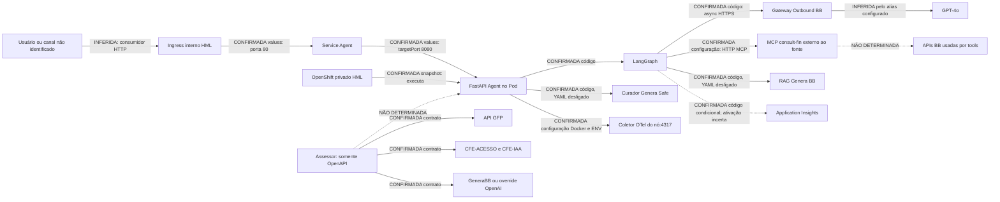
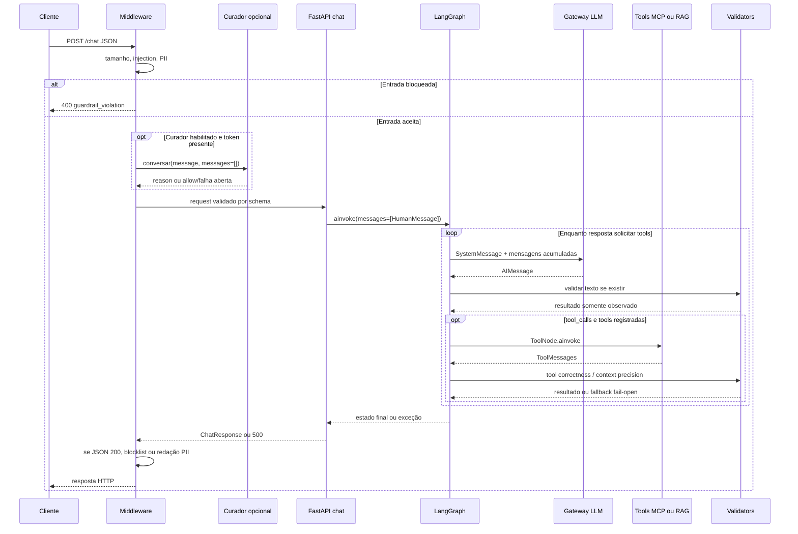
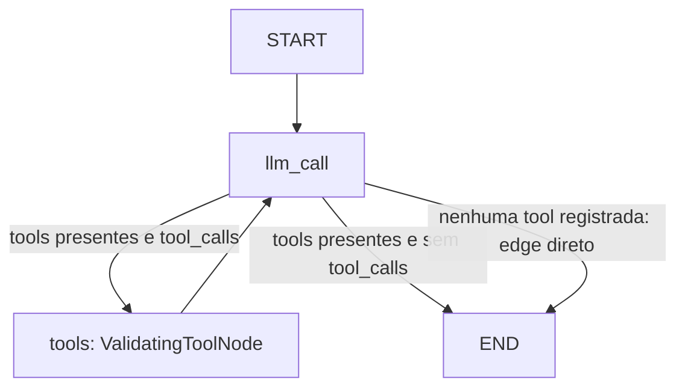

# BASELINE V0 — CONSULT FIN

## 0. Metadados da análise

| Campo | Registro |
|---|---|
| Data | 08/09/2026; fuso de referência America/Fortaleza |
| Workspace | `C:\Users\manue\.0_PROG\UAN\1. CONSULT FIN` |
| Objetivo | Fonte inicial de verdade para compreender, investigar e evoluir o projeto |
| Método | Inventário recursivo incluindo arquivos ocultos; comparação binária de duplicatas; leitura de código, configuração, testes, documentação, OpenAPI e snapshots; análise AST Python e parsing JSON/YAML; reprodução isolada de formatação dos prompts |
| Universo inicial | **CONFIRMADO:** 136 arquivos, 605.923 bytes; 60 arquivos na árvore principal do Agent e 60 cópias idênticas; 4 arquivos de deploy e 4 cópias idênticas; 8 referências na raiz |
| Versionamento | **CONFIRMADO:** nenhum diretório `.git` ou `AGENTS.md` encontrado no workspace. URLs de repositórios são referências, não checkouts com histórico verificável |
| Limites | Não houve acesso ao cluster, às APIs, ao registry, às bibliotecas compartilhadas de CI ou aos repositórios remotos. Nenhuma credencial foi usada. Não foram alterados código, configuração ou deploy |
| Validação | Fontes Python analisadas sintaticamente; OpenAPI e manifests analisados estruturalmente; dois defeitos de prompt reproduzidos sem LLM. Suíte pytest não executada: interpretador disponível sem `pytest` e `fastapi`; nenhuma instalação de dependências realizada |
| Temporalidade | “LIVE” neste documento significa **manifesto LIVE copiado nos arquivos ARGO**, não consulta atual. Horário da captura não está formalmente registrado; textos relativos como “20 days ago” não são relógio confiável |

**Convenção de certeza.** **CONFIRMADO** significa evidência objetiva no workspace, com escopo indicado: código existente, configuração declarada, contrato publicado ou snapshot. Não equivale a sucesso operacional. **INFERIDO** significa interpretação técnica fundamentada. **NÃO DETERMINADO** significa falta de evidência suficiente. Tabelas sob um parágrafo “CONFIRMADO” herdam essa classificação, salvo indicação em contrário. Ausência significa ausência no universo local inventariado.

**Referências abreviadas**, usadas para manter tabelas legíveis:

| Prefixo | Caminho relativo à raiz |
|---|---|
| `A/` | `plg-agent-consult-fin-main/` |
| `P/` | `plg-agent-consult-fin-main/plg_agent_consult_fin/` |
| `T/` | `plg-agent-consult-fin-main/tests/` |
| `H/` | `deploy-plg-agent-consult-fin-cloud-homologacao/` |
| `O:L` | `endpoint assessor.txt`, linha L; `O` é OpenAPI, não código do Assessor |
| `R1` a `R4` | `# ARGO 1.txt` a `# ARGO 4.txt`; números após `:` são linhas |

Linhas referem-se às cópias externas, idênticas às internas na data da análise. Segredos são representados por `<SECRET>`; não se reproduzem chaves de API, tokens de webhook ou connection strings. O inventário final permite localizar todos os arquivos sem abrir os que contêm valores sensíveis.

**Navegação:** [Negócio](#2-contexto-negocial) · [Sistemas](#4-inventário-de-sistemas) · [Chat](#6-fluxos-end-to-end) · [Grafo](#8-langgraph) · [MCP](#11-mcp) · [Assessor](#15-assessor-financeiro) · [Configuração](#17-configuração) · [HML](#26-argocd-e-estado-hml) · [Riscos](#30-dívidas-e-riscos) · [Dúvidas](#31-dúvidas-abertas) · [Evidências](#35-evidências-principais).

## 1. Resumo executivo

**O que é.** **CONFIRMADO:** o componente implementado é um serviço HTTP de agente de IA: recebe texto, consulta um LLM corporativo e pode executar ferramentas descobertas em MCP. **INFERIDO:** CONSULT FIN pretende aplicar essa infraestrutura à assistência financeira. O prompt atual é genérico e não define persona financeira, público, produtos ou metas do MVP. O contrato do Assessor descreve análise de transações e sessões, mas sua relação oficial com o Agent é **NÃO DETERMINADA**. Evidências: `P/app.py:62–132`, `P/graph.py:195–227`, `A/agent_config.yaml:13–18`, `O:142–270`.

**Como funciona.** **CONFIRMADO:** `POST /chat` passa por filtros locais de entrada e curador externo opcional, cria um estado contendo apenas a mensagem recebida, chama o LLM e repete o ciclo LLM → ferramentas → LLM enquanto houver tool calls. A resposta passa por blocklist e redação de PII antes do HTTP 200. `session_id` é apenas ecoado; não recupera histórico. Toxicidade, aconselhamento e PII são avaliados dentro do grafo, mas suas ações não são aplicadas pelo chamador. Evidências: `P/utils/guardrails_middleware.py:75–189`, `P/graph.py:157–191`, `P/app.py:100–131`.

**Componentes.** **CONFIRMADO:** há código completo do Agent, chart agregador HML sem dependências/templates vendorizados, quatro snapshots ArgoCD, metadados do Agent/MCP e OpenAPI 3.1.0 do “Assistente Financeiro API” versão 1.1.14. **Não há código do MCP nem do Assessor.** As duas subárvores repetidas são cópias binariamente idênticas, não serviços adicionais. Evidências: inventário da seção 35; `H/Chart.yaml:1–18`; `O:1–7`.

**Estado atual.** **CONFIRMADO nos snapshots:** Agent HML em OpenShift privado `k8shmlbb211d`, namespace `plg-agent-consult-fin`, imagem `0.1.1`, Deployment revisão 6, uma réplica disponível, Pod Running/Ready e zero reinícios. Argo informa Healthy e OutOfSync de HEAD `e79281b`. Isso não comprova sucesso de `/chat`, catálogo MCP ou exportação de traces. Há diferença concreta de `OTEL_PYTHON_EXCLUDED_URLS` entre `last-applied` e LIVE, além de variáveis duplicadas; falta o desired renderizado de HEAD para atribuir definitivamente a causa do OutOfSync. Evidências: `R1:19–37`, `R2:24–25,310–340,406–426`, `R4:458–510`.

**Implementado e desabilitado.** **CONFIRMADO no fonte:** FastAPI, grafo com tools, gateway BB com transporte assíncrono customizado, guardrails locais, métricas/spans, client RAG e client de curadoria. RAG e curador externo estão desligados no YAML local; guardrails locais continuam presentes. HPA, canário, Curió, ServiceMonitor, PVC e ingress externo estão desligados nos values HML. **NÃO DETERMINADO:** conteúdo efetivo do YAML dentro da imagem implantada e variáveis do Secret `env`. Evidências: `A/agent_config.yaml:20–47`; `H/values.yaml`.

**O que ainda não sabemos.** Público/canal e escopo oficial do produto; relação Agent–Assessor; tools e dependências internas do MCP; modelo/configuração efetivos de PRD; política de memória e aconselhamento; fonte documental do RAG; resultados de testes/builds; sucesso das integrações no cluster. Nenhuma dessas lacunas deve ser preenchida por analogia com o Assessor.

**Principais riscos fundamentados.** Credenciais em texto claro nas referências; validators de bloqueio sem enforcement no grafo; prompts dos dois judges quebrados por `.format` com chaves JSON não escapadas, reproduzido localmente; testes substituem esses prompts; descoberta MCP falha em aberto e fica congelada na compilação; readiness não consulta dependências; variável de Application Insights no manifesto diverge da lida pelo código; Jenkins desliga testes e verificação de segurança. Evidências e prioridades nas seções 19, 21, 26 e 30. Nenhum incidente de produção é demonstrado pelo workspace.

## 2. Contexto negocial

**CONFIRMADO:** a esteira identifica `consult-fin`, mantenedor “IA GEN AVANCADA”, grupo `plg`. A referência do MCP associa a gerência “LINHA EMPRESTIMOS E ANTECIPACOES PF”. Isso evidencia vinculação organizacional, não uma lista de capacidades implementadas (`endpoint consult.txt:7–39`; `endpoint MCP.txt:35–41`).

**INFERIDO:** a necessidade pretendida é ajudar usuários a obter respostas financeiras em linguagem natural, usando dados/ferramentas em vez de depender apenas do conhecimento do modelo. Sustentam essa leitura os nomes dos serviços, a orientação de usar tools para cálculos/dados e o contrato financeiro adjacente. **NÃO DETERMINADO:** se o usuário é cliente PF, funcionário, gerente, canal mobile, web ou outro sistema. O Agent não contém UI, identificação de cliente ou schemas de conta/transação.

**CONFIRMADO:** o significado implementado de “consultor” é estreito: assistente genérico com ferramentas. A instrução principal manda usar ferramenta apropriada para cálculos e busca; não implementa cálculo financeiro próprio. **NÃO DETERMINADO:** produtos, suitability, recomendações autorizadas, política regulatória, métricas de negócio, SLA e regras de elegibilidade. `NonAdviceValidator` indica intenção de sinalizar aconselhamento financeiro/jurídico/médico direto, mas não é prova de conformidade ou bloqueio (`P/validators/non_advice.py:1–6,95–114`; `P/graph.py:173–176`).

**CONFIRMADO:** a API do Agent entrega informação textual. Não há endpoint próprio para contratar, transferir, investir ou efetuar transações. **NÃO DETERMINADO:** se alguma tool remota tem efeito de escrita; seu código/schema não está disponível. Portanto, não é possível certificar que toda execução via MCP seja somente leitura.

| Capacidade | Descrição | Implementada? | Componente responsável | Evidência |
|---|---|---|---|---|
| Responder texto | Pergunta → resposta LLM | CONFIRMADO no código | Agent | `P/app.py:92–132` |
| Responder perguntas financeiras com dados reais | Requer contexto/integração concreta | NÃO DETERMINADO ponta a ponta | Agent + MCP potencialmente | Prompt genérico; catálogo remoto ausente |
| Descobrir/executar tools | Ferramentas selecionadas pelo modelo | CONFIRMADO no client | Agent/MCP externo | `P/graph.py:209–224,60–116` |
| Consulta de cliente/produtos | Não há modelos de cliente/produto no Agent | NÃO DETERMINADO no MCP; ausente no Agent | Remoto desconhecido | `P/app.py:62–84`; ausência do servidor MCP |
| Recuperar documentos | Tool `retrieve_context` via Genera | CONFIRMADO implementado, desligado no YAML | RAG do Agent | `P/rag/rag_tool.py`; `A/agent_config.yaml:28–37` |
| Gerar perguntas sugeridas | Até 10 perguntas com dados GFP | CONFIRMADO apenas como contrato | Assessor | `O:267–270` |
| Analisar extrato/categorias/saúde | Operações especializadas | CONFIRMADO apenas como contrato | Assessor | `O:382–1182` |
| Personalização | JWT e cliente/período descritos no contrato | NÃO comprovada no Agent; declarada no Assessor | Assessor | `O:145,270` |
| Memória entre requests | Histórico de conversa | Ausente no Agent; declarada no Assessor | Assessor, se implementado conforme contrato | `P/app.py:100–103`; `O:916–1093` |
| Filtrar entrada/PII de saída | Regex, limite e redação | CONFIRMADO no middleware, defaults ativos | Agent | `P/utils/guardrails_middleware.py:52–54,103–170` |
| Bloquear aconselhamento inadequado | Ação BLOCK declarada, resultado descartado | CONFIRMADO: detector existe; bloqueio não aplicado no grafo | Agent | `P/validators/non_advice.py:102`; `P/graph.py:173–178` |
| Executar ação financeira | Não há fluxo local de execução financeira | NÃO DETERMINADO remotamente | Tools desconhecidas | Ausência de código MCP |

## 3. Escopo do workspace

**CONFIRMADO:** o workspace é um conjunto de fontes e exportações, não um monorepo comprovado. Foram encontradas duas árvores principais e oito arquivos soltos. A árvore externa do Agent contém 60 arquivos; a pasta interna de mesmo nome repete exatamente esses 60. O deploy repete quatro arquivos. A comparação foi por bytes, não apenas nomes/tamanhos. A origem por extração ZIP é **INFERIDA**, não demonstrada.

| Grupo | Artefatos | Interpretação |
|---|---|---|
| Código de aplicação | `P/app.py`, `graph.py`, `__main__.py`, `__init__.py` | Serviço Agent |
| Configuração/domínio técnico | `P/config.py`, `A/agent_config.yaml`, `.env.example` | Dataclasses de configuração; não são modelos financeiros |
| Integrações LLM/MCP | `P/llm/*`; MCP dentro de `graph.py` | Client de gateway e adapter MCP |
| RAG | `P/rag/*` | Client de recuperação; não contém corpus/indexador |
| Validators/guardrails | `P/validators/*`, `P/utils/*` | Filtros locais, judges e telemetria |
| Schemas/API | Pydantic em `app.py`; `endpoint assessor.txt` | Duas APIs distintas |
| Testes | `T/unit/*`, `T/integration/*`, `T/conftest.py` | Majoritariamente unitários/mock; integração nominal é dummy |
| Build/execução | Dockerfile, requirements, setup, pip.conf, script release | Empacotamento e startup |
| CI/CD | Jenkinsfile, aic.json, workflows GitHub | Definições que delegam a serviços/bibliotecas externos |
| Helm | `H/Chart.yaml`, `values.yaml` | Dependências remotas; sem `templates/`, `charts/` ou lock |
| Kubernetes/Argo | `R1–R4` | Application, Deployment, ReplicaSet, Pod capturados |
| Provisionamento | `endpoint consult.txt`, `endpoint MCP.txt` | Referências de esteira; contêm segredos |
| Documentação | READMEs, resumo, CHANGELOG, LICENSE, bbconfig | Mistura de explicações, templates e referências |
| Duplicados | Duas pastas internas de mesmo nome | Cópias idênticas; não modificar como componentes independentes |
| Aparentemente legado/template | README de deploy, dummy tests, exemplos PRD, `.env.example` com placeholder, CHANGELOG sem histórico real | INFERIDO por conteúdo genérico e divergências |
| Temporários | Nenhum artefato temporário de aplicação identificado inicialmente | Cópias duplicadas não foram removidas |

**CONFIRMADO:** não há implementação local de MCP/Assessor, base de dados, migrações, corpus RAG, modelos de embeddings, notebooks, frontend do Agent, lock de dependências, artefatos de coverage, certificado privado em arquivo ou manifests LIVE de Service/Ingress/Secret. A seção 35 enumera o inventário completo, inclusive arquivos de suporte.

## 4. Inventário de sistemas

| Sistema | Material disponível | Papel comprovado | Relação com CONSULT FIN |
|---|---|---|---|
| `plg-agent-consult-fin` | Fonte Python + build/testes/config | API de agente e orquestração | CONFIRMADO, componente implementado |
| `plg-mcp-consult-fin` | Metadados de esteira + endereço no YAML Agent | Destino configurado para tools | CONFIRMADO como destino; funcionamento/catálogo não determinados |
| Assessor / Assistente Financeiro API | OpenAPI 3.1.0, versão 1.1.14 | Contrato de serviço financeiro com sessão | NÃO DETERMINADO: parte, consumidor, antecessor, sucessor, paralelo ou referência |
| Deploy Agent HML | Chart/values e snapshots | Implantação de imagem Agent | CONFIRMADO por nomes, namespace e imagem |
| Gateway Outbound BB | Provider no Agent | Proxy de chat completion com AppKey e suporte a mTLS | CONFIRMADO como integração implementada |
| Genera BB / curador | Clients opcionais | RAG e guardrail remoto | CONFIRMADO no código; desligados no YAML |
| CFE-ACESSO / CFE-IAA / GFP | Descrições OpenAPI Assessor | Proxies e consulta de dados declarados | CONFIRMADO apenas como menção contratual; não conectar ao Agent por suposição |

**Resposta à questão central:** **NÃO DETERMINADO — o workspace não estabelece a relação oficial entre Assessor e CONSULT FIN.** O Agent não importa nem chama as operações do Assessor; o OpenAPI não menciona o Agent ou MCP. A semelhança de domínio não prova integração. Também não há evidência de que o Assessor compartilhe o cluster do Agent. `resumo-workspace.md:16,140` apresenta associações que não foram confirmadas.

## 5. Arquitetura geral

As arestas identificam o nível de certeza da relação; “CONFIRMADA contrato” significa declaração no OpenAPI, sem validação de runtime.



**CONFIRMADO:** Azure aparece em nomes/configuração e em bibliotecas de observabilidade, mas a hospedagem HML capturada é OpenShift em nuvem privada (`R1:64–74`). Não há evidência de app hospedada em Azure App Service/AKS. O backend real do alias GPT-4o no gateway é **NÃO DETERMINADO**; não existe provider `AzureChatOpenAI` implementado no Agent.

## 6. Fluxos end-to-end

### 6.1 Startup, pré-condição de `/chat`

**CONFIRMADO:** `python -m plg_agent_consult_fin` chama `main()` → configura logs e Uvicorn → importa `app` → importa `graph` e carrega singleton de configuração. Os validators são instanciados no módulo. Se `APPLICATION_INSIGHTS_CONNECTION_STRING` existir, o tracer Azure também é criado durante import. `configure_azure_monitor()` tenta anexar exporter. O lifespan faz `await graph.compile()` antes de liberar o servidor (`P/__main__.py:46–83`; `P/app.py:25–53`; `P/graph.py:27–45,237–242`).

**CONFIRMADO:** compilação descobre tools MCP, opcionalmente acrescenta RAG, constrói LLM e vincula tools. Falha MCP é capturada; falha de provider/chave/certificado não é capturada pela factory. Assim, um Agent sem tools pode ficar ready, enquanto uma chave LLM ausente pode impedir startup. Não há shutdown explícito dos clients (`P/graph.py:209–227`; `P/llm/gateway_outbound.py:60–90`; lifespan contém apenas `yield`).

### 6.2 `/chat`: sequência real

**CONFIRMADO no código**, salvo consequências marcadas como inferência:

| Etapa | Implementação | Input → output | Erros/dependências | Observabilidade |
|---|---|---|---|---|
| 1. Recepção | `GuardrailsMiddleware.dispatch`, `P/utils/guardrails_middleware.py:70–100` | POST path exatamente `/chat`, bytes → JSON/message; body reconstruído para downstream | Lê body integralmente antes do limite; JSON inválido/objeto sem `.get` produz message vazia provisória | `guardrail.requests`, span `guardrails.middleware.chat` |
| 2. Filtros de entrada | Mesmo arquivo:103–126; `filter_patterns.py` | message → aceita ou JSON de violação | >4096 chars default; injection regex; PII por regex/checksum; HTTP 400. Tipos como `null`/número podem gerar TypeError antes de Pydantic | Logs de regra; `_record_block` para tamanho/injection, mas não PII |
| 3. Curadoria opcional | `check_external_guardrail`, `genera_safe_guardrails.py:35–83` | message + histórico `None` → reason ou `None` | HTTPS Genera, JWT `X-Client-Id`; desligado/sem token/falhas → aceita; rejeição com reason truthy → HTTP 400 | Log de status/falha; bloqueio registrado pelo middleware |
| 4. Schema/handler | `ChatRequest`, `chat`, `P/app.py:62–103` | `{message,session_id?}` → HumanMessage em estado novo | FastAPI/Pydantic validam request; 422 nos casos que chegam à validação; sem autenticação local | Incrementa contador de chat e log de session_id |
| 5. Invocação | `AgentGraph.ainvoke`, `P/graph.py:244–247` | estado → execução do grafo compilado | Compila se necessário; callback Azure opcional | Callback se configurado; sem session_id no config do grafo |
| 6. LLM | `llm_call`, `P/graph.py:157–178` | SystemMessage + mensagens → AIMessage | `ChatOpenAI.ainvoke`; gateway externo; transport rewrite e AppKey; exceção propaga | Instrumentação SDK/OTel depende de runtime |
| 7. Validators textuais | Mesmo node:163–176 | texto em cada AIMessage → ValidationResults descartados | toxicity, non_advice, pii; não alteram texto nem tool calls | `validate.toxicity`, `validate.non_advice`, `validate.pii` e métricas |
| 8. Roteamento | `tools_condition`, `graph.py:184–189` | tool_calls → tools; sem calls → END | Sem tools registradas há edge direto END | Execução do grafo conforme tracer |
| 9. Tools | `ValidatingToolNode.__call__`, `graph.py:65–116` | AI tool calls → ToolMessages | ToolNode + tools MCP/RAG; sem timeout/retry próprio; captura interna depende da biblioteca | Logs SDK se instrumentado; pós-validação |
| 10. Pós-tool | `graph.py:89–114` | nome,args,resultado → avaliações, estado preservado | ToolCorrectness sempre para ToolMessage; ContextPrecision só nome RAG. Prompts quebrados; fallback de aprovação | `validate.tool_correctness`; `validate.context_precision` quando aplicável |
| 11. Loop | `graph.py:187` | ToolMessages acumuladas → novo llm_call | Repete até resposta sem tools/erro/limite da biblioteca; sem limite próprio no projeto | Spans por chamada/validator se exportados |
| 12. Serialização | `P/app.py:108–132` | última mensagem → string reply; conta ToolMessages | Lista de blocos concatenada; messages vazias → `reply=""`; exceção de `ainvoke` → 500 genérico | Log de duração e quantidade de ToolMessages |
| 13. Filtros HTTP de saída | `guardrails_middleware.py:138–183` | JSON 200 → JSON modificado | Blocklist troca reply por recusa; senão redige PII. Só reply; preserva session_id e contagem; não filtra respostas não-200 | Métrica bloqueio/redaçāo; content-length recalculado |
| 14. Retorno | Middleware finally:186–189 | response → cliente | HTTP 200 não implica que tools funcionaram ou conteúdo foi validado por judge | `guardrail.latency_ms` inclui toda a espera downstream |



O diagrama omite o ramo HTTP 400 da rejeição externa para legibilidade; ele está na etapa 3. Não há streaming HTTP no handler/middleware.

### 6.3 Outros fluxos

**CONFIRMADO:** `/metrics` lê estado do processo; `/health/live` retorna `alive`; `/health/ready` verifica `get_config()` e `_compiled`, sem invocar LLM/MCP (`P/app.py:135–180`). A chamada RAG e a curadoria têm payloads e erros detalhados nas seções 12–13. Os fluxos financeiros do Assessor são somente contratuais e ficam na seção 15.

## 7. plg-agent-consult-fin

**CONFIRMADO:** pacote Python `plg_agent_consult_fin`, versão `0.1.1` em `P/__init__.py:1`; Python mínimo 3.11 em `A/setup.py:76`; imagem base 3.11.6. A API anuncia `config.metadata.version`, que no YAML é `0.1.0`, não a versão do pacote. Nome exposto é “Azure LangGraph Agent”. `deployment: azure` e descrição são metadados, não seleção de infraestrutura (`P/app.py:46–53`; `A/agent_config.yaml:1–18,49–52`).

| Módulo | Responsabilidade e ponto de entrada |
|---|---|
| `__main__.main` | argparse, logging, filtro de health access logs, Uvicorn |
| `app` | lifespan, quatro rotas explícitas, três schemas Pydantic e contador |
| `config` | Dataclasses, YAML e cache protegido por threading.Lock |
| `graph` | Estado, factory, nodes, tools, singleton e callback Azure |
| `llm` | Contrato `LLMProvider`, registry e `GatewayOutboundProvider` |
| `rag` | Tool LangChain com client HTTP Genera |
| `validators` | Base instrumentada, scoring local e LLM judges |
| `utils` | Middleware, regex, curador HTTP e exporter de traces |

**CONFIRMADO:** não há camada de banco, repositório de domínio, modelos financeiros, scheduler, fila, handlers CFE/GFP ou frontend no pacote. As únicas estruturas Pydantic de aplicação são ChatRequest, ChatResponse e MetricsResponse. Os retornos internos de tools permanecem pouco tipados (`Any`, listas, dicionários).

## 8. LangGraph

**CONFIRMADO:** `AgentState` é TypedDict com um campo: `messages: Annotated[List[BaseMessage], add_messages]` (`P/graph.py:50–51`). Não contém cliente, sessão, query normalizada, chunks separados, plano, orçamento ou decisão de segurança. O reducer acumula mensagens dentro da execução; `builder.compile()` não recebe checkpointer/store (`:191`).



**Nodes efetivos: apenas `llm_call` e, se houver tools, `tools`.** Os validators não são nodes separados, e não existe node “guardrails” ou “RAG” independente. Middleware fica fora do grafo. `llm_call` copia as mensagens, acrescenta SystemMessage quando a primeira não for SystemMessage, chama o LLM e retorna somente a nova AIMessage. O SystemMessage acrescentado à cópia não é gravado como atualização do estado; a instrução é reaplicada nas chamadas seguintes do fluxo normal (`:157–178`).

**CONFIRMADO:** `ValidatingToolNode` encapsula `ToolNode`, coleta chamadas pendentes da última AIMessage, executa primeiro, depois valida ToolMessages. Faz correspondência por índice `pending_calls[i]`, não por `tool_call_id`. Atualiza conjunto global de nomes conhecidos, mas não schemas; envia ao judge nome, argumentos e resultado. Não envia pergunta original, planner intent ou expected tool (`:60–114`). **INFERIDO:** isso reduz a capacidade de avaliar adequação negocial mesmo após corrigir os prompts.

**Entrada/saída/parada.** Com tools, `tools_condition` controla saída/loop; sem tools, saída imediata após LLM. Não há contador próprio de iterações, recursion_limit customizado, prazo global ou fallback de modelo. Defaults/erros exatos do LangGraph instalado em HML são **NÃO DETERMINADOS**, pois não há lock nem inventário de pacotes da imagem. Exceções que chegam a `chat` viram 500 (`P/app.py:104–106`).

**Singleton/lifecycle/concorrência.** Uma instância de `AgentGraph` por processo, criada no import, com `asyncio.Lock` e dupla checagem; compilação eager no lifespan e lazy de segurança no `ainvoke`. O lock protege construção, não serializa conversas. Config usa threading.Lock separado. Cada worker possui grafo/config/contadores próprios. Não há memória entre requests. A lista de tools é obtida na compilação e não atualizada depois: uma falha inicial MCP deixa o processo sem tools até reinício/recriação do grafo (`:209–215,230–254`).

**Limitações confirmadas:** `invoke()` usa `asyncio.run`, portanto não foi projetado para ser chamado dentro de loop async já em execução; client LLM assíncrono é compartilhado no grafo, sem fechamento explícito. Validators são globais e `update_known_tools` substitui o conjunto global em uma nova factory. `AgentFactory.create(config)` usa instruções/MCP/temperatura do argumento, porém `GatewayOutboundProvider.build` relê `get_config()` global para parâmetros de gateway (`P/llm/gateway_outbound.py:60`), assim o override de configuração não é integral.

## 9. Prompts

**CONFIRMADO:** busca recursiva por prompts, mensagens LangChain, `.invoke`, `.ainvoke`, templates e YAML encontrou os itens abaixo. Não há `PromptTemplate`/`ChatPromptTemplate` em código de produção, arquivo de prompt separado ou prompt financeiro específico. Duplicatas internas repetem os mesmos conteúdos.

| Prompt/conteúdo | Finalidade | Arquivo | Consumidor | Variáveis | Observações |
|---|---|---|---|---|---|
| `instructions` | Comportamento principal | `A/agent_config.yaml:13–15` | `graph.llm_call` como SystemMessage | Nenhuma interpolação | Assistente prestativo; usar tools para cálculos/busca; não define produto financeiro |
| Mensagem do usuário | Pergunta atual | `P/app.py:100–103` | HumanMessage → LLM | `request.message` | Input externo, não política do sistema |
| `_SYSTEM_PROMPT` ContextPrecision | Pedir avaliação precisa em JSON | `P/validators/context_precision.py:28` | `_call_llm_judge` | Nenhuma | SystemMessage |
| `_JUDGE_PROMPT` ContextPrecision | Julgar relevância/suficiência de contexto, score 0–1 | Mesmo arquivo:30–47,64–72 | Judge LLM | `query`, `chunks` | Cada chunk truncado a 500 caracteres; exemplo JSON não escapado quebra `.format` |
| `_SYSTEM_PROMPT` ToolCorrectness | Avaliar chamada de ferramenta em JSON | `P/validators/tool_correctness.py:21` | `_call_llm_judge` | Nenhuma | Dicionário role=system |
| `_JUDGE_PROMPT` ToolCorrectness | Escolha, argumentos/schema e utilidade do retorno | Mesmo arquivo:23–63,86–101 | Judge LLM | `user_query`, `intent`, `expected_tool`, `tool_name`, `available_tools`, `tool_schema`, `tool_args`, `tool_result` | Valores truncados a 800 chars; exemplo JSON não escapado; grafo não fornece vários campos |
| Tool description RAG | Orientar seleção pelo LLM | `A/agent_config.yaml:36–37`; `P/rag/rag_tool.py:98` | Tool schema exposto ao modelo | Nome/descrição configuráveis | Metadado de tool, não system prompt |
| Descrições/schemas MCP | Orientar seleção de tools | `P/graph.py:211,224` | `bind_tools` | Fornecidos pelo servidor | NÃO DETERMINADO: conteúdo remoto ausente |
| Input ao curador/RAG | Texto para agente remoto | `genera_safe_guardrails.py:46–55`; `rag_tool.py:47–59` | Genera BB | message/query, context, agent_id | Prompts internos dos agentes remotos ausentes |
| Seeds locais | Comparação textual em toxicity/non_advice | `toxicity.py:72–104`; `non_advice.py:67–92` | `best_similarity` | Texto da resposta | Não enviados ao LLM; não são embeddings/prompts de geração |
| Exemplos/test fixtures | Isolar comportamento em testes | `T/unit/test_app.py:22–38`, `test_guardrails_middleware.py`, `test_config.py`, `test_graph.py`, testes de judges | Mocks/configs temporários | “Be helpful”, instruções teste, messages sintéticas | Não representam prompt de HML |
| Prompt documentado | Exemplos de instructions | `A/README.md:187–189` | Nenhum loader runtime | Nenhuma | Exemplo reduzido, YAML real inclui instrução adicional para cálculos |
| Prompts do Assessor | Geração de perguntas/análise | `O:145,270` | Serviço sem fonte | NÃO DETERMINADO | Contrato descreve objetivos, não textos dos prompts |

**Defeito reproduzido:** extração AST de `_JUDGE_PROMPT` e chamada `.format` com todas as variáveis esperadas resulta em `KeyError: '"score"'` no ContextPrecision e `KeyError` no campo JSON `score` do ToolCorrectness. A avaliação real não alcança `llm.invoke` se a construção do LLM tiver sucesso. Os catches aprovam em aberto: score 0,5 no primeiro e 1,0 no segundo (`context_precision.py:122–130`; `tool_correctness.py:173–183`). Os testes reconhecem o problema e substituem `_JUDGE_PROMPT` (`T/unit/test_context_precision.py:58–59`; `test_tool_correctness.py:82–83`).

## 10. LLM

```text
AgentFactory / judges
  ↓ LLMFactory.create(provider, temperature, top_p)
GatewayOutboundProvider.build()
  ↓ ChatOpenAI com http_async_client customizado
_GatewayTransport (somente caminho assíncrono)
  ↓ HTTPS /v1/cambio-chat-completion?api-version=...
Gateway Outbound BB
  ↓ alias configurado; backend efetivo NÃO DETERMINADO
cambio-non-prod-gpt4o
```

**CONFIRMADO:** registry tem apenas `gateway_outbound`; `register()` permite extensão/override por código. Provider desconhecido lança ValueError. Não há fallback de provider/modelo (`P/llm/factory.py:19–35`).

| Parâmetro | Agent fonte/YAML | Judge | Assessor contrato |
|---|---|---|---|
| SDK/provider | ChatOpenAI / gateway_outbound | Mesma factory | GeneraBB singleton; `openai` por request descrito |
| Modelo | `cambio-non-prod-gpt4o` | Mesmo config global | Header X-LLM-Model default `gpt-4.1-mini`; não comprova modelo do singleton GeneraBB |
| Base URL | `https://llms-agentes-ia.outbound.api.hm.bb.com.br/v1` | Mesma | NÃO DETERMINADA |
| API version | `2024-12-01-preview` | Transport async contém parâmetro, mas judges usam sync | NÃO DETERMINADA |
| Temperature / top_p | 0,7 / 0,95 | 0,0 / 1,0 | NÃO DETERMINADOS |
| max_tokens | 4096 | Mesmo gateway config | NÃO DETERMINADO |
| Autenticação | ENV obrigatória `GATEWAY_OUTBOUND_GW_APP_KEY`; X-Application-Key | Mesma construção; caminho sync não customizado | JWT usuário; X-LLM-Api-Key opcional no contrato, sensível |
| TLS/mTLS | verify=True; CA customizada e cert/key se ambos presentes | Só AsyncClient customizado na factory | NÃO DETERMINADO |
| Timeout/retries | Não fixados no ChatOpenAI/AsyncClient pelo projeto | Não fixados; invoke síncrono | NÃO DETERMINADOS |
| Streaming | Sem ativação/caminho streaming no projeto | Não | NÃO DETERMINADO |
| Override HTTP | Não há headers X-LLM no Agent | Não | X-LLM-Provider/Api-Key/Model em duas operações |
| Fallback | Ausente | Fail-open da avaliação, não fallback de modelo | NÃO DETERMINADO |

Evidências: `A/agent_config.yaml:5–18`; `P/llm/gateway_outbound.py:24–100`; judges `_build_judge_llm`; `O:145–228,270–353`.

**Transporte confirmado:** substitui `/chat/completions` por `/cambio-chat-completion`; preserva demais parâmetros e força `api-version`; remove Authorization e injeta `x-application-key`. `api_key="dummy"` é placeholder SDK, não credencial real. CA: `TRUST_STORE_CA_PATH` tem prioridade sobre `REQUESTS_CA_BUNDLE`; ausentes, validação continua `True`, contrariando comentário “sem verificação” em `:65`.

**Risco adicional INFERIDO por código:** judges chamam `llm.invoke` síncrono, mas a customização só é fornecida em `http_async_client`. Mesmo corrigindo prompts, não há transporte síncrono equivalente para rewrite, AppKey e mTLS. É necessária validação do caminho sync antes de ativar judges reais; não foi feita chamada ao gateway. A chamada sync dentro do node async também pode bloquear o event loop quando alcançar rede.

**Ambientes:** HML está configurado no YAML. `endpoint consult.txt:44–62` registra provisionamento de aliases `cambio-prod-gpt4o` em domínio `.api.bb.com.br`, e `cambio-non-prod-gpt4o` em `.api.hm.bb.com.br`/`.api.desenv.bb.com.br`; seus códigos de autenticação são `<SECRET>`. Isso confirma parâmetros oferecidos pela esteira, não configuração efetiva de PRD. O README contém exemplo de deploy PRD e pede preparação manual (`A/README.md:7–11,457–484`); nenhum snapshot PRD foi fornecido.

## 11. MCP

**CONFIRMADO:** o código do `plg-mcp-consult-fin` **não está presente**. `endpoint MCP.txt` informa instância “Ativa”, criação em 27/08/2026 e URLs de repositório, releases, Jenkins e Argo em DES/HML/PRD. Esse status é da esteira; não é teste MCP, disponibilidade do Pod ou resultado de `tools/list`.

| Aspecto | Evidência e comportamento |
|---|---|
| Destino | `http://plg-mcp-consult-fin.plg-mcp-consult-fin.svc.cluster.local/mcp` (`A/agent_config.yaml:45`) |
| Serviço/namespace | Pela forma do DNS, Service `plg-mcp-consult-fin` no namespace homônimo; manifesto do Service ausente |
| Protocolo/transporte | MCP via `MultiServerMCPClient`, `streamable_http` no YAML; URL HTTP sem porta explícita (80) |
| Nome lógico | `plg-mcp-consult-fin-local`, embora endereço seja interno do cluster; “local” não significa localhost |
| Autenticação atual | `type: none`; sem Authorization injetado |
| Bearer opcional | `resolve_token()` busca ENV indicada por `token_env_var`; se vazia/ausente, segue sem header |
| Cert opcional | Dataclass aceita cert_path/key_path/type=cert, mas `_mcp_server_config` não encaminha certificados; mTLS MCP não implementado nesse caminho |
| Descoberta | `await mcp.get_tools()` na compilação; lista de nomes e contagem é logada; `llm.bind_tools(tools)` publica schemas ao modelo |
| Execução | ToolNode chama objetos devolvidos pelo adapter; retorno vira ToolMessage e é fornecido novamente ao LLM |
| Lifecycle | Client criado em variável local na factory; tools retidas pelo grafo; não há bloco `client.session`, contexto persistente ou encerramento explícito no código próprio |
| Timeouts/retries | Nenhum valor explícito passado ao client/servidores. Defaults exatos e lifecycle interno dependem da versão instalada, não determinada |
| Descoberta indisponível | Exceção em `get_tools` → tools=[] para a coleta inteira; não preserva resultados parciais explicitamente |
| Recuperação | Nenhuma redescoberta após compilar; reinício/recriação necessário para uma nova tentativa |
| Falha de chamada | Delegada a ToolNode/adapter; se escapar ao grafo, `/chat` retorna 500. Não há resposta HTTP específica “MCP indisponível” |

Evidências de client: `P/config.py:19–55,160–181`; `P/graph.py:135–148,209–224,65–116,237–247`. **NÃO DETERMINADO:** sessões internas do adapter, tempo de conexão/leitura, autenticação exigida pelo servidor, métodos internos e efeitos colaterais. Não se reconstrói implementação remota a partir desse client.

| Tool MCP | Objetivo negocial | Input | Output | Chamador | Dependência externa |
|---|---|---|---|---|---|
| Catálogo remoto não fornecido | NÃO DETERMINADO | Schema remoto ausente | Schema remoto ausente | ToolNode se descoberta funcionar | MCP configurado; APIs internas desconhecidas |

**CONFIRMADO:** nomes como `calculator`, `invented_tool`, `retrieve_context` em testes de ToolCorrectness são fixtures; não provam catálogo MCP. `retrieve_context` é a única tool local definida no código e pertence ao client RAG, não à implementação MCP. Não há log real de “Ferramentas MCP carregadas” no workspace.

## 12. RAG

| Dimensão | Estado |
|---|---|
| IMPLEMENTADO | CONFIRMADO: tool LangChain + POST de recuperação + extração de lista + validator pós-tool |
| CONFIGURADO | CONFIRMADO: `enabled:false`, URL Genera, total_context=5, timeout=10s, tool_name=`retrieve_context`; agent_id/user_id/uor vazios |
| ATIVO EM HML | NÃO DETERMINADO diretamente. INFERIDO desligado se a imagem usa o mesmo YAML; não há mount de YAML nos snapshots, mas conteúdo da imagem não foi inspecionado |

**CONFIRMADO — acionamento:** `AgentFactory.create` só acrescenta a tool quando `rag.enabled`. Se já houver tool homônima, não acrescenta a local. Depois o modelo decide chamá-la, sem recuperação obrigatória antes de toda resposta (`P/graph.py:217–224`). Nome igual ao RAG ativa ContextPrecision, inclusive se a tool homônima tiver origem MCP.

**Contrato local:** `_retrieve(query: str, total_context: int = 5) -> list[Any]`. Faz `_call_gateway(query, messages=None, total_context=...)`. `_call_gateway` exige enabled, token e agent_id; sem algum deles retorna `[]`. Payload:

```json
{
  "action": "recuperar-contexto",
  "body": {"data": {"input": "<query>", "context": {"messages": [], "total_context": 5}}},
  "agent_id": "<ID configurado>"
}
```

Headers: `accept`, `Content-Type`, `X-Client-Id: <SECRET>`, `UOR`, `userIdentification`. HTTPS com CA de `REQUESTS_CA_BUNDLE` ou verify=True, sem cert/key mTLS próprio nesse client. Extrai **somente** `data.output.text[0].retrieved_contexts`, se lista. HTTP inválido, timeout, JSON/formato inesperado e exceção → log + `[]`. Não há retry próprio. Cliente HTTP global criado sob demanda e não fechado (`P/rag/rag_tool.py:21–102`).

**CONFIRMADO:** o default 5 da assinatura da tool é sempre passado à chamada; portanto mudar somente `rag.total_context` não altera esse default no fluxo tool. O valor do YAML é usado por `_call_gateway` apenas se receber `total_context=None`. Não há limites de quantidade/comprimento no schema da tool.

**Validação:** a lista/string do ToolMessage é convertida a chunks para ContextPrecision; uma lista serializada como string é tratada como um único chunk, sem parse JSON explícito. A avaliação não filtra/reordena nem impede retorno ao modelo e tem o defeito de prompt já demonstrado (`P/graph.py:96–114`).

**NÃO DETERMINADO:** corpus, proprietário documental, ingestão, atualização, embeddings, banco vetorial, distância, filtros de acesso, ranking, reranking, citações/proveniência e garantias de frescor. Não há implementação local desses mecanismos. `azure-search-documents` aparece apenas comentado em `A/requirements.txt:22–24`; isso não comprova Azure AI Search ativo.

## 13. Guardrails e validators

**CONFIRMADO:** `guardrails.enabled` governa apenas o client externo; o middleware local é instalado incondicionalmente (`P/app.py:59`). Não há chave YAML única que desligue todos os controles. “Ativo” abaixo refere-se ao caminho do fonte/default local; efetivos ENV/YAML em HML permanecem parcialmente desconhecidos.

| Controle | Momento | Como funciona | Bloqueia? | Retorna o quê? | Ativo atualmente no fonte/config |
|---|---|---|---|---|---|
| Tamanho | Antes do handler | len(message)>limite ENV 4096 | Sim | HTTP 400 code=input_too_long | Sempre no middleware |
| Prompt injection | Entrada | 11 regex de expressões/jailbreak predominantemente EN | Sim | 400 prompt_injection | Sempre |
| PII entrada | Entrada | E-mail, telefone, SSN, cartão, CPF/CNPJ; checksum nos dois últimos | Sim | 400 pii_detected | Default ENV true |
| Genera Safe | Entrada | POST action=conversar a curador; `allowed`/`status` | Sim se reason truthy; falha aberta | reason/None → 400 external_guardrail ou continua | YAML false |
| ToolCorrectness | Depois da tool | Judge com tool,args,result; score qualidade >=0,5 passa | Não | ValidationResult; erro aprova score 1,0 | Chamado para cada ToolMessage; prompt quebra avaliação |
| ContextPrecision | Depois da tool de nome RAG | Judge query/chunks; >=0,3 passa | Não | ValidationResult; erro aprova score 0,5; chunks vazios reprova | Condicional ao nome RAG, desligado localmente com RAG |
| Toxicity | Cada AIMessage com texto | Regex ponderadas + similaridade fuzzy PT/EN; score risco >0,5 reprova | **Não no grafo**, apesar de action=BLOCK | ValidationResult descartado | Chamado sem flag global de desligamento |
| NonAdvice | Cada AIMessage com texto | Financeiro/jurídico/médico, regex + fuzzy; ressalvas reduzem pesos a 40% | **Não no grafo** | ValidationResult descartado | Chamado |
| PII validator | Cada AIMessage com texto | Regex/checksum; score risco 0 ou 1; action=BLOCK | **Não no grafo** | ValidationResult descartado; detalhes só tipos/contagens | Chamado |
| Blocklist saída | Depois do handler | 3 regex EN de revelação de prompt/ignorar diretrizes | Substitui reply; mantém HTTP 200 | “Desculpe, nao posso fornecer essa informacao.” | Sempre em JSON 200 |
| Redação PII saída | Depois do handler | Substituição por [EMAIL], [PHONE], [SSN], [CARD], [CPF], [CNPJ] | Redige; não muda status | reply modificado | Default ENV true; só se blocklist não casou |
| ValidatorPipeline | Biblioteca interna | `run`/`run_until_block` | Poderia sinalizar parada | Resultados + primeiro BLOCK reprovado | Existe, não é utilizado pelo grafo |

Evidências: `P/utils/filter_patterns.py:8–74`; `guardrails_middleware.py:103–170`; `genera_safe_guardrails.py:40–83`; `P/validators/__init__.py:60–166`; classes individuais; `P/graph.py:89–114,173–178`.

**CONFIRMADO:** a similaridade “semântica” é normalização de acentos/case/pontuação e comparação lexical rapidfuzz (`token_set_ratio`/`partial_ratio`), com fallback `difflib.SequenceMatcher`; não usa embeddings (`semantic_similarity.py:30–68`). `GUARDRAIL_SEMANTIC_ENABLED=true` por default; thresholds de similaridade 0,86 toxicity e 0,84 non-advice, diferentes dos thresholds de reprovação. Regex continuam ativas ao desligar fuzzy.

**Limitações confirmadas/inferidas:** controles de entrada só analisam `message`, não `session_id` ou corpo completo. Saída só altera `reply`, não ToolMessages intermediárias nem dados já enviados ao LLM/tracer. O limite é de caracteres de message após carregar body inteiro, não limite de bytes HTTP. **INFERIDO:** tipos inesperados e corpos grandes são lacunas de robustez; regex podem produzir falsos positivos/negativos e não garantem resistência a ataques em português. O código não contém avaliação adversarial que quantifique eficácia.

## 14. APIs

### 14.1 Catálogo Agent

**CONFIRMADO:** não há autenticação/autorização implementada nas rotas: sem Depends de identidade, bearer parsing, OAuth, validação JWT ou middleware de auth. Todas têm o middleware registrado, mas apenas POST com path exatamente `/chat` executa guardrails. Auth no ingress/gateway consumidor é **NÃO DETERMINADA**.

| Método/path | Objetivo/request | Response/status | Dependências, erros e implementação |
|---|---|---|---|
| POST `/chat` | Enviar ChatRequest JSON | 200 ChatResponse; 400 violação guardrail; 422 validação; 500 falha grafo | LLM, MCP descoberto, RAG/curador opcionais. `P/app.py:86–132`; middleware:75–208 |
| GET `/metrics` | Métricas básicas; sem body | 200 MetricsResponse JSON | Config + contadores em processo; sem formato Prometheus. `P/app.py:135–148` |
| GET `/health/live` | Processo vivo; sem body | 200 `{"status":"alive"}` | Sem teste externo; `P/app.py:151–158` |
| GET `/health/ready` | Config carregada e grafo compilado | 200 `{"status":"ready"}`; 503 `{"status":"not ready","detail":"..."}` | Pode expor texto da exceção de config. Não testa LLM/tools. `P/app.py:161–180` |
| GET `/docs` | Swagger UI | HTML 200 via FastAPI | Habilitado explicitamente em `app.py:50`; ENABLE_SWAGGER não lido |
| GET `/redoc` | ReDoc | HTML 200 via FastAPI | `app.py:51` |
| GET `/openapi.json` | Schema gerado | JSON via default FastAPI | INFERIDO do construtor sem override de openapi_url; não há dump Agent no workspace |
| GET `/docs/oauth2-redirect` | Rota auxiliar do Swagger | HTML via default FastAPI | INFERIDO do default; não comprova OAuth configurado |

**CONFIRMADO:** `GET /`, `/health` e operações `op...` não são rotas explícitas do Agent; pertencem ao contrato do Assessor quando presentes. Não há endpoint de catálogo tools, reset de memória, produtos ou configurações. Respostas 401/403/429 não estão implementadas no código próprio; limites externos desconhecidos.

### 14.2 Schemas Pydantic e erros

| Schema | Campos | Validação/default | Evidência |
|---|---|---|---|
| ChatRequest | message:str; session_id:Optional[str] | message obrigatório; session_id=None; sem min/max no schema, sem histórico/context; limite vem do middleware | `P/app.py:62–70` |
| ChatResponse | reply:str; session_id:Optional[str]; tool_calls_made:int | reply obrigatório; sessão None; contagem 0 | `:73–76` |
| MetricsResponse | uptime_seconds:float; total_requests:int; agent_id:str; agent_name:str | Todos obrigatórios no retorno | `:79–83` |
| Violação de guardrail | error, code, detail | JSON construído manualmente, sem BaseModel; error=`guardrail_violation` | `guardrails_middleware.py:205–208` |
| Erro de grafo | detail | HTTPException 500: `Erro interno do servidor.` | `P/app.py:104–106` |

Exemplo de request válido sem dados pessoais: `{"message":"Explique o que é uma reserva de emergência.","session_id":"exemplo"}`. A existência desse exemplo não demonstra resposta correta ou tool financeira. `tool_calls_made` conta ToolMessages acumuladas, não chamadas HTTP reais, sucesso de cada tool ou número de rounds do LLM (`app.py:119`).

## 15. Assessor Financeiro

**CONFIRMADO apenas como contrato:** `endpoint assessor.txt` é JSON válido OpenAPI **3.1.0**, título **Assistente Financeiro API**, versão **1.1.14**, 19 paths/operações e 12 schemas. Não contém código, configuração deploy, `servers`, `security` global ou `components.securitySchemes`. “Assessor Financeiro” é o nome do arquivo/contexto; título interno usa “Assistente”. Não extrapolar para o Agent.

### 15.1 Catálogo completo do contrato

Convenções: **H3** = headers opcionais no schema `Authorization`, `ESTADO-INTEGRACAO`, `INFO-INTEGRACAO`; **H6** = H3 + `X-LLM-Provider` (default generabb), `X-LLM-Api-Key` (opcional/sensível), `X-LLM-Model` (default gpt-4.1-mini). **J?** = 200 application/json com schema `{}`, estrutura não determinada. **V** = 422 HTTPValidationError. Ausência de header no contrato não prova acesso anônimo real. Middleware e implementação de todas as rotas são **NÃO DETERMINADOS**; operationId é uma identificação contratual, não função inspecionada.

| Método/path | Objetivo | Request/headers | Response/status | Dependência/erro/evidência |
|---|---|---|---|---|
| GET `/` | Frontend, substitui APP_VERSION no rodapé | Sem parâmetros | 200 text/html string | Frontend não fornecido; `O:9–27`, `read_index__get` |
| GET `/health` | Health check | Sem parâmetros | J? | Critério desconhecido; `O:28–46` |
| GET `/health/live` | Liveness | Sem parâmetros | J? | Critério desconhecido; `O:47–65` |
| GET `/health/ready` | Readiness | Sem parâmetros | J? | Critério desconhecido; `O:66–84` |
| POST `/proxy/bb-acesso` | Proxy CFE-ACESSO, descrito como dev para restrições de headers browser | Body/headers não especificados | J? | CFE-ACESSO; `O:85–103` |
| POST `/proxy/bb-iaa-listar` | Proxy para listar perguntas | Não especificado | J? | CFE-IAA; `O:104–122` |
| POST `/proxy/bb-iaa-responder` | Proxy para responder pergunta | Não especificado | J? | CFE-IAA; `O:123–141` |
| POST `/op16929111v1` | Pergunta/resposta financeira; resolver sessão pelo JWT | PerguntaOperacao obrigatório; H6 | J? + V; descrição chama retorno RespostaOperacao, schema ausente | Sessão/LLM; JWT sempre obrigatório segundo prosa; `O:142–266` |
| POST `/op16795179v1` | Iniciar/reutilizar sessão e gerar até 10 perguntas | Sem requestBody; H6 | J? + V; descrição indica codigoSessao no body | JWT, API GFP e LLM; `O:267–381` |
| POST `/categorias` | Listar categorias | SessaoBody obrigatório; H3 | J? + V | Dados da sessão; `O:382–470` |
| POST `/extrato/listar` | Transações brutas | ExtratoListarRequest obrigatório; H3 | 200 ExtratoListarResponse + V | Dados da sessão; `O:471–559` |
| POST `/extrato/exportar` | Exportar CSV BR | ExtratoListarRequest obrigatório; H3 | J? + V **no schema**; descrição diz CSV BOM UTF-8, `;`, decimal vírgula, DD/MM/AAAA | Divergência contratual de media type; `O:560–648` |
| POST `/analisar-categoria` | Detalhar categoria | CategoriaAnaliseBody obrigatório; H3 | J? + V | Sessão; `O:649–737` |
| POST `/op17426938v1` | Resumo mensal | ResumoMensalBody obrigatório; H3 | J? + V | Descrição deprecated: substituir por pergunta “Resumo financeiro” em 16929111v1; `O:738–826` |
| POST `/configurar-categorias` | Definir essenciais/não essenciais | ConfiguracaoCategoriaBody obrigatório; H3 | J? + V | Sessão; `O:827–915` |
| POST `/memoria/resetar` | Limpar memória da sessão | SessaoBody obrigatório; H3 | J? + V | Persistência não descrita; `O:916–1004` |
| POST `/memoria/configurar` | Ajustar janela de turnos | MemoriaConfig obrigatório; H3 | J? + V | Limite máximo real não descrito; `O:1005–1093` |
| POST `/saude-financeira` | Avaliar saúde a partir dos dados | SessaoBody obrigatório; H3 | J? + V | Fórmula/modelo desconhecido; `O:1094–1182` |
| POST `/sessao/encerrar` | Encerrar e liberar recursos | SessaoEncerrarBody obrigatório; sem headers declarados | J? + V; prosa diz 200 mesmo inexistente/expirada | Autorização não descrita; `O:1183–1221` |

**Divergência de autenticação CONFIRMADA:** prosa de `/op16929111v1` afirma JWT sempre obrigatório, mesmo com codigoSessao válido; parâmetro Authorization está `required:false`, nullable. Não escolher arbitrariamente entre contrato declarativo e validação runtime ausente. Não há 401/403 documentados. `SessaoEncerrarBody` exige código, mas a operação não declara Authorization: controle efetivo precisa ser verificado no fonte do Assessor.

### 15.2 Todos os schemas do Assessor

**CONFIRMADO:** campo não listado em required é opcional no contrato; nullable não é sinônimo de propriedade obrigatória. `codigoSessao` opcional usa string ou null, sem valor default explícito.

| Schema | Campos e restrições | Required | Evidência |
|---|---|---|---|
| CategoriaAnaliseBody | categoria:string; codigoSessao:string ou null | categoria | `O:1225–1249` |
| ConfiguracaoCategoriaBody | categorias_essenciais:string[]; categorias_nao_essenciais:string[]; codigoSessao:string ou null | Ambas as listas | `O:1251–1286` |
| ExtratoListarRequest | codigoSessao:string máximo 200 ou null | Nenhum | `O:1288–1306` |
| ExtratoListarResponse | codigoSessao:string; total_linhas:integer; transacoes:TransacaoExportada[] | Todos | `O:1308–1333` |
| HTTPValidationError | detail:ValidationError[] | Nenhum | `O:1335–1347` |
| MemoriaConfig | max_turnos:integer, sem mínimo/máximo; codigoSessao:string ou null | max_turnos | `O:1348–1372` |
| PerguntaOperacao | textoPergunta:string máximo 255; codigoSessao:string ou null | textoPergunta | `O:1373–1399` |
| ResumoMensalBody | codigoSessao:string ou null; anoResumo:integer >=0; mesResumo:integer 0–12; zero indica todos | anoResumo, mesResumo | `O:1401–1435` |
| SessaoBody | codigoSessao:string ou null | Nenhum | `O:1437–1454` |
| SessaoEncerrarBody | codigoSessao:string mínimo 1 caractere | codigoSessao | `O:1456–1470` |
| TransacaoExportada | data:string ISO descrito; descricao,categoria,tipo,instituicao:string; valor:number; grupo_categoria:integer | Todos os sete campos | `O:1472–1515` |
| ValidationError | loc:array de string ou integer; msg:string; type:string | Todos | `O:1517–1550` |

**CONFIRMADO:** RespostaOperacao é citado na descrição, mas não aparece em components.schemas; não há schema formal para perguntas sugeridas, resumo, saúde ou resposta conversacional. `data` não declara format=date; valor é number e a descrição diz float para apresentação, sem demonstrar aritmética interna.

### 15.3 Fluxos e estado declarados

**CONFIRMADO como descrição de contrato:** iniciar sessão → extrair cliente de JWT → consultar GFP → gerar até dez perguntas por LLM → retornar codigoSessao. Perguntar → JWT obrigatório segundo prosa → resolver/reutilizar sessão por cliente+período quando código ausente/vazio/inválido/expirado → responder; override openai cria ChatOpenAI da request sem modificar singleton `app.state.modelo` GeneraBB (`O:145,270`). Memória suporta reset e janela deslizante; encerramento é idempotente.

**NÃO DETERMINADO:** assinatura/issuer/audience/expiração JWT, armazenamento e TTL de sessão, isolamento por cliente, fonte e schema GFP, regras de saúde financeira, prompts, implementação de memória, host/ambiente, autenticação CFE, timeouts/retries, modelo GeneraBB, testes e operação real. O código do Agent não implementa esses fluxos.

## 16. Integrações externas

| Sistema | Quem chama / para quê | Protocolo | Configuração/evidência | Obrigatória? / certeza |
|---|---|---|---|---|
| Gateway LLM BB | Agent e construção dos judges; geração textual | HTTPS JSON compatível com ChatOpenAI, rota reescrita | `agent_config.yaml:5–11`; `gateway_outbound.py` | CONFIRMADO código; LLM necessário ao chat |
| MCP consult-fin | Agent; descobrir/executar tools | MCP streamable_http, URL HTTP | `agent_config.yaml:39–47`; `graph.py:209` | CONFIRMADO client; descoberta falha aberta |
| Genera BB RAG | RAG tool; recuperar contexto | HTTPS POST `/gateway/agent`, action recuperar-contexto | `rag_tool.py:35–100` | Opcional, YAML false |
| Genera Safe/curador-iagen | Middleware; julgar entrada | HTTPS POST, action conversar | `genera_safe_guardrails.py:35–83` | Opcional e fail-open |
| Coletor OTel | Auto-instrumentação; traces/metrics | Endpoint OTLP `http://$(OTEL_K8S_NODE_IP):4317` | Docker CMD; `R4:308–325` | Configurado; entrega não comprovada |
| Azure Application Insights | Callback LangChain e exporter manual | SDK Azure/exportação HTTPS | `graph.py:35–45`; `tracing.py:31–76` | Opcional; ENV divergente nos snapshots |
| Azure OpenAI | Alias de modelo e fixtures | Não há client AzureChatOpenAI no Agent | `requirements.txt`, testes AZURE_OPENAI_* | Backend Azure do gateway NÃO DETERMINADO |
| GFP | Assessor; dados do cliente para perguntas | NÃO DETERMINADO | `O:270` | Apenas descrito no contrato |
| CFE-ACESSO | Assessor proxy de desenvolvimento | API externa não especificada | `O:88` | Apenas descrito |
| CFE-IAA | Assessor proxies listar/responder | API externa não especificada | `O:107,126` | Apenas descrito |
| GeneraBB/OpenAI Assessor | Geração financeira/override | SDK citado; endpoint não fornecido | `O:145,197–228` | Apenas descrito |
| Registry/Artifactory BB | Build, publicação e pull imagem/pacotes | HTTPS e registry | Dockerfile:2,53; pip.conf; R4:482–484 | Necessário ao fluxo corporativo observado |
| Charts repo BB | Helm; obter charts dependentes | URLs HTTPS corporativas | `H/Chart.yaml:6–18` | Dependências ausentes localmente |
| Jenkins/Git/GitHub workflows | CI/CD | SCM/jobs/workflows externos | Jenkinsfile, ci/cd YAML, endpoint consult | Implementações compartilhadas não fornecidas |
| IDH operator/BBCert | Infra; provisionar/renovar certificados | CRDs/operators não fornecidos | `H/values.yaml:357–400`; Chart dependencies | Declarado nos values; cert secret montado no Pod |
| Curió/Redis | Sidecar/cache de configuração IIB potencial | Não determinado em runtime | `H/values.yaml:236–293` | **Desligado**; referência Redis não é banco/cache do Agent |

Nenhuma chamada direta do Agent a APIs de conta, investimento, produtos, CFE ou GFP foi encontrada. Não confundir dependências de build com integrações negociais.

## 17. Configuração

### 17.1 Cadeia efetiva e precedência

```text
H/values.yaml + globals inline da Application Argo
    ↓ charts remotos (templates não presentes)
Deployment env / envFrom Secret env / volume Secret idh-mtls
    ↓ processo: variáveis de ambiente e arquivos /app/certs/*
    ├── Gateway provider / guardrails / tracing leem ENV diretamente
    └── NÃO há conversão geral ENV → AgentConfig

Docker COPY . /app
    ↓ /app/agent_config.yaml (se imagem construída deste fonte)
load_agent_config: raiz acima do pacote → cwd
    ↓ yaml.safe_load + dataclasses
get_config singleton
    ↓ graph / LLM / RAG / curador / metadados API
```

**CONFIRMADO:** config não é Pydantic Settings; é dataclass e parsing manual. Sem `.env` automático, expansão `${VAR}` no YAML, reload, arquivo de config escolhido por ENV ou merge de ambientes. `load_agent_config(path)` aceita caminho explícito, mas app chama sem argumento. Campos obrigatórios acessados com `raw[...]` podem lançar KeyError, apesar do docstring citar ValueError; YAML estruturalmente inválido também pode causar AttributeError/TypeError. Casting `bool()` pressupõe booleano YAML correto: string literal `"false"` seria truthy (`P/config.py:126–242`).

### 17.2 ENV lidas pelo código próprio

**CONFIRMADO** pelo rastreamento de `os.getenv/os.environ`. “Obrigatória” distingue construir serviço de ativar integração.

| Variável/config | Objetivo/consumidor | Obrigatória | Default | Origem possível | Sensível |
|---|---|---|---|---|---|
| GATEWAY_OUTBOUND_GW_APP_KEY | AppKey gateway; `gateway_outbound.py:61` | Sim, build do LLM | Sem default; KeyError | Shell/Secret env (conteúdo ausente) | Sim |
| KEY_STORE_CERT_PATH | Certificado cliente gateway | Opcional no código; README exige para BB | None | Values → ENV `/app/certs/tls.crt` | Caminho não; conteúdo controlado |
| KEY_STORE_KEY_PATH | Chave privada mTLS gateway | Opcional no código; par necessário | None | Values → ENV `/app/certs/tls.key` | Conteúdo secreto |
| TRUST_STORE_CA_PATH | CA gateway, prioridade máxima | Não | None | Values → ENV `/app/certs/ca.crt` | Não é credencial |
| REQUESTS_CA_BUNDLE | Fallback CA gateway; CA RAG/curador | Não | None | Shell/Secret/base image | Caminho não |
| RAG_CLIENT_ID | JWT em X-Client-Id | Para recuperação útil | string vazia | ENV/Secret; não revelado | Sim |
| GUARDRAIL_EXTERNAL_CLIENT_ID | JWT curador X-Client-Id | Para curadoria remota | string vazia | ENV/Secret; não revelado | Sim |
| GUARDRAIL_MAX_INPUT_LEN | Limite de caracteres | Não | 4096 | ENV import-time | Não |
| GUARDRAIL_BLOCK_PII_INPUT | Bloquear entrada PII | Não | true | ENV import-time | Não |
| GUARDRAIL_REDACT_PII_OUTPUT | Redigir reply | Não | true | ENV import-time | Não |
| GUARDRAIL_SEMANTIC_ENABLED | Fuzzy toxicity/non-advice | Não | true | ENV na construção validator | Não |
| APPLICATION_INSIGHTS_CONNECTION_STRING | Callback Azure + exporter | Não | Ausente/vazio; Docker define vazio | ENV, nome **com `_` entre APPLICATION e INSIGHTS** | Tratar como sensível |
| OTEL_RECORD_CONTENT | Gravar conteúdo no callback Azure | Não | true | ENV ao importar graph | Não; efeito de privacidade |
| SERVICE_NAME | Dimensão extra em métricas customizadas | Não | vazio | ENV import-time | Não |
| DEPLOY_ENV | Dimensão de ambiente | Não | vazio | Snapshot define hml | Não |
| Nome dinâmico em MCP authentication.token_env_var | Bearer de servidor MCP | Se política exigir | Ausente → sem header | ENV; YAML define nome | Sim |

Fontes: `P/llm/gateway_outbound.py:61–66`; `rag/rag_tool.py:27,41`; `utils/genera_safe_guardrails.py:27,41`; `utils/guardrails_middleware.py:52–61`; `utils/tracing.py:31`; `graph.py:35–40`; validators; `config.py:44–50`.

### 17.3 Todos os campos YAML carregados

**CONFIRMADO:** valores abaixo diferenciam default do loader de valor explicitamente fornecido. Os grupos representam todos os campos das dataclasses, sem supor ENV equivalente.

| Campo | Finalidade | Obrigatório/default do loader | YAML local / consumidor | Sensível |
|---|---|---|---|---|
| agent_id | Identidade técnica | Obrigatório | agent-001 / metrics | Não |
| agent_name | Nome API/tracer | Obrigatório | Azure LangGraph Agent | Não |
| deployment | Metadado | Obrigatório | azure; não escolhe runtime | Não |
| instructions | System prompt | Obrigatório | Texto genérico da seção 9 | Não |
| agent_description | Descrição API | Obrigatório | Agente LangGraph/MCP/Azure | Não |
| temperature / top_p | Sampling | 0,7 / 1,0 | 0,7 / 0,95 no YAML / factory | Não |
| llm.provider | Registry | gateway_outbound | gateway_outbound | Não |
| llm.gateway_outbound.base_url | Endpoint base | URL HML da seção 10 | Mesmo valor / provider | Não |
| llm.gateway_outbound.model | Alias | cambio-non-prod-gpt4o | Mesmo valor | Não |
| llm.gateway_outbound.api_version | Query param | 2024-12-01-preview | Mesmo valor | Não |
| llm.gateway_outbound.max_tokens | Limite geração | 4096, int | Mesmo valor | Não |
| mcp.servers | Lista servidores | [] | Um servidor no YAML | Não |
| servers[].name / description | Chave client / descrição | name obrigatório; description="" | Nome e descrição da seção 11 | Não |
| transport.type / endpoint | Transporte e URL | type=http; endpoint obrigatório | streamable_http / DNS interno | Não |
| authentication.type | Modo auth | none, se bloco presente | none | Não |
| authentication.token_env_var | Nome ENV token | None | Ausente | Nome não; valor sim |
| authentication.cert_path / key_path | Campos previstos MCP | None | Ausentes; não usados pela factory | Conteúdo key sim |
| metadata.owner/version/created_at | Metadados | "" para todos | team-ai / 0.1.0 / 2026-03-11 | Não |
| guardrails.enabled/url | Ativar curador / endpoint | false / URL Genera | false / URL Genera | Não |
| guardrails.user_id/uor | Identificação remota | "" / "" (uor convertido str) | Vazios | Potencial dado pessoal/organizacional |
| guardrails.agent_id/timeout | Agente curador / prazo HTTP | agente-curador-iagen / 5,0 | Mesmos | Não |
| rag.enabled/url | Ativar tool / endpoint | false / URL Genera | false / URL Genera | Não |
| rag.user_id/uor/agent_id | Identificação e agente remoto | Todos "" | Vazios | Potencial dado pessoal/organizacional |
| rag.total_context/timeout | Quantidade solicitada / prazo | 5 / 10,0 | Mesmos; ressalva default tool na seção 12 | Não |
| rag.tool_name/tool_description | Schema publicado ao LLM | retrieve_context / descrição em português | Mesmos | Não |

Evidências: `P/config.py:19–118,160–242`; `A/agent_config.yaml`.

### 17.4 ENV/argumentos de plataforma e configurações apenas mencionadas

| Nome/grupo | Origem | Consumidor comprovado ou limitação |
|---|---|---|
| APP_NAME, MP_OPENAPI_SERVERS, ENABLE_INDEX, ENABLE_SWAGGER | Values/snapshots | **CONFIRMADO:** não lidos pelo Python próprio; não criam homepage nem desabilitam `/docs` |
| OTEL_K8S_NODE_IP | Values/fieldRef status.hostIP | Kubernetes expande referência de ENV no endpoint; sem leitura direta Python |
| OTEL_EXPORTER_OTLP_ENDPOINT | Values/Pod | SDK auto-instrumentado; destino porta 4317; sucesso desconhecido |
| OTEL_PYTHON_EXCLUDED_URLS | Values/Pod | Auto-instrumentação; duplicação/diferença na seção 26 |
| OTEL_SERVICE_NAME | Docker/Pod | Identidade padrão SDK; diferente de SERVICE_NAME das dimensões próprias |
| APPLICATIONINSIGHTS_CONNECTION_STRING | Snapshot | Nome sem underscore interno, diferente do código; valor `<SECRET>` |
| OTEL_PYTHON_CONFIGURATOR / OTEL_LOG_LEVEL | Docker | default / error; usa distro padrão e reduz logs bootstrap |
| PYTHONWARNINGS | Docker | Silencia UserWarnings Azure/instrumentação |
| VERSAO, PYTHONDONTWRITEBYTECODE, PYTHONUNBUFFERED, PYTHONPATH, HOME, PATH | Docker | Metadado/runtime Python, ambiente virtual, diretório /tmp |
| PIP_PROGRESS_BAR, UV_INDEX_URL, pip.conf | Docker/build | Progresso off, índice corporativo, timeout pip=60; não timeout de chat |
| SSL_CERT_FILE | .env.example | Não lido pelo código próprio; comportamento SDK não confirmado |
| HOST, PORT, WORKERS, LOG_LEVEL | README:306–309 | **Não lidos como ENV por main**; flags reais `--host`, `--port`, `--workers`, `--log-level` |
| AZURE_OPENAI_DEPLOYMENT/ENDPOINT/API_KEY | Test fixtures | Não são configuração de provider ativo do Agent |
| MCP_TOKEN | Exemplo README/testes | Apenas possível nome para token_env_var, não ENV atual no YAML |
| CURIO_SIGLA_APLICACAO/CACHE_CONFIGURACAO_IIB/CACHE_CONFIGURACAO_IIB_ID/IIB_LOG_LEVEL/LOG_LEVEL, KUMULUZEE_LOGS_LOGGERS0_NAME | Values Curió | Sidecar desligado; não inferir Redis ativo |
| IDH_CHAVE_APLICACAO, CURIO_OP_PROVEDOR/CONSUMIDOR, OTEL_LOG_LEVEL DEBUG | Comentários values | Exemplos, não configuração ativa |
| build_date/vcs_ref/versao/BOM_PATH | ARG Docker | Metadados build; BOM_PATH default /docker/plg |
| RUNS_ON_COPILOT_AGENT, outputs CI, secrets inherit | Workflows | Variáveis/segredos da esteira; valores/implementação ausentes |

**CONFIRMADO:** não há ConfigMap que injete `agent_config.yaml`; `H/values.yaml:301` não tem dados ativos. Secret `env` é referenciado, mas seu manifesto/keys/valores estão ausentes. Logo não se pode afirmar que uma variável faltante no array `env` também esteja faltante no processo.

## 18. Dados, sessão e estado

**CONFIRMADO no Agent:** estado conversacional existe apenas durante cada `ainvoke`. Cada `/chat` cria `[HumanMessage]` novo; `session_id` não vai para o grafo, não vira thread_id e não consulta armazenamento. Duas requests com mesmo session_id não têm memória compartilhada implementada (`P/app.py:100–103,128–131`; `graph.py:191,247`).

**INFERIDO:** Agent é stateless quanto ao histórico do usuário, mas mantém estado operacional em memória: config singleton, grafo compilado, lista de tools, clients HTTP, validators e contadores. Reiniciar processo perde esses objetos/contadores. `WORKERS` via flag cria processos independentes; métricas por processo podem variar entre requests. Não há banco, Redis, cache de respostas, store/checkpointer, fila ou persistência de conversas no fonte.

**CONFIRMADO:** query/response podem sair do processo para gateway; conteúdo pode ser gravado em telemetria quando habilitada; isso não equivale a memória funcional de conversa. Retenção desses dados nos serviços externos é **NÃO DETERMINADA**. Secret de service account é credencial de plataforma, não armazenamento negocial.

**Assessor:** sessão por cliente/período, transações e janela de memória são descritas no OpenAPI. Tipo de armazenamento, cache, durabilidade e TTL são **NÃO DETERMINADOS**; não transportar essa descrição ao Agent.

## 19. Segurança

### 19.1 Controles encontrados

**CONFIRMADO:** filtros de entrada/saída descritos na seção 13; verificação TLS do gateway ligada (`verify=True` na ausência de CA customizada), suporte a certificado cliente no AsyncHTTPTransport; AppKey em header do gateway; tokens opcionais para MCP bearer, Genera Safe e RAG. Tokens de saída não autenticam o consumidor de `/chat` (`gateway_outbound.py:40–44,75–90`; `config.py:44–50`).

**CONFIRMADO nos artefatos:** `.env` ignorado por Git e Docker; diretórios certs-des/certs-hml ignorados por Git. Secret `idh-mtls` montado readOnly em `/app/certs`; certificados de ingress declarados em Secret separado. Pod LIVE tem `allowPrivilegeEscalation:false`, `runAsNonRoot:true`, `runAsUser:1001`, drop de capability `MKNOD`, `fsGroup:1001`, seccomp RuntimeDefault e SELinux level; annotation SCC `bdh-redis` (`A/.gitignore:281,348–349`; `A/.dockerignore:6`; `R4:43,373–405,423–457`). Não há definição da SCC; seu nome não indica uso de Redis pela aplicação.

**CONFIRMADO:** values habilitam ingress interno classe `ingress-interno-iib`, TLS e desabilitam ingress externo (`H/values.yaml:195–223`). **NÃO DETERMINADO:** políticas reais de entrada, autenticação upstream, redes autorizadas ou exposição além da rede BB, pois não há manifesto LIVE de Ingress/Route.

### 19.2 Riscos observados e localização de material sensível

| Achado | Evidência | Consequência delimitada |
|---|---|---|
| Credenciais em texto claro | `endpoint consult.txt:34,49,55,61`; `endpoint MCP.txt:34` | Tokens webhook e códigos de autenticação de provedores disponíveis no arquivo; validade atual não testada |
| Connection string copiada | `R2:25,338–340`; `R3:316–318`; `R4:336–338` | Material de configuração de telemetria deve ser tratado como sensível; não reproduzido aqui |
| API Agent sem auth própria | `P/app.py`; middleware | Dependência de controle externo não documentado; não afirmar que ingress é público/anônimo sem evidência |
| BLOCK dos validators não aplicado | `P/graph.py:173–178` | Texto reprovado por toxicidade/non-advice pode continuar até resposta; blocklist é outro controle, mais estreito |
| MCP HTTP sem auth configurada | `A/agent_config.yaml:44–47` | Não há TLS/autenticação de aplicação nesse trecho configurado; NetworkPolicy externa desconhecida |
| Conteúdo em traces por default | `P/graph.py:40` | Se callback ativado, conteúdo anterior à redação HTTP pode ser exportado |
| Dados intermediários não redigidos antes do LLM | ToolMessages retornam ao modelo em `graph.py:77–116,187` | PII fornecida por tool pode alcançar gateway; filtro de entrada não cobre retorno MCP |
| session_id ecoado/logado livremente | `P/app.py:97,105,122–131` | Pode carregar dado sensível/identificador arbitrário; não validado como identidade |
| ServiceAccount default com token projetado | `R4:404–405,439–441` | Credencial K8s disponível no Pod; permissões RBAC não fornecidas |
| Secret opcional | `R4:339–342` | Ausência do Secret env não impede criação de Pod; se AppKey faltar, fonte falha no startup |
| `.dockerignore` restrito | `A/.dockerignore`; `Dockerfile:65` | INFERIDO: diretórios de certificados ignorados no Git não estão explicitamente excluídos do contexto Docker; avaliar antes de build local |

O documento não registra hashes de segredos, JWT completo, chave de aplicação ou conteúdo de certificados. `<SECRET>` identifica classe de material, não comprova validade. Não houve rotação ou revogação nesta análise; decisão/execução exige responsáveis pelos sistemas.

### 19.3 Informações não disponíveis

**NÃO DETERMINADO:** autenticação de usuário na borda; autorização por cliente/tool; RBAC/RoleBindings; NetworkPolicy; validade/renovação real dos certificados; políticas de retenção/mascaramento de logs e telemetria; gestão/rotação de credenciais; proteção contra abuso/rate limit; consentimento; classificação oficial dos dados; auditoria de ações MCP e controles regulatórios. `bbconfig.yaml` referencia arquiteturas corporativas, mas seus textos não estão no workspace; isso não comprova aderência.

## 20. Observabilidade

**CONFIRMADO — caminho configurado:** Docker executa `opentelemetry-instrument`; `opentelemetry-bootstrap -a install` é executado no build. SDK padrão recebe ENV OTLP para o coletor do nó. Tracing manual tenta anexar AzureMonitorTraceExporter apenas se a variável **APPLICATION_INSIGHTS_CONNECTION_STRING** estiver preenchida e o provider global for `opentelemetry.sdk.trace.TracerProvider`. Só traces recebem exporter manual; métricas são delegadas à distro OTLP (`A/Dockerfile:41–61,69–72`; `P/utils/tracing.py:31–76`).

Há um segundo caminho condicional: `AzureAIOpenTelemetryTracer`, criado no import de graph e passado como callback ao `ainvoke`. Exportação dupla pode ocorrer se configurada, mas não foi demonstrada. **CONFIRMADO:** manifesto define **APPLICATIONINSIGHTS_CONNECTION_STRING**, sem underscore após APPLICATION. O nome não é o lido pelos dois caminhos próprios. **NÃO DETERMINADO:** Secret `env` poderia fornecer a variável correta; não há logs que comprovem callback/exporter ativo.

### 20.1 O que um `/chat` permite observar

| Sinal | Conteúdo/campos | Local |
|---|---|---|
| Log início | session_id | `P/app.py:97` |
| Log conclusão | session_id, tool_calls, elapsed_ms | `P/app.py:120–126` |
| Log erro | Stack trace e session_id, HTTP 500 genérico ao usuário | `P/app.py:104–106` |
| Log startup MCP | Quantidade/nomes de tools, ou indisponibilidade | `P/graph.py:212–225` |
| Log SSL config | Caminhos e existência dos arquivos, não seu conteúdo | `gateway_outbound.py:68–73` |
| Log curador/RAG | Status, timeout, falha e formato inesperado | Clients HTTP |
| Span `guardrails.middleware.chat` | route, optional service/deploy, blocked flags, latency | `guardrails_middleware.py:84–87,192–202` |
| Spans `validate.toxicity`, `validate.non_advice`, `validate.pii` | name, passed, score, action, details até 512 chars | `validators/__init__.py:109–130`; `graph.py:173–176` |
| Spans `validate.tool_correctness`, `validate.context_precision` | Mesmos atributos, somente quando tool aplicável | `graph.py:89–114` |
| `guardrail.requests`, `guardrail.blocked`, `guardrail.redactions` | Counters por route/layer/code ou rule, dimensões extras | Middleware:35–46,163–168,192–202 |
| `guardrail.latency_ms` | Histogram; duração de toda request guardada, inclui LLM/tools | Middleware:47–50,186–189 |
| `validator.invocations`, `validator.passed`, `validator.failed` | Counters por validator | BaseValidator:38–49,132–139 |
| `validator.score`, `validator.latency_ms` | Histograms de score e duração | BaseValidator:50–57,132–135 |
| `/metrics` | Uptime, total_requests, agent_id/name | `P/app.py:141–148` |
| Callback/instrumentação automática | Spans de LLM/grafo/HTTP conforme biblioteca instalada | Nomes/payloads exatos NÃO DETERMINADOS; não há traces exportados no workspace |

**CONFIRMADO:** não há chamadas explícitas `span.add_event`, correlation ID próprio ou inclusão de session_id nos atributos/config do grafo. O span corrente do middleware pode oferecer contexto à instrumentação, mas propagação efetiva ponta a ponta é **NÃO DETERMINADA**. Não há request ID devolvido em header pelo código próprio.

**Lacunas de interpretação:** bloqueios PII de entrada não chamam `_record_block`, logo não incrementam guardrail.blocked nesse ramo. total_requests conta apenas entradas no handler `/chat`, inclui falhas de grafo, exclui bloqueios/422 anteriores; não conta todas as requisições HTTP. Score mistura **risco** (toxicidade/PII/non-advice: alto é ruim) e **qualidade** (judges: alto é bom); dashboard precisa separar por validator. Judge ToolCorrectness falho é contado como passed score=1,0, podendo parecer qualidade perfeita. Não há painel, regra de alerta, SLO ou log real de execução disponível.

**CONFIRMADO:** health access logs são filtrados em `__main__.HealthCheckFilter`; logs Azure detalhados são reduzidos. ServiceMonitor está desligado e `/metrics` é JSON, não exposição Prometheus (`H/values.yaml:225–234`; `P/__main__.py:30–43,67–74`).

## 21. Testes

**CONFIRMADO por AST:** 14 arquivos `test_*.py` unitários e 1 de integração, total **142 funções/métodos `test_*`** (antes de expansão por parametrização). Não são 15 arquivos unitários como diz o resumo anterior. Existem 5 casos dummy (4 unitários e 1 integração). A presença de testes não comprova aprovação. Não há resultado pytest, cobertura ou relatório CI no workspace.

| Componente | Testado? | Arquivo de teste | Tipo | Cenários principais / limites |
|---|---|---|---|---|
| API | Sim, 13 funções | `T/unit/test_app.py` | ASGI in-process, grafo mockado | Health 200/503, metrics, chat/sessão, 422, 500, blocos/listas, ToolMessages, vazio; não prova startup real |
| Config | Sim, 15 | `test_config.py` | Unitário, YAML temporário | Scalars, metadata, MCP, bearer, arquivo ausente, descoberta cwd, singleton |
| Grafo | Sim, 8 | `test_graph.py` | Async + mocks LLM/MCP | Falha descoberta, sem tools, facade async/sync, adicionar RAG, SystemMessage; não valida tool loop remoto |
| Factory | Sim, 4 | `test_llm_factory.py` | Unitário | Registro/override, desconhecido, provider builtin |
| Gateway | Sim, 8 | `test_gateway_outbound_provider.py` | Mock ChatOpenAI/transport | Args build, chave ausente, TLS defaults/par cert, rewrite/query/header; sem handshake real |
| Middleware | Sim, 17 | `test_guardrails_middleware.py` | ASGI + mocks | Tamanho, injection, PII on/off, externo, saída, JSON inválido, pass-through 500 |
| Regex | Sim, 28 | `test_filter_patterns.py` | Unitário local | Injection, PII, CPF/CNPJ, redação, blocklist |
| Genera Safe | Sim, 12 | `test_genera_safe_guardrails.py` | HTTP mock | Desligado, token ausente, allowed/status/reason, timeout/HTTP/erro, payload histórico |
| RAG | Sim, 15 | `test_rag_tool.py` | HTTP/tool mock | Pré-condições, parsing lista, contexto customizado, timeout/HTTP/erro, nome/descrição/default |
| ContextPrecision | Sim, 5 | `test_context_precision.py` | Judge mockado | Sem contexto/chunks, limiar, parsing e fail-open; substitui prompt defeituoso |
| ToolCorrectness | Sim, 5 | `test_tool_correctness.py` | Judge mockado | Sem contexto, tool desconhecida, qualidade baixa, parsing e fail-open; substitui prompt defeituoso |
| PII validator | Sim, 3 | `test_pii_validator_risk_scale.py` | Unitário | Score 0/1, CPF inválido |
| Fuzzy validators | Sim, 4 | `test_semantic_validators.py` | Unitário local | Ameaça similar, fuzzy desligado, conselho similar, ressalva |
| Exemplos genéricos | Sim, 4+1 | `T/unit/test_dummy.py`, `T/integration/test_dummy.py` | unittest/example | Strings e soma; nenhum serviço externo |
| MCP servidor | Não disponível | Nenhum | — | Código e contrato ausentes |
| Assessor | Não disponível | Nenhum | — | Somente OpenAPI |
| Helm/cluster/telemetria | Não há testes específicos | Nenhum | — | Sem render test, readiness e exporter reais |

**CONFIRMADO — limitações dos testes:** fixtures de API usam `ASGITransport` e mock de `AgentGraph.ainvoke`; não há gerenciador explícito de lifespan nessas fixtures (`test_app.py:67–84`). Config fixtures ainda definem AZURE_OPENAI_* que não são usadas pelo provider ativo. `test_success_flat_context_key` e `test_success_results_key` do RAG usam o mesmo formato aninhado `data.output.text[0].retrieved_contexts`, apesar dos nomes sugerirem formatos adicionais (`test_rag_tool.py:100–130`).

**Execução desta baseline:** não foi executada a suíte; verificação de disponibilidade encontrou ausência de pytest e FastAPI no Python acessível. Análise sintática do código foi aprovada e o erro de formatação dos dois prompts foi reproduzido isoladamente. Não se reporta percentual de cobertura ou “testes passando”.

**Configuração de teste:** setup extras unit/integration incluem pytest, pytest-asyncio e httpx; README oferece `pytest --cov`, mas pytest-cov não está declarado. Não há pytest.ini, pyproject.toml, setup.cfg ou configuração coverage; sonar-project.properties não aponta relatório de coverage. Jenkins desliga testes unitários/integrados e Sonar (`A/setup.py:9–24,71–75`; `A/README.md:435–451`; `A/Jenkinsfile:7–9`).

**Lacunas prioritárias:** prompts reais sem substituição; transporte sync vs async dos judges; auth e autorização da solução final; loop tool→LLM com contratos reais; falha/reconexão MCP após startup; lifespan/readiness reais; request message null/número/lista; payloads grandes; isolamento concorrente; exportação e redação de traces; efeitos de dependências não pinadas; corpus RAG e políticas de aconselhamento em português.

## 22. Docker

### 22.1 Imagem e startup

| Aspecto | CONFIRMADO no Dockerfile |
|---|---|
| Base | `docker.binarios.intranet.bb.com.br/bb/dev/dev-python:3.11.6` (`:2`) |
| Diretório | WORKDIR `/app` (`:4`) |
| BOM/metadados | README/CHANGELOG/LICENSE/Dockerfile copiados para ARG BOM_PATH default `/docker/plg`; labels com build date/vcs_ref/versao (`:6–30`) |
| Dependências | Copia pip.conf e requirements; usa `uv venv /app/.venv` + `uv pip install --python ... -r requirements.txt`; bootstrap OTel (`:51–61`) |
| Código/config | `COPY . /app`; PYTHONPATH=/app; não executa pip install do pacote no Dockerfile (`:39,65`) |
| Runtime | PATH da venv; HOME=/tmp; sem bytecode e stdout unbuffered (`:32–63`) |
| Usuário | Não há instrução USER; usuário da imagem base NÃO DETERMINADO localmente; Pod LIVE força UID 1001 |
| Porta | EXPOSE 8080; CMD força host 0.0.0.0 e port 8080 |
| CMD | opentelemetry-instrument → python -m plg_agent_consult_fin → argparse/Uvicorn |
| ENTRYPOINT | Nenhum declarado neste Dockerfile; eventual herança da imagem base não inspecionada |
| HEALTHCHECK | Nenhum declarado; probes Kubernetes externas presentes |

**NÃO DETERMINADO:** conteúdo da imagem base, presença/versão do uv nela, certificados corporativos de base, versões exatas resolvidas no build, vulnerabilidades e correspondência do digest implantado com o fonte local. Rebuild com requirements abertos pode produzir árvore de dependências diferente.

### 22.2 Como executar localmente — comandos sustentados pelo projeto

**Pré-condições:** Python >=3.11, acesso ao índice necessário, AppKey, cert/key/CA válidos e conectividade ao gateway. MCP aponta para DNS de cluster; fora dele, será necessário acesso de rede ou configuração MCP apropriada. Não existe servidor MCP local fornecido. Nenhum comando abaixo foi executado nesta análise.

Na raiz **externa** `plg-agent-consult-fin-main`, em shell Bash/WSL conforme README e `.env.example`:

```bash
python -m venv .venv
source .venv/bin/activate
pip install -r requirements.txt
pip install -e .
cp .env.example .env
```

Preencher `.env` com credenciais e caminhos reais, deixando somente atribuições shell válidas. **CONFIRMADO:** a linha `SERVICE_NAME={{ codebase_name }}` é placeholder de template e precisa ser substituída/removida; simplesmente copiar e executar não é suficiente. O código não carrega `.env` automaticamente. A própria `.env.example:6` indica exportação manual:

```bash
set -a
source .env
set +a
python -m plg_agent_consult_fin --host 0.0.0.0 --port 8080
```

Alternativa documentada: `uvicorn plg_agent_consult_fin.app:app --host 0.0.0.0 --port 8080 --reload`. Flags `--workers` e `--log-level` são aceitas pelo entrypoint próprio. O equivalente operacional no PowerShell é fornecer as ENV ao processo e chamar o módulo; o projeto não fornece script `.ps1` de inicialização.

Verificações documentadas (`A/README.md:419–430`):

```bash
curl http://localhost:8080/health/live
curl http://localhost:8080/health/ready
curl http://localhost:8080/metrics
curl -s -X POST http://localhost:8080/chat -H 'Content-Type: application/json' -d '{"message":"Explique reserva de emergência","session_id":"exemplo"}'
```

Docker documentado (`README:413–417`):

```bash
docker build --build-arg versao=dev -t plg-agent:local .
docker run --rm --env-file .env -p 8080:8080 plg-agent:local
```

**Limitação confirmada:** esse `docker run` não monta certificados. Caminhos do host em `.env` não passam a existir no container; é preciso disponibilizar os arquivos no container e ajustar caminhos antes de esperar mTLS funcional. O projeto não fornece comando completo para esse mount local. O Pod HML resolve isso por Secret volume. Build/execução dependem de artefatos corporativos, e não foram validados aqui.

## 23. CI/CD

### 23.1 Responsabilidades comprovadas

| Etapa/ferramenta | Evidência | O que se pode afirmar |
|---|---|---|
| Fonte Git corporativo | `endpoint consult.txt:28–31`; setup.url | CONFIRMADO: codebase e releases DES/HML/PRD separados nas referências |
| Jenkins | Jenkinsfile:1–14; endpoint consult:32–34 | CONFIRMADO: delega a `aic-jenkins-sharedlib`/`pythonBuildPipeline`; job provisionado |
| Flags Jenkins | Jenkinsfile | Estática=true; segurança=false; construção=true; unit=false; integração=false; Sonar=false; pacote/Docker/publicação=true; debug=false |
| Config AIC | aic.json:3–8 | Python3.11, estática=true, segurança=false, pacoteSource=false, publicarPacoteEImagem=false; relação de precedência com Jenkins não conhecida |
| GitHub Actions CI | `.github/workflows/ci.yaml` | Reusable workflow `bbvinet/aic-workflow-python/...@v2`; push main/fix/feat/feature, dispatch; secrets inherit |
| GitHub autodeploy | ci.yaml:28–49 | Jobs des/hom após CI, condicionados aos outputs autodeploy/autodeploy-hom; recebem versão/repo/canal/matrícula |
| GitHub deploy | `H/.github/workflows/cd.yaml` | Reusable workflow `aic-workflow-deploy-cloud/...@v1`; push cloud/* ambientes e dispatch/PR produção |
| Copilot setup | Workflow próprio | Apenas checkout; não é CI de testes/build do serviço |
| Docker/registry | Dockerfile, R1:37 | Receita de build e referência de imagem publicada; log do build ausente |
| ArgoCD | R1:54–77 | Observa repositório HML HEAD, values.yaml e globals; aplica ao cluster; automated prune=true |
| Kubernetes/OpenShift | R2–R4 | Deployment→ReplicaSet→Pod confirmado por ownerReferences |

```text
Developer → Git codebase
  ├─ Jenkins/sharedlib: estática + build + pacote + Docker/publicação habilitados
  │                     testes e segurança desligados na definição local
  └─ GitHub reusable CI → outputs → autodeploy DES/HML condicional
            [NÃO DETERMINADO: quais pipelines executaram a imagem 0.1.1]
                       ↓ imagem no registry corporativo (snapshot confirma referência)
Repo release HML (mecanismo exato de atualização NÃO DETERMINADO)
                       ↓ ArgoCD HEAD + Helm dependencies/values
                       ↓ Deployment → ReplicaSet → Pod OpenShift
```

**NÃO DETERMINADO:** se GitHub e Jenkins coexistem operacionalmente, se um é legado/migração, qual pipeline publicou 0.1.1, gates corporativos ocultos, histórico/aprovações, logs dos testes, atualização automática de values, promoção PRD, rollback, assinatura de imagem e gestão de secrets de CI. Não atribuir ao GitHub os flags do Jenkins nem inferir testes habilitados nos reusable workflows não fornecidos.

**CONFIRMADO:** `aic.json.publicarPacoteEImagem=false` contrasta com flags Jenkins de empacotamento/publicação true; isso é diferença entre definições, não prova de falha. `create_release.sh` faz bump, commit, push e tag, parseando major/minor/fix por posição de caractere (`:8–10,27–34`); não foi executado. **INFERIDO:** versões com componentes de múltiplos dígitos podem ser tratadas incorretamente. CHANGELOG não registra histórico real da 0.1.1.

## 24. Helm

**CONFIRMADO:** chart raiz `chart-agent-consult-fin`, apiVersion v2, version/appVersion `0.0.1`. Dependências: `dia-chart-agent ~1.0.0`, alias `plg-agent-consult-fin`; `bbcert ~1.0.7`; `idh-operator-chart 0.0.13`, em repositórios corporativos pre-prd. Não há templates locais, `Chart.lock` ou pacotes charts. Snapshot Deployment identifica subchart dia-chart-agent `1.0.5`; label Application menciona chart release-appset `3.3.1`, que é outra camada (`H/Chart.yaml`; `R2:28–33`; `R1:10`).

**NÃO DETERMINADO:** renderização reproduzível do HEAD atual sem obter versões/templates remotos. As correspondências abaixo são comprovadas pelo campo values e, onde indicado, por LIVE; não se atribui nome exato de CRD/template ausente.

| Values | Efeito esperado / recurso correspondente | Estado/evidência |
|---|---|---|
| service.enable/name/type/ports | Service ClusterIP `plg-agent-consult-fin`, 80→8080 | Configurado `H:4–11`; sem Service LIVE |
| hpa.enable/minReplicas/maxReplicas | HPA | false; 2–5 são parâmetros inativos (`:15–22`) |
| deployment.enable/replicaCount | Deployment regular | true/1; LIVE 1 (`:24–27`; R2:254) |
| deployment.imagePullSecrets | Secret pull `atfregistry` previsto | Value presente; não aparece no Pod LIVE fornecido; injeção/consumo pelo chart não comprovado |
| containers.tag/imagePullPolicy | Imagem tag0.1.1/IfNotPresent | LIVE coincide; registry/nome completo advêm da renderização, não estão integralmente nos values |
| containers.environments/envFrom | ENV e Secret env | Valores base mapeados ao Deployment; LIVE tem adicionais/duplicados, env Secret optional=true |
| containers.ports | Lista vazia | Não impede Uvicorn escutar/probe por porta numérica; não inventar containerPort declarado |
| containers.resources | requests 50m/250Mi, limits 3001m/375Mi | LIVE coincide |
| liveness/readinessProbe | HTTP paths /health/live e /health/ready, porta8080 | Delay30s, período10s, timeout10s, falhas6, sucesso1; LIVE coincide |
| volumeMounts + volumes | Secret idh-mtls → tls.crt/tls.key/ca.crt em /app/certs readOnly | LIVE coincide (`:93–107`) |
| strategy | RollingUpdate | LIVE acrescenta maxSurge/maxUnavailable25% |
| nodeSelector/tolerations/hostAliases | Scheduling/rede | Locais vazios; LIVE tem seleção/tolerância de worker e anti-affinity |
| initContainer.enable | Init container | false; configuração busybox inativa |
| deploymentCanario.enable/deploymentControle | Canário/controle | false; tag0.0.2 inativa, não imagem em execução |
| ingress.enable/hostname/path/servicePort | Ingress interno host agent-consultor-fin.plg.hm.bb.com.br, `/`, 80 | true; URL também em R1; sem manifesto LIVE |
| ingress.annotations | Classe ingress-interno-iib; HAProxy connect30s/server1800s/client1800s | Declarado; não é timeout LLM nem prova do controller efetivo |
| ingress.tls | Secret plg-agent-consult-fin-tls e host | Declarado, conteúdo/certificado não fornecidos |
| ingressExterno.enable | Ingress nginx-externo | false; hostname alternativo inativo |
| serviceMonitor.enable | Scrape Prometheus | false; endpoints vazios |
| curio.enable | Sidecar IIB | false; porta8081/probes/env/Redis do bloco não ativos |
| persistenceVolume.enable | PVC nas-client 1Gi previsto | false; nenhum volume persistente LIVE |
| configMaps | ConfigMaps customizados | Sem entradas ativas |
| conectividade | Declarações de destinos | []; não prova ausência/presença de NetworkPolicy gerada por outra camada |
| processamentoAVX/GPU/GPUmem/acessoProxy | Recursos de plataforma | false/false/3/false; GPUmem parâmetro inativo |
| dnsingress.urls | DNS/integração ingress host/classe | Declarado; mecanismo/template não fornecido |
| idhmtls.enabled/renewTime/secretName | Certificado cliente | true/365/idh-mtls; Secret montado, operador não observado |
| bbcert.enabled/custodianteCertificado | Emissão cert TLS, responsável institucional | true; matrícula no arquivo, não reproduzida |
| bbcert.dadosCertificado | ambientePKI=hml, commomName=host, SAN wildcard, ttl365, secret export | Configurado para plg-agent-consult-fin-tls |
| bbcert.autoRenew | Renovação | enabled=true, 30 dias antes; execução real não comprovada |

`H` na tabela é `H/values.yaml`, não prefixo de arquivo adicional. Valores `projetoPiloto:false` e `multEnv:false` são passados ao subchart; sem templates, efeito detalhado é **NÃO DETERMINADO**. Overrides inline Argo: clusterEnv=hml, clusterName=k8shmlbb211d, clusterDist=openshift, clusterCloud=privada, clusterSite=bb2, servicoNome=dia-agent-ops (`R1:64–71`).

## 25. Kubernetes/OpenShift

```text
Rede BB / consumidor (identidade NÃO DETERMINADA)
    ↓ HTTPS host agent-consultor-fin.plg.hm.bb.com.br (443 INFERIDO de HTTPS)
Ingress interno declarado, TLS plg-agent-consult-fin-tls
    ↓ Service ClusterIP plg-agent-consult-fin:80 (values)
Pod Agent → Uvicorn/FastAPI :8080 (CMD e probes)
    ├─ MCP DNS de outro namespace :80 /mcp (YAML fonte)
    ├─ Gateway BB HTTPS :443 (YAML/provider)
    └─ OTLP coletor do nó :4317 (ENV LIVE)
```

**CONFIRMADO:** cluster API `https://api.k8shmlbb211d.nuvem.bb.com.br:6443`, namespace `plg-agent-consult-fin`; dist openshift, cloud privada, site bb2. Porta6443 é API de controle do cluster, não endpoint do chat (`R1:64–74`).

| Recurso | Estado disponível |
|---|---|
| Application Argo | Manifest parcial com source/destination/syncPolicy e summary (`R1`) |
| Deployment | LIVE apps/v1 `plg-agent-consult-fin-regular`, revision6/generation6, 1 réplica; resources/probes/env/volumes (`R2`) |
| ReplicaSet | LIVE `plg-agent-consult-fin-regular-9fc87fd96`, owner Deployment, geração1; 1 available/ready (`R3:224–245,384–389`) |
| Pod | LIVE `plg-agent-consult-fin-regular-9fc87fd96-2cxxl`, owner ReplicaSet; Running Ready (`R4`) |
| Service/Ingress | Declarados values, sem LIVE; não foi fornecida Route OpenShift |
| Secrets | env e idh-mtls referenciados; plg-agent-consult-fin-tls/atfregistry declarados; sem conteúdo/manifest |
| ConfigMaps | kube-root-ca.crt e openshift-service-ca.crt projetados no Pod; sem configuração negocial |
| ServiceAccount | default; token projetado com expirationSeconds3607; sem RBAC |
| PVC/HPA/ServiceMonitor | Desligados values; nenhum manifesto correspondente |

**CONFIRMADO no Pod:** restartPolicy Always, terminationGracePeriodSeconds30, dnsPolicy ClusterFirst, enableServiceLinks=true, scheduler default, preemptionPolicy PreemptLowerPriority, QoS Burstable. Node worker selecionado, anti-affinity preferencial por release em hostname, tolerâncias not-ready/unreachable300s e memory-pressure. CNI OVN-Kubernetes/eth0 e IPs estão registrados nos snapshots; isso não revela políticas de firewall (`R4:29–41,285–297,389–422,509`).

**CONFIRMADO:** Deployment revisionHistoryLimit4, progressDeadlineSeconds600, RollingUpdate25%/25%; Pod traz hardening que não estava explicitamente no securityContext vazio do Deployment (`R2:253–268,387`; `R4:373–405`). **INFERIDO:** defaults/admission de plataforma contribuíram para campos do Pod; não atribuir cada campo a um operador específico sem evidência.

## 26. ArgoCD e estado HML

### 26.1 Três estados separados

| Camada | O que existe | Limite |
|---|---|---|
| Desejado em Git | Cópia local Chart/values; Application aponta repositório HML HEAD, revision exibida e79281b | Sem `.git`, não há prova de que a cópia local seja exatamente esse commit |
| Renderizado Helm | Nenhum bundle desired atual. `last-applied-configuration` contém um Deployment histórico enviado ao cluster | Last-applied não equivale ao render atual HEAD; templates/dependências não fornecidos |
| LIVE capturado | Deployment, ReplicaSet, Pod e status Argo nos arquivos | Evidência histórica da captura, não observação em 08/09 ao vivo |

**CONFIRMADO nos snapshots:** Argo Application e Deployment OutOfSync/Healthy; imagem0.1.1; revision6; available/ready/updatedReplicas=1. Pod iniciou em **2026-09-02T12:12:52Z** (09:12:52 Fortaleza), Ready desde12:13:29Z e restartCount0. Digest:

```text
sha256:91308023ad9786f9c58504c364e944f0fd12c06f5a08117fd8a86007e8e8d55e
```

Esse digest é identificador de imagem, não segredo. Evidências: `R4:468–492`; `R2:406–426`. Fonte declara pacote0.1.1, mas isso por si só não prova igualdade do conteúdo da imagem com esta cópia.

### 26.2 Divergências concretas encontradas

Foi feito parsing do YAML LIVE de `R2` e JSON de sua annotation last-applied; comparação preservou ocorrências duplicadas de ENV, evitando converter a lista em dict e perder diferenças.

| Campo | Values local | Last-applied de R2:25 | LIVE R2 | Conclusão |
|---|---|---|---|---|
| OTEL_PYTHON_EXCLUDED_URLS | 1 ocorrência: `v1/health/.*,metrics` | 2: `v1/health/.*,metrics` e `health/live,health/ready,metrics` | 2: ambas `health/live,health/ready,metrics` (`:324–327`) | **CONFIRMADO:** primeiro valor mudou em relação ao last-applied |
| OTEL_K8S_NODE_IP | 1 ocorrência fieldRef | 2 ocorrências separadas | 2 ocorrências adjacentes (`:310–319`) | **CONFIRMADO:** duplicação e ordem distintas |
| OTEL_EXPORTER_OTLP_ENDPOINT | 1 ocorrência | 2 ocorrências separadas | 2 adjacentes (`:320–323`) | **CONFIRMADO:** duplicação/ordem |
| APP_NAME, OTEL_SERVICE_NAME, DEPLOY_ENV, APPLICATIONINSIGHTS_CONNECTION_STRING | Não constam explicitamente no bloco environments local | Presentes | Presentes | **CONFIRMADO:** runtime/last-applied contêm configuração adicional; origem exata ausente |
| envFrom Secret env | Sem optional declarado | optional=true | optional=true | Diferença de values para recurso, não evidência de edição manual |
| nodeSelector/tolerations/anti-affinity | Vazio/vazio/não declarado | Worker e anti-affinity | Worker e anti-affinity | Complemento de render/plataforma; templates ausentes |
| Imagem/réplicas/recursos/probes/volume cert | Tag0.1.1, 1, recursos/probes conhecidos | Coincidentes nos parâmetros essenciais | Coincidentes | Não há evidência de drift de imagem/réplicas nesses dados |

**INFERIDO:** duplicação de ENV com nomes iguais e valores distintos na origem pode contribuir para divergência de diff/aplicação. **NÃO DETERMINADO — os snapshots não permitem identificar com certeza a diferença entre o desired renderizado do HEAD `e79281b` e LIVE que o Argo está sinalizando.** O que foi localizado é um diff concreto **last-applied → LIVE**, candidato à investigação; não é legítimo promovê-lo a causa única do OutOfSync atual.

**CONFIRMADO:** managedFields do Deployment mostram `argocd-controller` em 2026-09-02T12:12:49Z e `kube-controller-manager` em12:13:29Z, sem outro manager nesse snapshot. Isso **não sustenta** a hipótese de “provável alteração manual” do resumo anterior; tampouco prova que nunca houve edição humana. Não há Events/Logs reais apesar dos rótulos “SUMMARY EVENTS LOGS”.

**Sync policy:** manifesto mostra automated.prune=true; `selfHeal` não aparece (`R1:75–77`). A UI copiada contém textos “SELF HEAL”, mas não preserva estado inequívoco do controle. Portanto self-heal habilitado é **NÃO DETERMINADO**; não inferir `true` pelo rótulo. Summary informa retry disabled. Não houve sync nesta análise.

### 26.3 O que está operacional e o que falta provar

**CONFIRMADO:** scheduler iniciou um container que ficou Ready segundo probes; há rollout disponível. **NÃO DETERMINADO:** sucesso de pergunta financeira, tools descobertas, configuração RAG/curador dentro da imagem, AppKey/mTLS válidos hoje, entrega OTLP/Azure, conteúdo do Secret env e saúde atual do MCP. “Healthy” não responde essas perguntas porque readiness só verifica config/compilação.

Para fechar investigação do OutOfSync, faltam export do desired renderizado para a mesma revisão, diff do Argo, versões exatas dos charts, valores efetivos e histórico da sync; a pergunta e responsável constam na seção31.

## 27. Tratamento de erros e resiliência

| Falha | Comportamento atual | Impacto |
|---|---|---|
| YAML ausente/inválido/campo obrigatório ausente | Exception em load/import; não há configuração fallback | Pode impedir startup; readiness nem chega a ser exposto |
| Provider desconhecido | ValueError em LLMFactory | Startup/compilação falha |
| AppKey ausente | `os.environ[...]` KeyError | Não constrói LLM; startup falha |
| Cert/CA inválido/inacessível | SSL context/transport pode lançar; sem catch na factory | Startup falha; erro não transformado em “MCP sem tools” |
| MCP indisponível na descoberta | Catch Exception → tools=[]; LLM é construído | Serviço ready sem capacidades MCP; sem retentativa posterior |
| MCP falha após descoberta | Sem catch próprio em ValidatingToolNode | ToolNode/adapter podem representar erro como ToolMessage ou propagar; defaults HML desconhecidos; exceção propagada vira 500 |
| LLM timeout/HTTP/network/model error | Propaga de ainvoke ao chat | HTTP500 genérico, stack trace no log; sem fallback LLM próprio |
| Loop de tools excessivo | Sem limite customizado; comportamento do LangGraph instalado | Pode terminar por erro de recursão/limite SDK; valor não determinado |
| RAG desligado/sem token/agent_id | Retorna [] | Sem contexto; tool pode existir se enabled mas incompleto |
| RAG timeout/HTTP/parse | Warning + [] | Degrada para contexto vazio, sem indicar erro específico ao cliente HTTP |
| Curador desligado/sem token | None | Entrada segue |
| Curador timeout/HTTP/parse/schema sem allowed/status | None / allowed default true | Falha em aberto; nenhuma avaliação garantida |
| Curador rejeita mas reason vazio/null | Retorna reason falsy; middleware testa truthiness | INFERIDO diretamente do ramo: rejeição pode não bloquear |
| Judge prompt inválido | KeyError capturado | ContextPrecision passed=true score0,5; ToolCorrectness passed=true score1,0 |
| Validator `_validate` lança | BaseValidator catch → passed=true score0,5, details erro | Fail-open, não bloqueia; falha de instrumentação fora desse catch não tem mesma garantia |
| Non-advice/toxicity/PII reprova | Retorno ignorado pelo grafo | Texto prossegue; só filtros HTTP de saída podem modificar |
| message null/número | len/regex antes de schema pode lançar TypeError | INFERIDO: potencial 500 em vez de422; não reproduzido via FastAPI nesta análise |
| Corpo JSON inválido | Middleware assume message=""; downstream pode validar | Em geral422 ao chegar ao schema; não confundir com guardrail400 |
| Output blocklist | Substitui reply | HTTP200 com recusa, contagem tools mantida |
| Telemetry manual falha | configure_azure_monitor captura ImportError/Exception | Loga e segue sem exporter; callback Azure no import não tem esse wrapper |
| Grafo compilado, dependência caiu | readiness continua200 | Tráfego continua roteado a serviço possivelmente degradado |

Evidências: `P/config.py:141–242`; `graph.py:209–247`; `app.py:99–106,168–180`; `gateway_outbound.py:60–90`; `rag_tool.py:43–91`; `genera_safe_guardrails.py:43–83`; `validators/__init__.py:111–141`; middleware:96–174.

**CONFIRMADO:** não há circuit breaker, retry/backoff de aplicação, bulkhead, fila, orçamento global por request, cancelamento coordenado ou fallback de modelo no código próprio. Isso não significa que SDKs não tenham retries: suas versões/defaults resolvidas não foram capturadas. Há timeouts explícitos apenas de curador (5s) e RAG (10s), além de probes/ingress/build que têm funções diferentes. Clients HTTP não são fechados no lifespan; **INFERIDO:** novas construções de judges e reinicializações exigem atenção a recursos.

## 28. Dependências

**CONFIRMADO:** não existe pyproject.toml/lock. requirements usa versões mínimas ou sem versão; setup.py mantém lista separada e divergente. Não foi executado pip resolver/check nem auditoria de vulnerabilidades, e não se atribuem CVEs sem evidência.

| Responsabilidade | requirements.txt | Uso observado |
|---|---|---|
| Web/API | fastapi>=0.111.0; uvicorn[standard]>=0.29.0; pydantic>=2.7.0 | app/entrypoint/schemas |
| Grafo/agente | langgraph>=1.0.0; langchain-core>=0.2; langchain>=1.0.0 | StateGraph/ToolNode e messages/tools; sem import direto de pacote langchain no fonte próprio |
| LLM | langchain-openai>=0.1; openai>=1.30 | ChatOpenAI; openai usado via dependência, não import próprio |
| MCP | langchain-mcp-adapters>=0.2 | MultiServerMCPClient; SDK MCP transitivo, sem versão direta |
| Azure | langchain-azure-ai; azure-identity; azure-monitor-opentelemetry | Tracer Azure e exporter; azure-identity não importado diretamente pelo código próprio |
| Observabilidade | opentelemetry-sdk; opentelemetry-distro; opentelemetry-exporter-otlp | Instrumentação/counters/spans; exporter Azure e instrumentadores vêm da instalação/transitivos |
| Config/utilitários | pyyaml>=6.0; httpx>=0.27; typing-extensions>=4.11 | YAML, clients, TypedDict |
| Validação lexical | rapidfuzz>=3.9 | Similaridade local; fallback difflib se indisponível |
| Testes/dev em setup extras | pytest; pytest-asyncio; httpx; bandit; flake8; isort; langchain-azure-ai | Testes/lint/dev; não há pytest-cov declarado |

**Divergências confirmadas:** setup usa `langgraph>=0.2`, não >=1.0.0; inclui requests>=2.31.0 que requirements diz ter sido substituído por httpx; omite rapidfuzz e langchain presentes em requirements. HTTPX/langchain-azure-ai aparecem também em extras e runtime. **INFERIDO:** instalar só `pip install -e .` pode ter comportamento fuzzy diferente por ausência de rapidfuzz e resolver grafo diferente. Versões mínimas antigas ao lado de bibliotecas novas são ponto de resolução/compatibilidade, não conflito concreto comprovado.

**Aparentemente sem uso direto:** requests, azure-identity, langchain e openai não são importados pelo fonte próprio; podem ser transitivamente usados por SDKs. `azure-search-documents` é só comentário, não dependência instalada. **NÃO DETERMINADO:** versões de Starlette, MCP, instrumentadores e SDKs na imagem HML; ausência de pinagem impede deduzir defaults de rede, ToolNode e tracing com precisão.

## 29. Decisões arquiteturais

**CONFIRMADO:** decisões abaixo são observáveis na implementação. **Motivações, benefícios e trade-offs são INFERIDOS**, não ADRs aprovados. Nenhum registro formal de decisão arquitetural foi encontrado.

| Decisão | Motivação aparente | Benefício | Trade-off | Evidência |
|---|---|---|---|---|
| FastAPI + schemas pequenos | API simples para consumir agente | Integração HTTP direta | Pouco contexto/identidade/contrato negocial | `P/app.py:46–91` |
| LangGraph com ciclo tools | Permitir decisão iterativa do modelo | Tools e modelo em ciclo uniforme | Custo/latência/limite dependem de iterações e bibliotecas | `P/graph.py:180–191` |
| MCP remoto | Separar catálogo de ferramentas do Agent | Evolução independente do servidor | Schema/disponibilidade/autorização remotos; código ausente | `P/graph.py:209–224` |
| LLM factory | Isolar construção de provider | Extensão por registro | Só um provider implementado; config global limita override | `P/llm/factory.py`; `gateway_outbound.py:60` |
| Gateway corporativo e mTLS | Centralizar acesso ao modelo | Integração com credencial/certificado corporativos | Transporte async customizado; sync não equivalente | `gateway_outbound.py:24–100` |
| Singleton de grafo/config | Evitar reconstrução por request | Reduz custo de startup recorrente | Tools/config não atualizam automaticamente; estado por worker | `graph.py:230–254`; `config.py:245–256` |
| Fail-open de descoberta/curador | Preservar disponibilidade | Chat continua sem parte das dependências | Ready/200 podem ocultar ausência de capacidade/controle | `graph.py:213–215`; `genera_safe_guardrails.py:74–83` |
| Validators pós-tool observacionais | Medir qualidade sem alterar fluxo | Comparabilidade de resultados | Não impede efeitos de tool já executada; prompts atualmente falhos | `graph.py:54–116` |
| RAG por agente remoto | Reutilizar recuperação externa | Evita manter índice no Agent | Sem controle local de fontes/filtros/proveniência | `rag_tool.py:35–100` |
| Estado apenas por invocação | Simplificar backend | Sem banco/sessão local | Cliente não tem continuidade apesar de session_id | `app.py:100–103`; `graph.py:191` |
| Middleware de conteúdo fora do grafo | Proteger contrato HTTP | Filtros simples de entrada/saída | Não cobre tools internas, telemetry ou calls diretas ao grafo | `app.py:59`; middleware |
| Fonte/deploy em repos distintos | Separar código de promoção | Release por ambiente | Rastreabilidade depende de pipeline/commit ausentes | endpoint consult; R1 source |
| OTLP + Azure condicional | Integrar plataforma e tracing do agente | Mais de um destino possível | Configuração dupla, nomes ENV divergentes e privacidade | Dockerfile; graph; tracing |

## 30. Dívidas e riscos

Severidade indica impacto potencial da evidência, não incidente comprovado. A baseline não modifica esses itens. Riscos dependentes de política/produção são explicitamente condicionais.

| ID | Nível | Descoberta e certeza | Impacto / ação técnica proposta | Evidência |
|---|---|---|---|---|
| R01 | CRÍTICO | CONFIRMADO: credenciais em texto claro nas referências; validade NÃO DETERMINADA | Responsáveis devem avaliar validade, rotação/revogação e saneamento das cópias; não propagar valores | endpoint consult:34,49,55,61; endpoint MCP:34 |
| R02 | ALTO | CONFIRMADO: validators BLOCK ignorados pelo grafo | Se bloqueio de aconselhamento/toxicidade é requisito, falta enforcement real; alinhar política e implementar teste no fluxo | graph:173–178; validators |
| R03 | ALTO | CONFIRMADO e reproduzido: prompts judges quebram `.format` | Avaliação de qualidade efetiva ausente; corrigir chaves e testar prompts reais | context_precision:40,67; tool_correctness:47–52,86 |
| R04 | ALTO | CONFIRMADO: testes substituem prompts defeituosos | Suíte pode aprovar sem detectar falha de produção; remover contorno em teste de integração do prompt | testes judges:58–59/82–83 |
| R05 | ALTO | INFERIDO: sync judges não recebem customização async do gateway | Após corrigir prompt, ainda pode haver falha de auth/path/mTLS e bloqueio event loop; unificar caminho e validar | gateway_outbound:88–99; judges invoke |
| R06 | ALTO | CONFIRMADO: sem auth de entrada no Agent; controle externo desconhecido | Necessário esclarecer borda/autorização antes de dados pessoais ou tools com escrita | app.py; YAML MCP none |
| R07 | ALTO | CONFIRMADO: descoberta MCP fail-open persistente + readiness superficial | Pod Ready pode operar sem capacidade essencial até reinício; definir dependência obrigatória e reconsulta | graph:209–215,237–247; app:166–180 |
| R08 | ALTO | CONFIRMADO: ENV Azure de manifesto e código diferentes | Traces podem não chegar ao destino pretendido; verificar Secret/env efetivo sem expor valores | R4:336; tracing:31; graph:35 |
| R09 | ALTO | CONFIRMADO: Jenkins testes/segurança/Sonar desligados | Mudanças podem ser publicadas sem esses gates nessa esteira; esclarecer pipeline efetivo | Jenkinsfile:5,7–9 |
| R10 | ALTO | CONFIRMADO: resultados tools entram no LLM antes de redação HTTP; conteúdo tracer default true | Condicional à presença de PII e ativação do tracer: exposição em integrações/telemetria; definir dados permitidos e mascaramento | graph:40,77–116,161; middleware:158–170 |
| R11 | MÉDIO | CONFIRMADO: OutOfSync e ENV duplicadas/diferença last-applied/LIVE | Obter diff desired atual; corrigir fonte geradora da duplicação sem atribuir autoria indevida | R2:25,310–327; seção26 |
| R12 | MÉDIO | CONFIRMADO: auth cert MCP declarada mas não encaminhada | Mudar YAML para cert não ativa mTLS; ajustar suporte/contrato | config:30–34; graph:137–148 |
| R13 | MÉDIO | CONFIRMADO: dependências abertas e duas listas divergentes | Rebuild não reproduzível; alinhar instalação/lock e versões verificadas | requirements/setup |
| R14 | MÉDIO | INFERIDO por código: message inválida pode falhar antes de Pydantic; body integral em memória | Robustez API e limite de payload; testar limites/tipos e tratar retorno apropriado | middleware:89–113 |
| R15 | MÉDIO | CONFIRMADO: judge ToolCorrectness não recebe query/schema; scores de erro contados como passed | Avaliação sem contexto e dashboards enganosos; enviar contexto e separar erro de aprovação | graph:89–94; tool_correctness:162–183 |
| R16 | MÉDIO | CONFIRMADO: não há fechamento explícito de clients | INFERIDO risco de recursos em novas construções/judges; definir lifespan/clients reutilizáveis | clients globais e provider; app lifespan |
| R17 | MÉDIO | CONFIRMADO: RAG default tool=5 pode ignorar mudança YAML | Quantidade efetiva diverge da configuração pretendida; alinhar defaults | rag_tool:54,99–100 |
| R18 | MÉDIO | CONFIRMADO: PII entrada sem métrica blocked | Subcontagem de bloqueios; ajustar instrumentação | middleware:119–126 |
| R19 | MÉDIO | CONFIRMADO: uma réplica e HPA desligado em HML | Menor margem em indisponibilidade/picos; adequação depende do SLA ainda ausente | values:15–27; R2:254 |
| R20 | MÉDIO | CONFIRMADO: OpenAPI Assessor incompleto/divergente | Integração não pode confiar em auth/CSV/respostas sem fonte/testes do serviço | seção15 |
| R21 | MÉDIO | CONFIRMADO: cert dirs não explicitamente excluídos no Docker | INFERIDO risco se desenvolvedor preparar certificados dentro do contexto; revisar contexto de build | Docker COPY; .dockerignore/.gitignore |
| R22 | BAIXO | CONFIRMADO: cópias internas idênticas | Confusão de edição/discovery e possível inclusão no build; escolher árvore canônica sem apagar evidência | Inventário binário |
| R23 | BAIXO | CONFIRMADO: versões metadados0.1.0/API vs pacote/imagem0.1.1, chart0.0.1, changelog template | Dificulta rastreabilidade; unificar versionamento descritivo | app:49; YAML:51; __init__; Chart; CHANGELOG |
| R24 | BAIXO | CONFIRMADO: README/ENV não representam todas as flags reais | Corrigir orientação de execução, mTLS MCP e métricas | Seção35.2 |
| R25 | BAIXO | INFERIDO: release script parse por um caractere | Bump de versão com componentes grandes pode falhar; revisar quando adotado | create_release.sh:8–10 |

**Nenhuma falha de produção, incidente financeiro, comprometimento ativo ou vulnerabilidade de pacote foi comprovado.** R01 é crítico pela natureza do material exposto, sem afirmar uso indevido. A ausência de requisitos oficiais de negócio e do MCP é uma lacuna arquitetural prioritária, não um defeito de implementação que se possa corrigir por preferência pessoal.

## 31. Dúvidas abertas

Cada linha registra uma pergunta não resolvível apenas com os artefatos atuais. Responsáveis são **INFERIDOS** por função; não representam atribuição formal.

| Pergunta | Por que importa | O que já sabemos | O que falta | Quem provavelmente pode responder |
|---|---|---|---|---|
| Qual objetivo e critério de sucesso do MVP CONSULT FIN? | Orienta desenvolvimento e escopo | Agent genérico + nome financeiro | Brief, jornadas, métricas e aceite negocial | Product owner / área negocial |
| Quem é usuário e qual canal chama `/chat`? | Define contrato, identidade e UX | API recebe apenas message/session_id | Consumidor, fluxos de autenticação e canal | Produto / arquitetura de canais |
| Qual relação oficial Agent–Assessor? | Evita duplicar/substituir sistema incorreto | Fonte Agent e OpenAPI Assessor distintos, sem ligação | Mapa de responsabilidades/roadmap e contratos de integração | Arquitetura / donos dos dois serviços |
| Assessor é referência, legado, paralelo, parte ou futuro consumidor? | Determina fronteira de migração | Nenhuma alternativa comprovada | Decisão formal e fonte/versionamento do Assessor | Produto / arquitetura |
| Onde está o código e contrato do MCP? | Impede inventariar tools e efeitos | URL interna configurada e esteira provisionada | Repo acessível/export, schemas, testes e deploy MCP | Mantenedor MCP / IA GEN AVANCADA |
| Quais tools estão carregadas em HML e previstas PRD? | Define capacidades reais | Descoberta dinâmica, nenhum log tools/list | Catálogo real, versão, input/output, políticas | Equipe MCP |
| Alguma tool escreve/contrata/transaciona? | Define autorização e confirmação humana | ToolNode executa o que o LLM pede | Efeitos, idempotência, permissões e aprovação | MCP / segurança / negócio |
| Quais APIs BB o MCP chama e com qual identidade? | Define dados, escopo por cliente e falhas | Não há implementação remota | Mapa de dependências, auth e SLA | MCP / responsáveis APIs |
| Onde é autenticado/autorizado consumidor Agent? | Evita acesso indevido e mistura de clientes | Sem auth no FastAPI; ingress interno declarado | Política de borda e autorização por tool/cliente | Segurança / plataforma / canal |
| Conselhos financeiros devem ser bloqueados ou só observados? | BLOCK declarativo não é aplicado | Detector e filtros genéricos existem | Política de conteúdo e exemplos aceitos/rejeitados | Negócio / compliance / risco |
| Quais regras regulatórias se aplicam ao produto? | Define restrições de recomendações e dados | Só intenção non-advice no código | Enquadramento aprovado, sem deduzir normas | Compliance / jurídico / produto |
| RAG será ativado e qual corpus autorizado? | Determina arquitetura e qualidade | Client implementado/desligado | Fonte documental, dono, versionamento, ACL, embeddings/índice | Produto / time RAG |
| Genera Safe deverá ser obrigatório? | Fail-open pode contrariar política | Client opcional/desligado | Contrato de resposta, SLA e política de falha | Segurança IA / Genera / produto |
| Qual estratégia de memória de conversa do Agent? | session_id atual não mantém histórico | Estado só por request | TTL, armazenamento, contexto, isolamento e retenção | Arquitetura / produto |
| Qual modelo/provider/config efetivos PRD? | Determina custo, segurança e comportamento | Esteira cita prod-gpt4o; YAML é HML | Manifest/ENV/config da release PRD e backend do gateway | Plataforma LLM / operação |
| Qual fonte/commit gerou imagem0.1.1 capturada? | Permite validar equivalência com baseline | Tag/digest e fonte local mesma versão nominal | Proveniência build, commit, SBOM/pacotes e config da imagem | CI/CD / mantenedores |
| O que exatamente causa OutOfSync de e79281b? | Evita sync/rollback sem entender drift | ENV duplicadas e diferença last-applied/LIVE | Desired renderizado, Argo diff, values efetivos e chart locks | GitOps / plataforma |
| Qual pipeline está ativo: Jenkins, GitHub ou ambos? | Define gates e promoção | Definições locais coexistem e diferem | Histórico de runs e implementação shared/reusable | AIC / CI/CD |
| Como corrigir credenciais presentes nos arquivos de referência? | Evita propagação de acesso | Valores sensíveis estão em texto claro | Validade, responsáveis, plano de rotação/saneamento | Donos das credenciais / segurança |
| Quais keys o Secret env injeta? | Fecha config LLM/guardrails/telemetry | Secret optional referenciado, conteúdo ausente | Lista de nomes e indicação de presença, sem expor valores | Operação HML |
| Application Insights e OTLP recebem traces reais? | Confirma observabilidade end-to-end | Config e spans existem; nome ENV diverge | Evidência de execução correlacionada e destino | Observabilidade / plataforma |
| Qual política de dados em prompts/tools/logs/traces? | Pode sair PII antes de redação HTTP | Conteúdo tracer default true, tool results entram no LLM | Classificação, retenção, redaction e controles de acesso | Segurança / privacidade / observabilidade |
| Qual SLA, carga, orçamento e timeout global? | Define réplicas, backpressure e iterações | Uma réplica; sem prazo global próprio | SLO, testes carga, custo por request e política de retry | Operação / produto / arquitetura |
| MCP precisa ser obrigatório na readiness? | Serviço pode estar Ready sem tools | Descoberta fail-open e grafo congelado | Decisão de degradação/reconexão e sinalização ao canal | Produto / operação |
| Como o Assessor valida JWT e ownership de sessão, inclusive encerramento? | Contrato é ambíguo/incompleto | Prosa exige JWT, schema nullable; encerrar sem header descrito | Fonte de auth, testes, issuer/audience/TTL/regras | Equipe Assessor / segurança |
| Quais contratos reais de GFP/CFE e respostas do Assessor? | OpenAPI não define várias respostas | Proxies e operações descritos | Requests/responses, endpoints, autenticação e sandbox | Assessor / APIs BB |
| Qual evidência de qualidade/segurança dos testes atuais? | Suíte mockada não demonstra produção | 142 funções, prompts contornados, Jenkins tests off | Runs recentes, coverage, testes contrato/end-to-end | QA / desenvolvimento / CI |
| Há requisitos de cálculo determinístico e rastreabilidade financeira? | Texto LLM não substitui regra numérica | Prompt manda usar tool; catálogo desconhecido | Fórmulas, fontes, precisão, auditoria e aceitação | Negócio financeiro / MCP |

## 32. Glossário

Expansões institucionais não demonstradas estão marcadas **NÃO DETERMINADO**. Definições técnicas indicam uso no projeto, sem assumir arquitetura adicional.

| Termo | Significado | Evidência/contexto |
|---|---|---|
| CONSULT FIN / consult-fin | Nome do projeto/instância; expansão formal NÃO DETERMINADA | endpoint consult; nomes de repos |
| Agent | Serviço que orquestra LLM e tools via grafo | `P/graph.py` |
| Assessor / Assistente Financeiro | Serviço descrito por OpenAPI, relação com Agent desconhecida | `O:1–7` |
| BB | Banco do Brasil | setup.py autor, LICENSE/Docker labels |
| PLG | Sigla de sistema/grupo; expansão NÃO DETERMINADA | Nomes/namespaces e endpoint metadata |
| IA GEN AVANCADA | Nome do mantenedor/grupo | endpoint consult/MCP |
| PF | Expansão NÃO DETERMINADA no material; aparece em nome de gerência | endpoint MCP:39 |
| CFE-ACESSO | Serviço alvo de proxy de acesso; expansão CFE NÃO DETERMINADA | `O:88` |
| CFE-IAA | Serviço alvo de listar/responder perguntas; expansão IAA NÃO DETERMINADA | `O:107,126` |
| GFP | API de dados consultada pelo Assessor; expansão NÃO DETERMINADA | `O:270` |
| Genera BB / GeneraBB | Gateway/agente remoto no Agent, provider descrito no Assessor | Clients e OpenAPI; equivalência interna não comprovada |
| Genera Safe / curador-iagen | Client/agent_id da curadoria remota de conteúdo | genera_safe_guardrails.py/YAML |
| UOR | Header/config organizacional; expansão NÃO DETERMINADA | Config guardrail/RAG |
| userIdentification | Header de identificação configurado para Genera | Clients HTTP |
| MCP | Model Context Protocol, protocolo usado pelo adapter de tools | MultiServerMCPClient/streamable_http |
| Tool | Operação disponibilizada ao modelo para execução | bind_tools/ToolNode |
| ToolMessage | Mensagem de resultado de ferramenta | graph/app contagem |
| LLM | Large Language Model; modelo de linguagem chamado pelo Agent | LLMFactory/ChatOpenAI |
| GPT-4o | Família indicada pelo alias cambio-non-prod-gpt4o | YAML; backend exato não fornecido |
| RAG | Retrieval-Augmented Generation; contexto recuperado por tool externa | rag_tool.py |
| Chunk | Bloco de contexto retornado pela recuperação | ContextPrecision |
| LLM-as-a-Judge | Uso de LLM para avaliar qualidade de chamada/contexto | validators judges |
| Guardrail | Filtro/check de entrada/saída ou serviço curador | Middleware |
| PII | Personally Identifiable Information; dados pessoais detectados por padrões | filter_patterns/pii_validator |
| CPF / CNPJ | Identificadores brasileiros com verificadores numéricos no código | Funções checksum; expansão institucional não explicitada no fonte |
| SSN | Identificador norte-americano tratado por regex; expansão não explicitada no fonte | pii_validator.py:56–57 |
| JWT | JSON Web Token; identidade Assessor e credenciais Genera descritas | OpenAPI/.env.example |
| mTLS | TLS com certificado cliente no transporte gateway | GatewayOutboundProvider |
| TLS / CA | Proteção de transporte / autoridade certificadora usada para validação | ssl context, certs e values |
| AppKey | Chave enviada em X-Application-Key | _GatewayTransport |
| IDH | Operador/Secret mTLS; expansão NÃO DETERMINADA | Chart/idh-mtls |
| BBCert | Chart/operator referido para certificado de ingress | Values bbcert |
| IIB | Sigla em Curió/ingress; expansão NÃO DETERMINADA | Values |
| Curió | Sidecar de integração corporativa configurável, desligado | Values curio |
| AIC | Sigla da esteira/sharedlib; expansão NÃO DETERMINADA | Jenkinsfile/aic.json |
| ATF / Artifactory | Repositório corporativo referido em comentários/URLs; expansão ATF NÃO DETERMINADA | values/pip.conf |
| DIA / dia-agent-ops | Identificador de plataforma/chart/projeto; expansão NÃO DETERMINADA | R1, labels e charts |
| CTL | Campo id_ctl da esteira; expansão NÃO DETERMINADA | endpoint consult/MCP |
| DES / HML / PRD | Desenvolvimento / homologação / produção | URLs e workflows ambiente |
| BB1 / BB2 / D1 | Códigos de site/contexto nas aplicações; significado integral NÃO DETERMINADO | URLs Argo; clusterSite bb2 |
| LangGraph | Biblioteca do grafo llm_call/tools | graph.py |
| Singleton | Instância reutilizada por processo | get_config/AgentGraph |
| OTel / OTLP | OpenTelemetry / protocolo de exportação | tracing e ENV |
| Application Insights | Destino Azure de observabilidade | Tracer/exporter |
| OpenShift / Kubernetes | Plataforma HML capturada | R1–R4 |
| Helm / ArgoCD | Composição de manifests / sincronização GitOps | Chart e Application |
| HPA / PVC | Horizontal Pod Autoscaler / PersistentVolumeClaim; ambos desligados | Values |
| SCC / RBAC | Security Context Constraints / controle de acesso por papéis; políticas completas ausentes | Pod SCC e lacuna de permissões |
| Healthy / Ready / OutOfSync | Estado de saúde Argo / condição de readiness / divergência declarada de sincronização | R1–R4; não são sinônimos de sucesso negocial |
| Fail-open | Falha do controle/dependência permite prosseguir | MCP startup, curador e validators |

## 33. Matriz de entendimento

Legenda: 🟢 informação suficiente **para o escopo indicado**; 🟡 entendimento parcial; 🔴 informação crítica ausente. Não é avaliação de maturidade nem saúde operacional.

| Tema | Nível de entendimento | Justificativa |
|---|---|---|
| Negócio | 🔴 | Infraestrutura de chat confirmada; público, proposta oficial, política financeira e sucesso MVP ausentes |
| Agent | 🟢 fonte / 🟡 runtime | Fluxo e módulos reconstruídos; não há prova fonte→digest/config runtime |
| LangGraph | 🟢 fonte | Nodes/edges/state/lifecycle explícitos; defaults da versão HML não determinados |
| MCP | 🔴 | Só client/config e provisionamento; tools, efeitos e servidor ausentes |
| Assessor | 🟡 contrato / 🔴 relação | API catalogada, mas implementação e relação com CONSULT FIN desconhecidas |
| LLM | 🟡 | Provider/parâmetros/transporte visíveis; backend, defaults resolvidos, PRD e sucesso remoto não demonstrados |
| RAG | 🟡 | Client e desativação local claros; corpus/índice/acesso/runtime ausentes |
| Guardrails/validators | 🟢 fonte / 🟡 eficácia | Caminhos e defeitos demonstrados; políticas/avaliação de eficácia ausentes |
| Segurança | 🔴 | Controles e riscos locais identificados; auth final, RBAC, rede e políticas de dados ausentes |
| Deploy | 🟡 | Values e Pod capturado disponíveis; templates, desired HEAD e proveniência incompletos |
| CI/CD | 🟡 | Definições presentes; execução real/gates compartilhados/promoção desconhecidos |
| Observabilidade | 🟡 | Spans/metrics mapeados; entrega/exportação/correlação runtime não comprovadas |
| Testes | 🟡 | Casos e mocks conhecidos; sem execução/coverage e com lacunas de integração |
| Dados/sessão | 🟢 Agent / 🟡 externos | Ausência de memória Agent comprovada; persistência Assessor/serviços desconhecida |

## 34. Mapa mental do sistema

```text
CONSULT FIN
│
├── Negócio [INFERIDO: assistência financeira conversacional]
│   ├── Público/canal/MVP: NÃO DETERMINADOS
│   ├── Agent hoje: pergunta textual → resposta LLM
│   └── Recomendação/execução financeira autorizada: NÃO DETERMINADA
│
├── Agent [código presente; pacote0.1.1 / metadata API0.1.0]
│   ├── API: /chat, /metrics, /health/live, /health/ready, docs
│   ├── Estado: messages por request; session_id apenas eco/log
│   ├── LangGraph: START → llm_call ⇄ tools → END
│   ├── LLMFactory → GatewayOutboundProvider → gateway BB
│   │   ├── Alias HML GPT-4o; temperature0.7/top_p0.95/max_tokens4096
│   │   └── Rewrite/AppKey/mTLS no client assíncrono
│   ├── Tools: catálogo MCP remoto desconhecido
│   ├── RAG: retrieve_context via Genera, YAML desligado
│   ├── Entrada: tamanho/injection/PII + curador externo desligado
│   └── Saída: validators observam; middleware blocklist/redação
│       └── Judges: erro confirmado de formatação dos prompts
│
├── MCP [servidor ausente do workspace]
│   ├── streamable_http em DNS interno de outro namespace
│   ├── auth none configurada; descoberta uma vez por compilação
│   └── Tools/APIs/efeitos/permissões: NÃO DETERMINADOS
│
├── Assessor [somente OpenAPI1.1.14; relação NÃO DETERMINADA]
│   ├── JWT/sessão/perguntas sugeridas/transações/categorias
│   ├── Memória e saúde financeira descritas em contrato
│   └── GFP/CFE/GeneraBB/OpenAI mencionados, sem implementação
│
├── Infra e entrega
│   ├── Fonte + Jenkins/GitHub: execução efetiva NÃO DETERMINADA
│   ├── Docker Python3.11.6 → registry corporativo
│   ├── Helm HML → charts remotos não fornecidos
│   ├── Argo HEAD → Deployment rev6 → ReplicaSet → Pod0.1.1
│   ├── OpenShift privado BB2; namespace plg-agent-consult-fin
│   ├── Ingress interno TLS → Service80 → Uvicorn8080
│   ├── Uma réplica; HPA/canário/Curió/PVC/ServiceMonitor desligados
│   └── Snapshot Healthy + OutOfSync; diff HEAD exato não fornecido
│
└── Observabilidade e segurança
    ├── Logs início/fim/erro por session_id
    ├── Spans middleware + validators; métricas locais/OTLP
    ├── Application Insights condicional; ENV divergente no manifesto
    ├── Sem auth própria Agent; identidade na borda desconhecida
    ├── Secret mTLS montado; Pod UID1001 e hardening capturado
    └── Credenciais nas referências: não copiar; tratar com responsáveis
```

## 35. Evidências principais

### 35.1 Índice de evidências por pergunta de conclusão

| Pergunta | Onde a baseline responde | Evidência primária |
|---|---|---|
| O que faz para o negócio? | 1–2; lacunas31 | YAML instructions, app; escopo oficial ausente |
| Quem chama quem? | 4–5,11,16 | graph, clients, OpenAPI separado |
| O que ocorre em `/chat`? | 6,13–14 | app/graph/middleware |
| Papel do LLM/MCP/tools? | 8,10–11 | Factory, provider, descoberta; catálogo desconhecido |
| Onde estão prompts e controles? | 9,13 | YAML, judges, validators, utils |
| O que habilitado/desabilitado? | 12–13,17,24,26 | Fonte/config versus snapshot separados |
| Como config chega ao runtime? | 17,22,24 | Loader/ENV/Docker/values/Secrets referenciados |
| Como chega do Git ao Pod? | 23–26 | CI declarada, registry, Argo e ownerReferences |
| O que roda HML? | 26 | Snapshot0.1.1, digest, Ready1; operação atual não verificada |
| Por que OutOfSync? | 26.2 e dúvida31 | Diferença last-applied/LIVE localizada; desired HEAD ausente |
| Dependências e falhas? | 16,27–28 | Clients, catches, requirements/setup |
| Há memória/sessão? | 18; Assessor15 | Chat estado novo; compile sem checkpointer |
| Como observar? | 20 | Logs, spans/métricas e divergência ENV |
| Segurança e relação Agent/MCP/Assessor? | 4,11,15,19 | Fonte Agent, referência MCP, contrato Assessor; limites explícitos |
| O que esclarecer antes de evoluir? | 30–33 | Riscos e perguntas com responsáveis sugeridos |

### 35.2 Divergências entre documentação, testes, configuração e código

| Afirmação/artefato | Confronto com evidência primária | Resultado |
|---|---|---|
| Resumo: Agent e Assessor conversam/compartilham infraestrutura (`resumo:16`) | Nenhuma chamada e nenhum deploy Assessor disponíveis | NÃO DETERMINADO; não usar como fato |
| Resumo: provável edição manual causa OutOfSync (`resumo:182`) | Managers Argo/Kubernetes; diff atual ausente; ENV duplicada em last-applied | Hipótese não sustentada |
| README/resumo: rapidfuzz usa embeddings (`README:74`; resumo:108) | semantic_similarity usa comparação lexical | CONFIRMADO: não há embeddings |
| README: defaults de todos validators LOG_ONLY (`:341`) | Toxicity/NonAdvice/PII declaram BLOCK; grafo ignora retorno | Declaração de classe difere; efeito observado é apenas diagnóstico |
| README: validators após tools (`:339`) | Textuais executam dentro llm_call em toda AIMessage com texto | Ordem real detalhada no fluxo |
| validators docstring: todos on-prem sem API (`__init__:6`) | Judges constroem LLM e pretendem chamar invoke | Generalização incorreta; execução judge tem defeito próprio |
| README: MCP cert suportado (`:383`) | Dataclass aceita; factory só URL/transporte/Bearer | mTLS MCP não implementado nesse caminho |
| README: falha MCP por servidor no início da requisição (`:375`) | Descoberta na compilação, catch global tools=[] | Degradação é startup/compile e pode afetar conjunto inteiro |
| README: HOST/PORT/WORKERS/LOG_LEVEL ENV (`:306–309`) | __main__ só argparse | Usar flags, não esperar override ENV |
| README: copiar .env e iniciar (`:398–402`) | Sem load_dotenv; .env.example pede source/export | Falta passo de exportação no procedimento simplificado |
| `.env.example:46`: guardrails.external.enabled | Loader usa guardrails.enabled | Caminho documentado não existe |
| YAML descrição/deployment Azure | Cluster LIVE OpenShift privado | Metadado não prova local de hospedagem |
| Comentário provider: sem verificação sem CA (`:65`) | `verify=True` em `:82` | Validação TLS permanece ligada |
| tracing docstring usa APPLICATIONINSIGHTS_CONNECTION_STRING | Código usa APPLICATION_INSIGHTS_CONNECTION_STRING | Nome de configuração divergente; LIVE segue nome sem underscore |
| ENABLE_SWAGGER=false em values | app docs_url=/docs incondicional | ENV não desliga Swagger neste código |
| README testes integration como endpoints (`:88`) | Pasta integration só dummy; ASGI está em unit | Classificação documental não corresponde ao conteúdo |
| README comando --cov | pytest-cov não declarado | Comando exige dependência adicional não listada |
| Testes judges fazem parsing | Substituem prompt antes de chamar | Não cobrem formatação defeituosa de produção |
| Testes RAG “flat/results” | Mesmo nested response em três testes | Não comprovam múltiplos formatos |
| OpenAPI JWT obrigatório na prosa | Header nullable/required:false | Contrato inconsistente; runtime ausente |
| OpenAPI CSV na prosa | Response application/json/schema{} | Media type real não determinado |
| README chart produção pronto inicial | Trecho usa templates/valores genéricos; PRD não capturado | Exemplo não é prova de deploy/config PRD |

### 35.3 Verificações realizadas e reprodução mínima

**CONFIRMADO nesta análise:** inventário recursivo com ocultos; contagem de arquivos/bytes; comparação binária das 64 cópias internas; parsing AST do fonte; extração de funções/asserts de testes; parsing JSON OpenAPI; parsing YAML de configuração/manifesto e JSON last-applied; comparação de listas ENV preservando duplicatas. As cópias principais e seus duplicados não foram modificados.

Reprodução do defeito dos prompts sem importar o serviço nem chamar rede, a partir da raiz do workspace:

```python
import ast
from pathlib import Path

base = Path("plg-agent-consult-fin-main/plg_agent_consult_fin/validators")
variables = dict.fromkeys([
    "query", "chunks", "user_query", "intent", "expected_tool", "tool_name",
    "available_tools", "tool_schema", "tool_args", "tool_result"
], "teste")
for name in ("context_precision", "tool_correctness"):
    tree = ast.parse((base / (name + ".py")).read_text(encoding="utf-8"))
    prompt = next(
        ast.literal_eval(node.value)
        for node in tree.body
        if isinstance(node, ast.Assign)
        and any(isinstance(target, ast.Name) and target.id == "_JUDGE_PROMPT"
                for target in node.targets)
    )
    try:
        prompt.format(**variables)
    except KeyError as error:
        print(name, type(error).__name__, str(error))
```

Resultado observado: ambos lançam KeyError referente ao exemplo JSON `score`. Não é teste completo de LLM, MCP, FastAPI ou cluster.

### 35.4 Inventário completo dos arquivos de entrada

As linhas abaixo enumeram os **72 caminhos canônicos** (60 Agent + 4 deploy + 8 raiz). A regra de duplicação ao final representa mais 64 caminhos, totalizando os 136 arquivos iniciais. Tamanho/linhas são do arquivo de entrada; nenhum valor de segredo é copiado. O próprio documento baseline, criado pela análise, não entra nessa contagem inicial.

| Caminho relativo | Classifica??o | Linhas | Bytes |
|---|---|---:|---:|
| `# ARGO 1.txt` | Snapshot Argo/Kubernetes | 77 | 2024 |
| `# ARGO 2.txt` | Snapshot Argo/Kubernetes | 426 | 18825 |
| `# ARGO 3.txt` | Snapshot Argo/Kubernetes | 389 | 13463 |
| `# ARGO 4.txt` | Snapshot Argo/Kubernetes | 510 | 16426 |
| `deploy-plg-agent-consult-fin-cloud-homologacao/.github/workflows/cd.yaml` | CI/CD | 25 | 679 |
| `deploy-plg-agent-consult-fin-cloud-homologacao/Chart.yaml` | Helm | 18 | 518 |
| `deploy-plg-agent-consult-fin-cloud-homologacao/README.md` | Documenta??o/licen?a | 94 | 6587 |
| `deploy-plg-agent-consult-fin-cloud-homologacao/values.yaml` | Helm | 400 | 12104 |
| `endpoint assessor.txt` | OpenAPI Assessor | 1552 | 43314 |
| `endpoint consult.txt` | Provisionamento; cont?m material sens?vel | 64 | 2585 |
| `endpoint MCP.txt` | Provisionamento; cont?m material sens?vel | 44 | 1711 |
| `plg-agent-consult-fin-main/.dockerignore` | Build/execu??o | 6 | 42 |
| `plg-agent-consult-fin-main/.env.example` | Configura??o/prompts | 74 | 3662 |
| `plg-agent-consult-fin-main/.flake8` | Configura??o de desenvolvimento | 4 | 59 |
| `plg-agent-consult-fin-main/.github/workflows/ci.yaml` | CI/CD | 49 | 1666 |
| `plg-agent-consult-fin-main/.github/workflows/copilot-setup-steps.yaml` | CI/CD | 32 | 1300 |
| `plg-agent-consult-fin-main/.gitignore` | Configura??o de desenvolvimento | 349 | 5961 |
| `plg-agent-consult-fin-main/agent_config.yaml` | Configura??o/prompts | 52 | 1723 |
| `plg-agent-consult-fin-main/aic.json` | CI/CD | 10 | 348 |
| `plg-agent-consult-fin-main/bbconfig.yaml` | Configura??o/prompts | 11 | 461 |
| `plg-agent-consult-fin-main/CHANGELOG.md` | Documenta??o/licen?a | 22 | 530 |
| `plg-agent-consult-fin-main/create_release.sh` | Build/execu??o | 79 | 2447 |
| `plg-agent-consult-fin-main/Dockerfile` | Build/execu??o | 72 | 2563 |
| `plg-agent-consult-fin-main/Jenkinsfile` | CI/CD | 14 | 972 |
| `plg-agent-consult-fin-main/LICENSE` | Documenta??o/licen?a | 7 | 356 |
| `plg-agent-consult-fin-main/pip.conf` | Build/execu??o | 5 | 181 |
| `plg-agent-consult-fin-main/plg_agent_consult_fin/__init__.py` | C?digo aplica??o/pacote | 1 | 22 |
| `plg-agent-consult-fin-main/plg_agent_consult_fin/__main__.py` | C?digo aplica??o/pacote | 87 | 2917 |
| `plg-agent-consult-fin-main/plg_agent_consult_fin/app.py` | C?digo aplica??o/pacote | 180 | 5078 |
| `plg-agent-consult-fin-main/plg_agent_consult_fin/config.py` | Configura??o/prompts | 256 | 7984 |
| `plg-agent-consult-fin-main/plg_agent_consult_fin/graph.py` | C?digo aplica??o/pacote | 254 | 9833 |
| `plg-agent-consult-fin-main/plg_agent_consult_fin/llm/__init__.py` | Integra??o LLM | 4 | 153 |
| `plg-agent-consult-fin-main/plg_agent_consult_fin/llm/base.py` | Integra??o LLM | 29 | 966 |
| `plg-agent-consult-fin-main/plg_agent_consult_fin/llm/factory.py` | Integra??o LLM | 35 | 1197 |
| `plg-agent-consult-fin-main/plg_agent_consult_fin/llm/gateway_outbound.py` | Integra??o LLM | 100 | 3474 |
| `plg-agent-consult-fin-main/plg_agent_consult_fin/rag/__init__.py` | RAG | 10 | 380 |
| `plg-agent-consult-fin-main/plg_agent_consult_fin/rag/rag_tool.py` | RAG | 102 | 3192 |
| `plg-agent-consult-fin-main/plg_agent_consult_fin/utils/__init__.py` | Guardrails/observabilidade | 0 | 0 |
| `plg-agent-consult-fin-main/plg_agent_consult_fin/utils/filter_patterns.py` | Guardrails/observabilidade | 121 | 4166 |
| `plg-agent-consult-fin-main/plg_agent_consult_fin/utils/genera_safe_guardrails.py` | Guardrails/observabilidade | 85 | 2560 |
| `plg-agent-consult-fin-main/plg_agent_consult_fin/utils/guardrails_middleware.py` | Guardrails/observabilidade | 209 | 8637 |
| `plg-agent-consult-fin-main/plg_agent_consult_fin/utils/tracing.py` | Guardrails/observabilidade | 86 | 3549 |
| `plg-agent-consult-fin-main/plg_agent_consult_fin/validators/__init__.py` | Validators | 166 | 5899 |
| `plg-agent-consult-fin-main/plg_agent_consult_fin/validators/context_precision.py` | Validators | 141 | 4790 |
| `plg-agent-consult-fin-main/plg_agent_consult_fin/validators/non_advice.py` | Validators | 201 | 8419 |
| `plg-agent-consult-fin-main/plg_agent_consult_fin/validators/pii_validator.py` | Validators | 130 | 4961 |
| `plg-agent-consult-fin-main/plg_agent_consult_fin/validators/semantic_similarity.py` | Validators | 69 | 1994 |
| `plg-agent-consult-fin-main/plg_agent_consult_fin/validators/tool_correctness.py` | Validators | 194 | 6631 |
| `plg-agent-consult-fin-main/plg_agent_consult_fin/validators/toxicity.py` | Validators | 201 | 7249 |
| `plg-agent-consult-fin-main/README.md` | Documenta??o/licen?a | 906 | 31621 |
| `plg-agent-consult-fin-main/requirements.txt` | Build/execu??o | 31 | 652 |
| `plg-agent-consult-fin-main/setup.py` | Build/execu??o | 89 | 2564 |
| `plg-agent-consult-fin-main/sonar-project.properties` | Configura??o de desenvolvimento | 8 | 571 |
| `plg-agent-consult-fin-main/tests/conftest.py` | Testes | 11 | 434 |
| `plg-agent-consult-fin-main/tests/integration/__init__.py` | Testes | 0 | 0 |
| `plg-agent-consult-fin-main/tests/integration/test_dummy.py` | Testes | 22 | 465 |
| `plg-agent-consult-fin-main/tests/unit/__init__.py` | Testes | 5 | 65 |
| `plg-agent-consult-fin-main/tests/unit/test_app.py` | Testes | 232 | 8308 |
| `plg-agent-consult-fin-main/tests/unit/test_config.py` | Testes | 224 | 6976 |
| `plg-agent-consult-fin-main/tests/unit/test_context_precision.py` | Testes | 80 | 2497 |
| `plg-agent-consult-fin-main/tests/unit/test_dummy.py` | Testes | 40 | 1000 |
| `plg-agent-consult-fin-main/tests/unit/test_filter_patterns.py` | Testes | 160 | 4429 |
| `plg-agent-consult-fin-main/tests/unit/test_gateway_outbound_provider.py` | Testes | 179 | 6794 |
| `plg-agent-consult-fin-main/tests/unit/test_genera_safe_guardrails.py` | Testes | 204 | 7338 |
| `plg-agent-consult-fin-main/tests/unit/test_graph.py` | Testes | 242 | 8627 |
| `plg-agent-consult-fin-main/tests/unit/test_guardrails_middleware.py` | Testes | 380 | 14106 |
| `plg-agent-consult-fin-main/tests/unit/test_llm_factory.py` | Testes | 56 | 1777 |
| `plg-agent-consult-fin-main/tests/unit/test_pii_validator_risk_scale.py` | Testes | 33 | 876 |
| `plg-agent-consult-fin-main/tests/unit/test_rag_tool.py` | Testes | 234 | 7620 |
| `plg-agent-consult-fin-main/tests/unit/test_semantic_validators.py` | Testes | 52 | 1742 |
| `plg-agent-consult-fin-main/tests/unit/test_tool_correctness.py` | Testes | 104 | 3528 |
| `resumo-workspace.md` | Documenta??o/licen?a | 209 | 11175 |

**CONFIRMADO ? caminhos duplicados completos por regra:**

- Para cada um dos 60 caminhos `plg-agent-consult-fin-main/<relativo>` acima, existe tamb?m `plg-agent-consult-fin-main/plg-agent-consult-fin-main/<relativo>`, com bytes id?nticos.
- Para cada um dos 4 caminhos `deploy-plg-agent-consult-fin-cloud-homologacao/<relativo>` acima, existe tamb?m `deploy-plg-agent-consult-fin-cloud-homologacao/deploy-plg-agent-consult-fin-cloud-homologacao/<relativo>`, com bytes id?nticos.
- Os oito arquivos da raiz n?o t?m uma segunda c?pia por essa regra. Nenhuma dessas duplicatas foi removida.

A fonte inicial de verdade ? esta baseline com seus limites de certeza. Novas evid?ncias de runtime, c?digo MCP/Assessor ou decis?es de neg?cio devem atualizar explicitamente as conclus?es afetadas, preservando a distin??o entre fonte, configura??o, contrato e observa??o.
