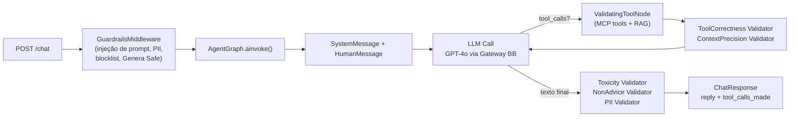

# 📋 Resumo do Workspace — `1. CONSULT FIN`

> Exploração completa — **08/09/2026**

---

## 🎯 O que é este projeto

Este workspace contém dois microsserviços de IA financeira desenvolvidos pelo time **IA GEN AVANCADA** do **Banco do Brasil**, na sigla `PLG`:

| Serviço | O que faz |
|---|---|
| **`plg-agent-consult-fin`** | Agente LLM conversacional — responde perguntas financeiras do cliente via chat |
| **Assessor Financeiro** *(referenciado via `endpoint assessor.txt`)* | API mais rica — inicia sessão com JWT, gera perguntas dinâmicas, usa CFE-ACESSO e CFE-IAA, suporta override de LLM por request via headers `X-LLM-*` |

Os dois serviços conversam entre si ou compartilham infraestrutura (mesma sigla PLG, mesmo cluster HML).

---

## 📁 Estrutura completa do workspace

```
1. CONSULT FIN/
│
├── 📄 # ARGO 1.txt        → Summary da aplicação ArgoCD HML
├── 📄 # ARGO 2.txt        → Live Manifest do Deployment K8s (revisão 6)
├── 📄 # ARGO 3.txt        → Live Manifest do ReplicaSet atual (criado 02/09)
├── 📄 # ARGO 4.txt        → Live Manifest do Pod em execução (Running · Healthy)
├── 📄 endpoint MCP.txt    → Esteira do MCP Server (mcp-consult-fin)
├── 📄 endpoint consult.txt → Esteira do Agente (agent-consult-fin)
├── 📄 endpoint assessor.txt → OpenAPI spec completo do Assessor Financeiro (v1.1.14)
│
├── 📂 plg-agent-consult-fin-main/       ← AGENTE (código-fonte)
│   ├── agent_config.yaml
│   ├── Dockerfile / Jenkinsfile
│   ├── requirements.txt / setup.py
│   ├── README.md (906 linhas)
│   ├── .github/workflows/
│   │   ├── ci.yaml
│   │   └── copilot-setup-steps.yaml
│   ├── plg_agent_consult_fin/           ← pacote Python principal
│   │   ├── app.py
│   │   ├── graph.py
│   │   ├── config.py
│   │   ├── __main__.py
│   │   ├── llm/        (base · factory · gateway_outbound)
│   │   ├── rag/        (rag_tool)
│   │   ├── validators/ (7 arquivos)
│   │   └── utils/      (5 arquivos)
│   ├── tests/
│   │   ├── unit/       (15 arquivos test_*.py)
│   │   └── integration/ (test_dummy)
│   └── plg-agent-consult-fin-main/  ⚠️ subpasta duplicada (sobra de extração ZIP)
│
└── 📂 deploy-plg-agent-consult-fin-cloud-homologacao/  ← HELM CHART HML
    ├── Chart.yaml / values.yaml / README.md
    ├── .github/
    └── deploy-plg-agent-consult-fin-cloud-homologacao/  ⚠️ subpasta duplicada
```

---

## 🤖 Microsserviço `plg-agent-consult-fin` — Agente Chat

### Stack
**Python 3.11 · FastAPI · LangGraph · LangChain · Azure OpenAI (GPT-4o)**

### Endpoints da API

| Método | Rota | Descrição |
|---|---|---|
| `POST` | `/chat` | Envia mensagem → resposta do agente (ChatRequest / ChatResponse) |
| `GET` | `/metrics` | Uptime, total de requests, agent_id |
| `GET` | `/health/live` | Liveness probe K8s |
| `GET` | `/health/ready` | Readiness probe — verifica config + grafo compilado |

### Fluxo interno do agente



### Módulo `graph.py` — destaques

- **`AgentFactory.create()`** — factory assíncrona: conecta MCP servers, instancia LLM via `LLMFactory`, compila o `StateGraph` LangGraph
- **`ValidatingToolNode`** — wrapper de `ToolNode` que executa `ToolCorrectness` e `ContextPrecision` após cada chamada de ferramenta, emitindo spans OTel
- **`AgentGraph`** — singleton thread-safe com lazy compilation (duplo check com `asyncio.Lock`)
- **Azure AI Tracer** — integração com Application Insights via `AzureAIOpenTelemetryTracer`

### Validators (`validators/`)

| Validator | O que faz |
|---|---|
| [`toxicity.py`](file:///C:/Users/manue/.0_PROG/UAN/1.%20CONSULT%20FIN/plg-agent-consult-fin-main/plg_agent_consult_fin/validators/toxicity.py) | Regex ponderado PT-BR + EN para toxicidade |
| [`non_advice.py`](file:///C:/Users/manue/.0_PROG/UAN/1.%20CONSULT%20FIN/plg-agent-consult-fin-main/plg_agent_consult_fin/validators/non_advice.py) | Detecta conselhos financeiros, jurídicos ou médicos |
| [`pii_validator.py`](file:///C:/Users/manue/.0_PROG/UAN/1.%20CONSULT%20FIN/plg-agent-consult-fin-main/plg_agent_consult_fin/validators/pii_validator.py) | PII com checksum de CPF/CNPJ |
| [`context_precision.py`](file:///C:/Users/manue/.0_PROG/UAN/1.%20CONSULT%20FIN/plg-agent-consult-fin-main/plg_agent_consult_fin/validators/context_precision.py) | LLM-as-a-Judge: relevância dos chunks RAG |
| [`tool_correctness.py`](file:///C:/Users/manue/.0_PROG/UAN/1.%20CONSULT%20FIN/plg-agent-consult-fin-main/plg_agent_consult_fin/validators/tool_correctness.py) | Valida uso correto das ferramentas disponíveis |
| [`semantic_similarity.py`](file:///C:/Users/manue/.0_PROG/UAN/1.%20CONSULT%20FIN/plg-agent-consult-fin-main/plg_agent_consult_fin/validators/semantic_similarity.py) | Similaridade semântica via embeddings (rapidfuzz) |

### Utils (`utils/`)

| Arquivo | Função |
|---|---|
| [`guardrails_middleware.py`](file:///C:/Users/manue/.0_PROG/UAN/1.%20CONSULT%20FIN/plg-agent-consult-fin-main/plg_agent_consult_fin/utils/guardrails_middleware.py) | FastAPI middleware — pipeline de guardrails de entrada e saída |
| [`filter_patterns.py`](file:///C:/Users/manue/.0_PROG/UAN/1.%20CONSULT%20FIN/plg-agent-consult-fin-main/plg_agent_consult_fin/utils/filter_patterns.py) | Guardrails síncronos: prompt injection, PII, blocklist |
| [`genera_safe_guardrails.py`](file:///C:/Users/manue/.0_PROG/UAN/1.%20CONSULT%20FIN/plg-agent-consult-fin-main/plg_agent_consult_fin/utils/genera_safe_guardrails.py) | Guardrail externo via curador-iagen (Genera Safe) |
| [`tracing.py`](file:///C:/Users/manue/.0_PROG/UAN/1.%20CONSULT%20FIN/plg-agent-consult-fin-main/plg_agent_consult_fin/utils/tracing.py) | Setup do Azure Monitor / OpenTelemetry |

### Testes (`tests/unit/` — 15 arquivos)

`test_app` · `test_config` · `test_graph` · `test_context_precision` · `test_filter_patterns` · `test_gateway_outbound_provider` · `test_genera_safe_guardrails` · `test_guardrails_middleware` · `test_llm_factory` · `test_pii_validator_risk_scale` · `test_rag_tool` · `test_semantic_validators` · `test_tool_correctness` · `test_dummy`

### Configuração — [`agent_config.yaml`](file:///C:/Users/manue/.0_PROG/UAN/1.%20CONSULT%20FIN/plg-agent-consult-fin-main/agent_config.yaml)

| Parâmetro | Valor |
|---|---|
| LLM Provider | `gateway_outbound` |
| Modelo HML | `cambio-non-prod-gpt4o` |
| Base URL HML | `https://llms-agentes-ia.outbound.api.hm.bb.com.br/v1` |
| max_tokens | `4096` |
| MCP Server | `plg-mcp-consult-fin` (streamable_http, dentro do cluster) |
| RAG | **Desabilitado** (`enabled: false`) |
| Guardrails externos | **Desabilitados** (`enabled: false`) |
| Temperature | `0.7` · top_p: `0.95` |

---

## 📄 `endpoint assessor.txt` — OpenAPI do Assessor Financeiro (v1.1.14)

Este arquivo é a **spec OpenAPI completa** (1.552 linhas) de um serviço diferente — o **Assistente Financeiro** — mais maduro e rico em funcionalidades. É provavelmente o serviço de referência ou o destino final da integração.

### Principais endpoints

| Rota | Operação |
|---|---|
| `POST /op16795179v1` | **Iniciar sessão + listar perguntas sugeridas** — extrai dados via JWT, consulta API GFP, gera até 10 perguntas dinâmicas com LLM |
| `POST /op16929111v1` | **Perguntar ao assistente** — Q&A financeiro com gerenciamento de sessão via JWT, suporte a override de LLM por request via `X-LLM-*` headers |
| `POST /proxy/bb-acesso` | Proxy local para CFE-ACESSO (contorna restrições de CORS em dev) |
| `POST /proxy/bb-iaa-listar` | Proxy para CFE-IAA listar perguntas |
| `POST /proxy/bb-iaa-responder` | Proxy para CFE-IAA responder pergunta |
| `GET /health`, `/health/live`, `/health/ready` | Health probes K8s |

> **Diferencial:** suporta override de LLM por request via headers `X-LLM-Provider`, `X-LLM-Api-Key`, `X-LLM-Model` (padrão: `generabb` / `gpt-4.1-mini`) — sem afetar o singleton do servidor.

---

## 🚀 Deploy HML — Helm Chart

| Parâmetro | Valor |
|---|---|
| Cluster | `k8shmlbb211d` (OpenShift, BB2, nuvem privada) |
| Namespace | `plg-agent-consult-fin` |
| Imagem | `plg-agent-consult-fin:0.1.1` |
| Réplicas | 1 (HPA desabilitado) |
| Recursos | CPU 50m–3001m · Memória 250Mi–375Mi |
| URL HML | https://agent-consultor-fin.plg.hm.bb.com.br |
| ArgoCD HML | https://deploy-hml.nuvem.bb.com.br/applications/hml-bb2-d1-plg-agent-consult-fin |
| mTLS | Certificado `idh-mtls` (TLS + CA injetados via volume) |
| Observabilidade | OpenTelemetry → `http://{NODE_IP}:4317` + Azure App Insights |

---

## 📡 Estado Atual no Cluster HML (snapshots ARGO 1–4)

| Recurso K8s | Status |
|---|---|
| **Aplicação ArgoCD** | ⚠️ `OutOfSync` from HEAD (e79281b) · ✅ Healthy |
| **Deployment** (rev. 6) | ⚠️ `OutOfSync` · ✅ Healthy · 1 réplica |
| **ReplicaSet** (criado 02/09) | ✅ Healthy · 1/1/1 |
| **Pod** (`-9fc87fd96-2cxxl`) | ✅ Running · Started and Ready |

> O Pod está **rodando e saudável** desde 02/09/2026. O `OutOfSync` indica que o manifesto vivo divergiu do que está no Git — provável edição manual direta no cluster.

---

## 🏗️ Infraestrutura BB

| Componente | Valor |
|---|---|
| Sigla | `PLG` |
| Time | IA GEN AVANCADA |
| Gerência | Linha Empréstimos e Antecipações PF |
| Git codebase | `fontes.intranet.bb.com.br/plg/plg-agent-consult-fin` |
| Git deploy HML | `fontes.intranet.bb.com.br/plg/plg-agent-consult-fin/hml-plg-agent-consult-fin` |
| CI/CD | Jenkins → `cloud.ci.intranet.bb.com.br/job/PLG/job/Python/job/plg-agent-consult-fin` |
| Registry | `docker.binarios.intranet.bb.com.br/bb/plg/plg-agent-consult-fin` |
| MCP Server associado | `plg-mcp-consult-fin` (criado 27/08/2026) |

---

## ⚠️ Pontos de Atenção

| # | Ponto | Impacto |
|---|---|---|
| 1 | ArgoCD **`OutOfSync`** — manifesto vivo diverge do Git | Risco de rollback inesperado se sync for acionado |
| 2 | **HPA desabilitado** — 1 réplica fixa | Sem resiliência a picos em HML |
| 3 | **RAG e guardrails externos desabilitados** no `agent_config.yaml` | Funcionalidades não ativas — checar se intencional para PRD |
| 4 | **Subpastas duplicadas** em ambos os repositórios | Pode causar confusão — provável sobra de extração de ZIP |
| 5 | `endpoint assessor.txt` é uma spec OpenAPI diferente do agente aqui codificado | Confirmar se é o serviço alvo de integração ou um serviço paralelo |
