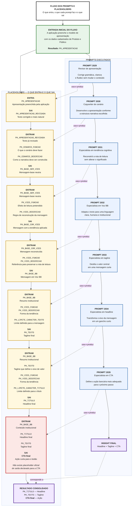

```mermaid
%%{init: {
  "theme": "base",
  "themeVariables": {
    "fontFamily": "Arial",
    "fontSize": "10px",
    "primaryTextColor": "#1F1F1F",
    "lineColor": "#737373"
  },
  "flowchart": {
    "htmlLabels": true,
    "nodeSpacing": 20,
    "rankSpacing": 25,
    "curve": "linear",
    "diagramPadding": 8
  }
}}%%

flowchart TB

    TITULO["<b>FLUXO DOS PROMPTS E PLACEHOLDERS</b><br/>O que entra, o que cada prompt faz e o que sai"]

    ORIGEM["<b>ENTRADA INICIAL DO FLUXO</b><br/>A aplicação preenche o modelo de apresentação<br/>com os dados cadastrados de Produto e Público<br/><br/><b>Resultado:</b> <code>PH_APRESENTACAO</code>"]

    TITULO --> ORIGEM


    %% =====================================================
    %% COLUNA 1 — PROMPTS
    %% =====================================================

    subgraph F1["PROMPTS EXECUTADOS"]
        direction TB

        P2029["<b>PROMPT 2029</b><br/>Revisor de apresentação<br/><br/>Corrige gramática, clareza<br/>e fluidez sem mudar o conteúdo"]

        P2030["<b>PROMPT 2030</b><br/>Copywriter de cenário<br/><br/>Desenvolve a apresentação conforme<br/>a estrutura narrativa escolhida"]

        P2031["<b>PROMPT 2031</b><br/>Especialista em tendência cognitiva<br/><br/>Reconstrói a rota de leitura<br/>sem alterar o significado"]

        P2032["<b>PROMPT 2032</b><br/>Especialista em Voz BB<br/><br/>Adapta o texto para uma linguagem<br/>clara, humana e institucional"]

        P2033["<b>PROMPT 2033</b><br/>Especialista em tagline<br/><br/>Destila o valor central<br/>em uma mensagem curta"]

        P2034["<b>PROMPT 2034</b><br/>Especialista em headline<br/><br/>Transforma o eixo da mensagem<br/>em um gancho curto"]

        P2035["<b>PROMPT 2035</b><br/>Especialista em CTA<br/><br/>Define a ação bancária mais adequada<br/>para o próximo passo"]

        PFINAL["<b>INSIGHT FINAL</b><br/>Headline + Tagline + CTA"]

        P2029 --> P2030
        P2030 --> P2031
        P2031 --> P2032
        P2032 --> P2033
        P2033 --> P2034
        P2034 --> P2035
        P2035 --> PFINAL
    end


    %% =====================================================
    %% COLUNA 2 — ENTRADAS E SAÍDAS
    %% =====================================================

    subgraph F2["PLACEHOLDERS — O QUE ENTRA E O QUE SAI"]
        direction TB

        IO2029["<b>ENTRA</b><br/><code>PH_APRESENTACAO</code><br/>Apresentação preenchida pela aplicação<br/><br/><b>SAI</b><br/><code>PH_APRESENTACAO_REVISADA</code><br/>Texto corrigido e mais natural"]

        IO2030["<b>ENTRAM</b><br/><code>PH_APRESENTACAO_REVISADA</code><br/>Texto já revisado<br/><br/><code>PH_CENARIO_FUNCAO</code><br/>O que o cenário deve fazer<br/><br/><code>PH_CENARIO_DESCRICAO</code><br/>Como a narrativa deve ser construída<br/><br/><b>SAI</b><br/><code>PH_BASE_SEM_VIES</code><br/>Mensagem-base neutra"]

        IO2031["<b>ENTRAM</b><br/><code>PH_BASE_SEM_VIES</code><br/>Mensagem-base neutra<br/><br/><code>PH_VIES_FUNCAO</code><br/>Efeito de leitura pretendido<br/><br/><code>PH_VIES_DESCRICAO</code><br/>Regra de reconstrução da mensagem<br/><br/><b>SAI</b><br/><code>PH_BASE_COM_VIES</code><br/>Mensagem com a tendência aplicada"]

        IO2032["<b>ENTRAM</b><br/><code>PH_BASE_COM_VIES</code><br/>Mensagem reconstruída<br/><br/><code>PH_VIES_FUNCAO</code><br/><code>PH_VIES_DESCRICAO</code><br/>Referência para preservar a rota de leitura<br/><br/><b>SAI</b><br/><code>PH_BASE_BB</code><br/>Mensagem em Voz BB"]

        IO2033["<b>ENTRAM</b><br/><code>PH_BASE_BB</code><br/>Resumo institucional<br/><br/><code>PH_VIES_FUNCAO</code><br/><code>PH_VIES_DESCRICAO</code><br/>Forma da tendência<br/><br/><code>PH_LIMITE_CARACTER_TEXTO</code><br/>Limite definido para a mensagem<br/><br/><b>SAI</b><br/><code>PH_TEXTO</code><br/>Tagline final"]

        IO2034["<b>ENTRAM</b><br/><code>PH_BASE_BB</code><br/>Resumo institucional<br/><br/><code>PH_TEXTO</code><br/>Tagline que define o eixo de valor<br/><br/><code>PH_VIES_FUNCAO</code><br/><code>PH_VIES_DESCRICAO</code><br/>Forma da tendência<br/><br/><code>PH_LIMITE_CARACTER_TITULO</code><br/>Limite definido para o título<br/><br/><b>SAI</b><br/><code>PH_TITULO</code><br/>Headline final"]

        IO2035["<b>ENTRAM</b><br/><code>PH_BASE_BB</code><br/>Conteúdo institucional<br/><br/><code>PH_TITULO</code><br/>Headline final<br/><br/><code>PH_TEXTO</code><br/>Tagline final<br/><br/><b>SAI</b><br/><b>CTA final</b><br/>Ação curta para o botão<br/><br/><i>Não existe placeholder oficial<br/>de saída declarado para a CTA</i>"]

        IOFINAL["<b>RESULTADO CONSOLIDADO</b><br/><code>PH_TITULO</code> — Headline<br/><code>PH_TEXTO</code> — Tagline<br/><b>CTA final</b> — Ação"]

        IO2029 --> IO2030
        IO2030 --> IO2031
        IO2031 --> IO2032
        IO2032 --> IO2033
        IO2033 --> IO2034
        IO2034 --> IO2035
        IO2035 --> IOFINAL
    end


    %% =====================================================
    %% ABERTURA DOS DOIS FLUXOS
    %% =====================================================

    ORIGEM --> P2029
    ORIGEM --> IO2029


    %% =====================================================
    %% CORRESPONDÊNCIA ENTRE PROMPT E PLACEHOLDERS
    %% =====================================================

    P2029 -. "usa e produz" .-> IO2029
    P2030 -. "usa e produz" .-> IO2030
    P2031 -. "usa e produz" .-> IO2031
    P2032 -. "usa e produz" .-> IO2032
    P2033 -. "usa e produz" .-> IO2033
    P2034 -. "usa e produz" .-> IO2034
    P2035 -. "usa e produz" .-> IO2035
    PFINAL -. "corresponde a" .-> IOFINAL


    %% =====================================================
    %% ALINHAMENTO DOS NÍVEIS
    %% =====================================================

    P2029 ~~~ IO2029
    P2030 ~~~ IO2030
    P2031 ~~~ IO2031
    P2032 ~~~ IO2032
    P2033 ~~~ IO2033
    P2034 ~~~ IO2034
    P2035 ~~~ IO2035
    PFINAL ~~~ IOFINAL


    %% =====================================================
    %% ESTILOS
    %% =====================================================

    classDef titulo fill:#FFFFFF,stroke:#1F1F1F,stroke-width:2px;
    classDef origem fill:#E8F5E9,stroke:#2E7D32,stroke-width:2px;
    classDef prompt fill:#EAF2FF,stroke:#2563A8,stroke-width:1.5px;
    classDef io fill:#FFF8DF,stroke:#C58A00,stroke-width:1.5px;
    classDef resultado fill:#F1E8FF,stroke:#7048A8,stroke-width:2.5px;
    classDef alerta fill:#FCE8E6,stroke:#C62828,stroke-width:2px;

    class TITULO titulo;
    class ORIGEM origem;
    class P2029,P2030,P2031,P2032,P2033,P2034,P2035 prompt;
    class IO2029,IO2030,IO2031,IO2032,IO2033,IO2034 io;
    class IO2035 alerta;
    class PFINAL,IOFINAL resultado;
```