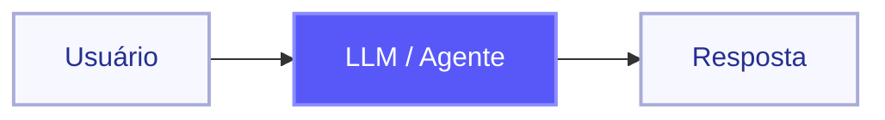
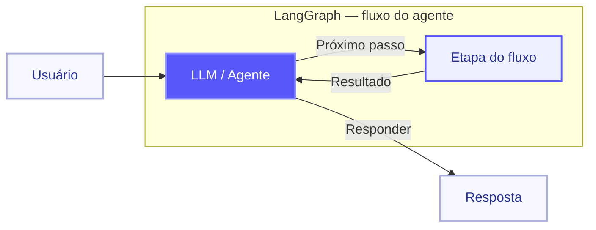
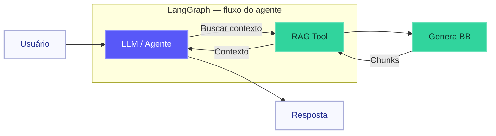
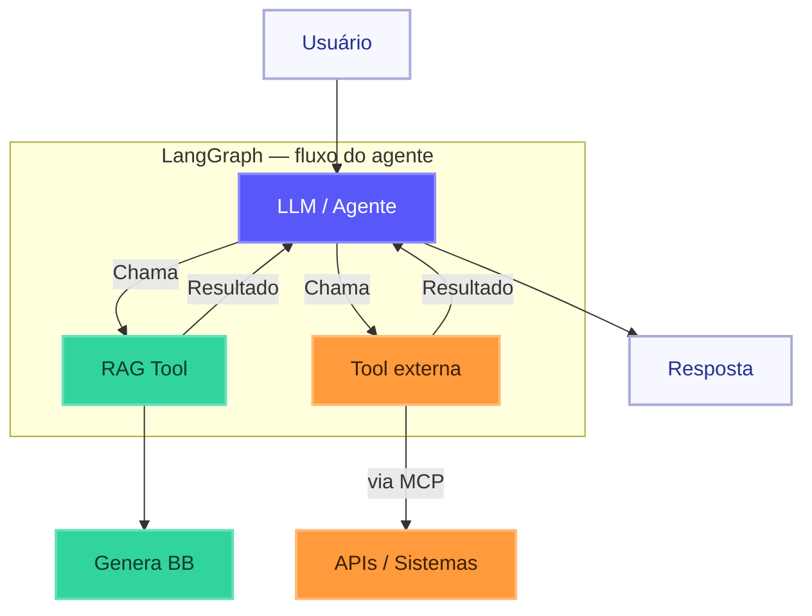
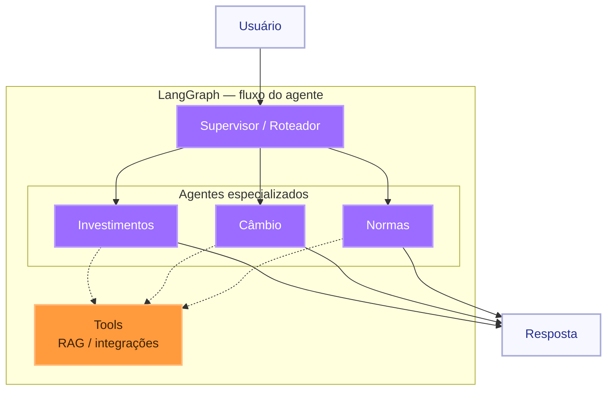
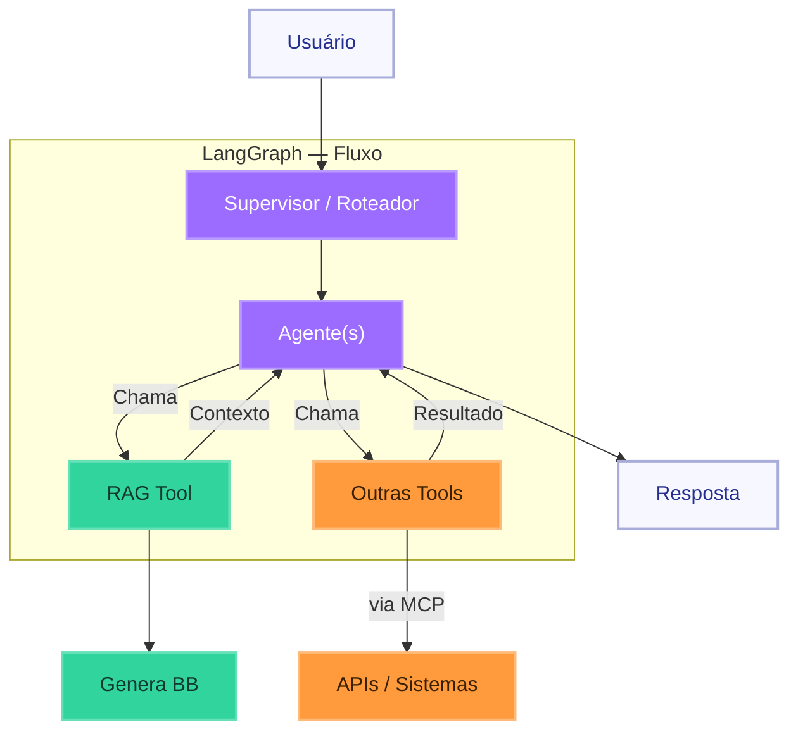

# Arquiteturas Modernas de Agentes

**Duração aproximada: 8 a 10 minutos**

---

# Slide 1 — Agentes modernos e o template

## Diagrama

### Pessoa 1 — Conceito

Quando a gente fala em agente de IA, é comum pensar em um chatbot.

Eu faço uma pergunta, o modelo processa e devolve uma resposta.

Mas um agente moderno pode ir além disso.

Ele pode entender o que precisa fazer, buscar informações, usar ferramentas, acessar outros sistemas e decidir qual caminho seguir antes de responder.

A ideia aqui não é aprofundar cada tecnologia.

É apresentar as principais peças que formam esse tipo de aplicação e mostrar como elas aparecem no nosso ambiente.

### Pessoa 2 — Na nossa esteira

E aqui a gente não começa do zero.

A esteira já provisiona um microserviço com uma estrutura pronta para receber essa lógica.

Nesse template já temos componentes como FastAPI, LangGraph, integração com o modelo, RAG, ferramentas e validadores.

Ou seja, boa parte da estrutura base da aplicação já vem preparada pela esteira.

A partir daí, o nosso trabalho fica mais concentrado nas regras de negócio e no comportamento do agente.

---

# Slide 2 — Frameworks para construção de aplicações

## Diagrama

### Pessoa 1 — Conceito

Até aqui parece simples: entra uma pergunta e sai uma resposta.

Mas o agente pode precisar responder diretamente, buscar uma informação ou chamar uma ferramenta antes de responder.

Quando esses diferentes caminhos começam a aparecer, precisamos estruturar esse fluxo.

É aí que entram frameworks como **LangChain** e **LangGraph**.

De forma simples, o LangChain oferece componentes para trabalhar com modelos, mensagens e ferramentas.

Já o LangGraph permite organizar as etapas e os diferentes caminhos que a execução do agente pode seguir.

### Pessoa 2 — Na nossa esteira

No nosso ambiente, esse fluxo é estruturado usando LangGraph.

**O fluxo do agente segue um ciclo de raciocínio e ação, estruturado com LangGraph.**

Quando uma requisição entra, o modelo pode responder diretamente ou identificar que precisa executar alguma etapa antes.

Se precisar buscar uma informação ou usar uma ferramenta, o fluxo segue para essa etapa e depois continua até chegar à resposta.

Então, quando falamos que o agente decide o próximo passo, essa decisão faz parte do próprio fluxo.

E um desses caminhos pode ser buscar uma informação que o modelo não tem disponível.

É aí que entra o **RAG**.

---

# Slide 3 — RAG

## Diagrama

### Pessoa 1 — Conceito

O modelo de IA não conhece automaticamente os documentos, normas e informações internas da empresa.

O **RAG**, ou Retrieval-Augmented Generation, ajuda justamente nesse ponto.

Antes de responder, a aplicação busca informações relacionadas à pergunta em uma base de conhecimento.

Os trechos mais relevantes são entregues ao modelo como contexto.

Assim, o modelo consegue construir a resposta usando também informações que estão fora do seu conhecimento original.

### Pessoa 2 — Na nossa esteira

No nosso ambiente, isso acontece através do **Genera BB**.

Os documentos já foram indexados previamente.

No nosso template, essa busca é disponibilizada ao agente como uma **Tool de RAG**.

Quando o agente precisa de uma informação, ele chama essa Tool, que consulta o Genera BB.

O Genera BB devolve os trechos mais relevantes encontrados.

Esses trechos são os chamados **chunks**.

A partir daí, esses chunks voltam para o agente como contexto para construir a resposta.

Até aqui, vimos uma Tool usada para buscar conhecimento.

Mas uma Tool também pode consultar uma API, acessar outro sistema ou executar alguma ação.

É isso que vamos abrir no próximo passo.

---

# Slide 4 — Tools e MCP

## Diagrama

### Pessoa 1 — Conceito

Uma **Tool** é uma função ou capacidade que o agente pode solicitar durante o fluxo.

Pode ser buscar contexto, consultar uma cotação, acessar uma API ou executar alguma função.

O modelo identifica que precisa daquela capacidade e solicita a execução da Tool.

A aplicação executa a chamada, recebe o resultado e devolve esse resultado para o agente continuar.

Então, o RAG que vimos no slide anterior é um exemplo de capacidade que, no nosso template, é exposta ao agente como uma Tool.

Quando começamos a integrar outras ferramentas e sistemas, entra também o **MCP, Model Context Protocol**.

O MCP **não é uma Tool**.

Ele é um padrão para disponibilizar ferramentas e outros recursos para aplicações de IA.

### Pessoa 2 — Na nossa esteira

Na nossa estrutura, as Tools fazem parte do fluxo do agente.

Quando o modelo identifica que precisa de uma capacidade, o LangGraph direciona a execução para a Tool correspondente.

Essa Tool pode ser, por exemplo, a busca de contexto no Genera BB ou uma integração com outro sistema.

O resultado volta para o agente, que continua o processamento.

Com MCP, ferramentas externas podem ser disponibilizadas seguindo um padrão comum.

O agente passa a enxergar essas capacidades como Tools disponíveis durante a execução, sem que o MCP seja tratado como uma Tool em si.

Então, até aqui, temos um agente que consegue seguir um fluxo, buscar conhecimento e utilizar diferentes capacidades.

Mas, conforme a solução cresce, concentrar muitas responsabilidades em um único agente pode aumentar bastante a complexidade.

É aí que entram os **sistemas multiagentes**.

---

# Slide 5 — Sistemas Multiagentes

## Diagrama

### Pessoa 1 — Conceito

Em vez de ter um único agente responsável por vários tipos de problema, podemos separar essas responsabilidades.

Essa é a ideia de um sistema multiagente.

Podemos ter, por exemplo, um agente especializado em investimentos, outro em câmbio e outro em normas.

Cada agente fica responsável por um domínio ou conjunto específico de tarefas.

### Pessoa 2 — Na arquitetura

E aqui estamos falando de uma escolha arquitetural.

Não significa que toda solução precise ter vários agentes.

Uma possibilidade é ter um agente supervisor.

Ele recebe a solicitação e distribui o trabalho para agentes especializados.

Outra possibilidade é ter um roteador, que identifica o tipo de solicitação e encaminha diretamente para o agente responsável.

Também podemos ter situações em que um agente produz uma resposta e outro faz uma validação antes que ela siga adiante.

A ideia principal é separar responsabilidades quando a complexidade da aplicação cresce.

---

# Slide 6 — Juntando tudo

## Diagrama

**LangGraph** — Fluxo  
**RAG Tool** — Conhecimento  
**Tools** — Capacidades  
**MCP** — Padrão de disponibilização  
**Multiagentes** — Especialização

### Pessoa 1

Se a gente juntar tudo o que vimos, fica mais fácil entender o papel de cada peça.

O **LangGraph** organiza o fluxo do agente.

O **RAG** traz conhecimento externo para o contexto do modelo e, no nosso template, essa busca é disponibilizada como uma Tool.

As **Tools** representam capacidades que o agente pode solicitar durante a execução.

O **MCP** padroniza como ferramentas e outros recursos podem ser disponibilizados para aplicações de IA.

E os **sistemas multiagentes** permitem separar responsabilidades quando a solução cresce.

### Pessoa 2

E várias dessas peças já aparecem no template que a empresa provisiona.

A ideia desse primeiro contato não é sair daqui sabendo implementar tudo isso.

É reconhecer esses componentes e entender o papel de cada um.

Quando vocês encontrarem uma configuração de RAG, uma Tool ou uma integração MCP durante o onboarding, esses elementos já vão ter algum contexto.

E a principal mensagem é esta:

**um agente moderno não é apenas um prompt conectado a um modelo.**

Ele é uma aplicação em que diferentes componentes trabalham juntos para executar um fluxo e entregar uma resposta.
