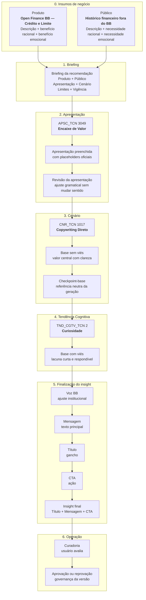

# Complemento — Fluxograma e Exemplo Real de Geração

> Documento complementar ao catálogo de Apresentações, Cenários e Tendências Cognitivas.
>
> Objetivo: mostrar, com um exemplo real do projeto, como Produto, Público, Apresentação, Cenário e Tendência Cognitiva se combinam até formar um insight final.

---

## 1. Fluxograma do exemplo real



---

## 2. Dados usados no exemplo

### Produto

| Campo | Valor |
|---|---|
| Produto | Open Finance BB — Crédito e Limite |
| Descrição | Um serviço que permite ao BB considerar informações financeiras de outros bancos na análise de crédito. |
| Benefício racional | Usar um histórico financeiro mais completo para apoiar a análise de crédito, limites e condições. |
| Benefício emocional | Mais confiança para buscar crédito com informações financeiras mais completas. |

### Público

| Campo | Valor |
|---|---|
| Público | Histórico financeiro fora do BB |
| Descrição | Pessoas que querem melhorar a análise de crédito no BB e têm parte do histórico financeiro em outros bancos. |
| Necessidade racional | Permitir que o BB considere informações financeiras de outros bancos na análise de crédito. |
| Necessidade emocional | Mais confiança para buscar crédito com um histórico financeiro mais completo. |

---

## 3. Configuração do briefing

| Camada | Escolha usada no exemplo |
|---|---|
| Produto | Open Finance BB — Crédito e Limite |
| Público | Histórico financeiro fora do BB |
| Apresentação | Encaixe de Valor |
| Cenário | Copywriting Direto |
| Tendência Cognitiva | Curiosidade |
| Limite de título | Até 20 caracteres |
| Limite de mensagem | Até 80 caracteres |
| CTA | Até 2 caracteres |

---

# 4. Passo a passo da geração

## Etapa 1 — Apresentação escolhida

### Tipo oficial

| Campo | Valor |
|---|---|
| Tabela | `APSC_TCN` |
| ID | `3049` |
| Nome | Encaixe de Valor |
| Função oficial | Juntar publico, necessidade, solucao e beneficio. |

### Texto oficial

```text
Para {PH_PBCO_DCR}, quando precisam {PH_PBCO_RCNL} e buscam {PH_PBCO_EMOC}, {PH_SGT_DCR} oferece {PH_SGT_RCNL}, favorecendo {PH_SGT_EMOC}.
```

---

## Etapa 2 — Apresentação preenchida pela aplicação

Nesta etapa, a aplicação apenas substitui os placeholders pelos dados cadastrados de Produto e Público.

```text
Para pessoas que querem melhorar a análise de crédito no BB e têm parte do histórico financeiro em outros bancos, quando precisam permitir que o BB considere informações financeiras de outros bancos na análise de crédito e buscam mais confiança para buscar crédito com um histórico financeiro mais completo, um serviço que permite ao BB considerar informações financeiras de outros bancos na análise de crédito oferece usar um histórico financeiro mais completo para apoiar a análise de crédito, limites e condições, favorecendo mais confiança para buscar crédito com informações financeiras mais completas.
```

### O que aconteceu aqui

| Elemento | Origem |
|---|---|
| Público | `{PH_PBCO_DCR}` |
| Necessidade racional do público | `{PH_PBCO_RCNL}` |
| Necessidade emocional do público | `{PH_PBCO_EMOC}` |
| Descrição do produto | `{PH_SGT_DCR}` |
| Benefício racional do produto | `{PH_SGT_RCNL}` |
| Benefício emocional do produto | `{PH_SGT_EMOC}` |

---

## Etapa 3 — Revisão da apresentação

A revisão ajusta gramática, fluidez e encaixe, sem alterar o significado.

```text
Para pessoas que querem melhorar a análise de crédito no BB e têm parte do histórico financeiro em outros bancos, o Open Finance BB permite que o Banco do Brasil considere informações financeiras de outras instituições na análise de crédito. Com um histórico financeiro mais completo, a análise de crédito, limites e condições pode ser apoiada por mais informações, trazendo mais confiança para buscar crédito.
```

### O que a revisão faz

- Melhora a leitura.
- Corrige encaixes artificiais do preenchimento.
- Mantém Produto, Público, necessidade e benefício.
- Não cria promessa nova.

---

## Etapa 4 — Cenário escolhido

### Tipo oficial

| Campo | Valor |
|---|---|
| Tabela | `CNR_TCN` |
| ID | `1017` |
| Nome | Copywriting Direto |
| Função oficial | Apresentar o valor central com clareza. |
| Descrição oficial | Valor central, relevancia, beneficio concreto e mensagem curta. |

### Aplicação no exemplo

O cenário Copywriting Direto orienta a IA a transformar a apresentação revisada em uma base clara, curta e centrada no valor principal.

```text
O Open Finance BB permite que o Banco do Brasil considere informações financeiras de outros bancos na análise de crédito. Isso ajuda a formar uma visão mais completa do histórico financeiro e pode apoiar a avaliação de crédito, limites e condições disponíveis para o cliente.
```

---

## Etapa 5 — Checkpoint-base

O checkpoint-base é a referência neutra da geração.

Ele fixa o significado antes de criar variações por tendência cognitiva.

```text
O Open Finance BB permite que o BB considere informações financeiras de outros bancos na análise de crédito, ajudando a formar uma visão mais completa do histórico financeiro para apoiar a avaliação de crédito, limites e condições disponíveis para o cliente.
```

### Por que o checkpoint é importante

Ele garante que todas as variações partam do mesmo significado.

A partir dele, a tendência cognitiva pode mudar a forma de apresentação, mas não pode mudar a oferta, o benefício ou as condições.

---

## Etapa 6 — Tendência Cognitiva escolhida

### Tipo oficial

| Campo | Valor |
|---|---|
| Tabela | `TND_CGTV_TCN` |
| ID | `2` |
| Nome | Curiosidade |
| Função oficial | Abrir lacuna de compreensao que a mensagem consegue resolver. |
| Descrição oficial | Usar pergunta precisa, curta e respondivel, sem clickbait. |

### Aplicação no exemplo

A tendência Curiosidade transforma a base neutra em uma abordagem com lacuna curta e respondível.

```text
Seu histórico em outros bancos também pode apoiar sua análise de crédito no BB. Com o Open Finance, essas informações ajudam a compor uma visão mais completa.
```

### O que mudou

| Antes | Depois |
|---|---|
| Texto informativo direto | Texto com abertura de curiosidade |
| Foco no funcionamento | Foco na pergunta implícita: “meu histórico fora do BB pode ajudar?” |
| Base neutra | Base com rota cognitiva de Curiosidade |

### O que não mudou

- O produto continua sendo Open Finance BB.
- O público continua sendo quem tem histórico financeiro em outros bancos.
- O benefício continua sendo apoiar a análise de crédito com informações mais completas.
- Não foi criada promessa de aprovação.
- Não foi criada condição comercial nova.

---

## Etapa 7 — Voz BB

A Voz BB ajusta a linguagem para ficar mais institucional, clara e segura.

```text
Seu histórico em outros bancos pode ajudar o BB a ter uma visão mais completa na análise de crédito. Com o Open Finance, você compartilha essas informações com mais clareza e segurança.
```

### Observação

A Voz BB melhora a forma de dizer, mas não pode alterar o significado da recomendação.

---

# 5. Insight final do exemplo

## Saída gerada

| Campo | Resultado |
|---|---|
| Tendência | Curiosidade |
| Título | Histórico conta? |
| Mensagem | Use dados de outros bancos para apoiar sua análise de crédito no BB. |
| CTA | Ir |

---

## Validação contra os limites

| Campo | Limite | Resultado | Situação |
|---|---:|---|---|
| Título | Até 20 caracteres | Histórico conta? | Dentro do limite |
| Mensagem | Até 80 caracteres | Use dados de outros bancos para apoiar sua análise de crédito no BB. | Dentro do limite |
| CTA | Até 2 caracteres | Ir | Dentro do limite |

---

## Leitura do resultado

```text
Título:
Histórico conta?

Mensagem:
Use dados de outros bancos para apoiar sua análise de crédito no BB.

CTA:
Ir
```

---

# 6. Explicação final do exemplo

Este exemplo mostra como uma mesma recomendação passa por camadas controladas.

Produto e Público definem o conteúdo de negócio.

A Apresentação Encaixe de Valor organiza esse conteúdo em uma proposta inicial.

O Cenário Copywriting Direto transforma essa proposta em uma base objetiva e clara.

A Tendência Curiosidade cria uma rota de leitura baseada em pergunta curta e respondível.

A Voz BB ajusta a linguagem para o tom institucional.

Por fim, a geração retorna título, mensagem e CTA dentro dos limites definidos.

---

## Frase-resumo

**Neste exemplo, o Genera transforma dados cadastrados de Produto e Público em um insight final rastreável, preservando significado e variando apenas a forma de comunicação.**

---

# 7. Fala sugerida para apresentar o exemplo

> “Este exemplo mostra uma geração real usando Open Finance BB — Crédito e Limite para um público que tem histórico financeiro fora do BB.
>
> Primeiro, o sistema parte dos dados cadastrados de produto e público. O produto informa o que é a solução e quais benefícios ela oferece. O público informa quem é a pessoa usuária, qual necessidade racional existe e qual estado emocional está envolvido.
>
> Em seguida, usamos a apresentação Encaixe de Valor. Ela junta público, necessidade, solução e benefício em uma primeira proposta de valor. Essa apresentação é preenchida pela aplicação e depois revisada para ficar mais natural.
>
> Depois entra o cenário Copywriting Direto, que transforma a apresentação revisada em uma base clara, objetiva e sem viés.
>
> Essa base vira o checkpoint. A partir dela, aplicamos a tendência Curiosidade. A mensagem passa então a abrir uma lacuna simples e respondível: a ideia de que o histórico em outros bancos pode ajudar na análise de crédito do BB.
>
> Depois o texto passa pela Voz BB e é finalizado em três elementos: título, mensagem e CTA.
>
> O resultado é: ‘Histórico conta?’, ‘Use dados de outros bancos para apoiar sua análise de crédito no BB.’ e o CTA ‘Ir’.
>
> O mais importante é perceber que a forma mudou, mas o significado foi preservado. O sistema não prometeu aprovação de crédito, não criou condição comercial e não inventou benefício. Ele apenas reorganizou o mesmo conteúdo por uma rota cognitiva específica.”

---

# 8. Mini-resumo para slide

## Exemplo real

**Produto:** Open Finance BB — Crédito e Limite  
**Público:** Histórico financeiro fora do BB  
**Apresentação:** Encaixe de Valor  
**Cenário:** Copywriting Direto  
**Tendência:** Curiosidade  

```text
Título:
Histórico conta?

Mensagem:
Use dados de outros bancos para apoiar sua análise de crédito no BB.

CTA:
Ir
```

**Ideia principal:** o sistema usa dados cadastrados, organiza a proposta de valor, aplica uma rota cognitiva e entrega uma mensagem final dentro dos limites definidos.

---

# 9. Mini-fluxograma para slide

```text
Produto + Público
        |
        v
Encaixe de Valor
        |
        v
Copywriting Direto
        |
        v
Checkpoint-base
        |
        v
Curiosidade
        |
        v
Voz BB
        |
        v
Título + Mensagem + CTA
```
