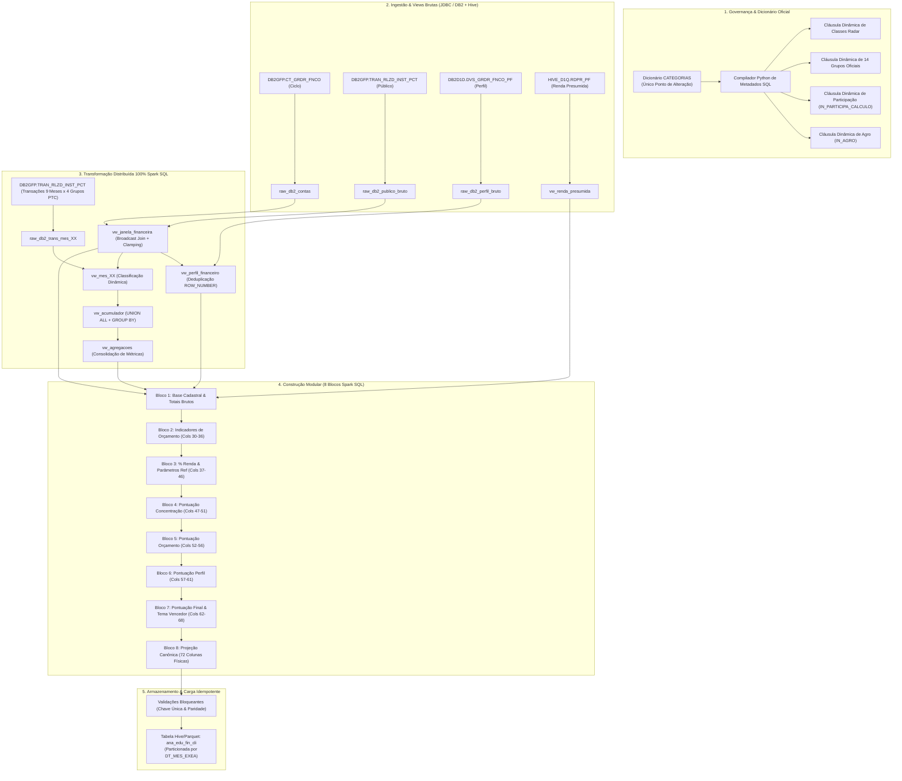

# Documentação Técnica Oficial: Pipeline Analítico ANA_EDU_FIN_CLI V9 (Radar Financeiro)

## 1. Visão Geral e Arquitetura Metadata-Driven

A versão **V9** do pipeline analítico **ANA_EDU_FIN_CLI** consolida a arquitetura **100% Spark SQL Orientada a Metadados (*Metadata-Driven ETL*)**.

### Principais Inovações e Diretrizes Estruturais da V9:
1. **Single Point of Truth no Dicionário `CATEGORIAS`:** Todas as decisões de classificação contábil/analítica, agrupamento setorial oficial (14 grupos), participação em cálculos orçamentários e identificação de agronegócio são centralizadas no dicionário. O pipeline compila dinamicamente as expressões SQL em tempo de execução.
2. **Flag de Governança `IN_PARTICIPA_CALCULO`:** Permite ligar/desligar categorias dos cálculos de orçamento sem alterar código SQL. Por padrão, todas as categorias recebem `'S'`, exceto **Agro** (`300, 310, 330, 350, 370`) e **Fatura de Cartão** (`111`) que recebem `'N'`.
3. **Preservação do Diagnóstico Agro (`FL_TEM_MOV_AGRO`):** Transações de agronegócio continuam sendo lidas para identificar que o cliente é produtor/agro (`FL_TEM_MOV_AGRO = 'S'`), mas seus valores financeiros não distorcem o orçamento pessoal (`_IN_PARTICIPA = 1`).
4. **Esquema Físico Canônico Enxuto (72 Colunas Físicas):** Desacoplamento da camada física do ETL. A tabela analítica final é composta por **71 campos analíticos essenciais + 1 coluna de partição física temporal (`DT_MES_EXEA`)**, garantindo alta performance de leitura, armazenamento otimizado em Parquet e total compatibilidade operacional.
5. **Zero Perda de Performance (Catalyst Optimizer):** As expressões SQL geradas dinamicamente são compiladas diretamente no plano físico do Spark, sendo executadas de forma vetorizada na JVM em uma única passada de dados (*single-pass scan*).
6. **Estratégia Fail-Fast e Padrão Raw View:** As leituras JDBC (IBM DB2) e tabelas Hive são registradas em views brutas (`raw_*`) com filtros imediatos de estado (`CD_EST_TRAN_INST = 0`), pruning de partição e *broadcast join* declarativo (`/*+ BROADCAST(c) */`).

---

## 2. Fluxo Arquitetural V9

---

## 3. Dicionário Físico Oficial de Dados (72 Colunas)

| # | Coluna | Tipo Físico | Descrição Negocial / Regra de Cálculo |
|:---:|---|:---:|---|
| **1** | `CD_CLI` | `INT` | Código identificador único do cliente no ecossistema bancário (Chave Primária). |
| **2** | `TS_ATL_TRAN` | `TIMESTAMP` | Maior timestamp de atualização das transações do cliente no recorte de público. |
| **3** | `DD_INC_MM_CLC_BLC` | `SMALLINT` | Dia do ciclo de cálculo (1 a 31; 996=múltiplas contas; 997=sem conta; 999=sem data). |
| **4** | `VL_REN_PRES` | `DECIMAL(18,2)` | Renda presumida consolidada ($\ge 0$ válida; `-1` a `-7` sentinelas de diagnóstico). |
| **5** | `CD_MAC_PRFL_CLI` | `BIGINT` | Código do macroperfil financeiro no DB2 (1=Endividado, 2=Equilibrista, 3=Investidor). |
| **6** | `NM_MAC_PRFL_CLI` | `STRING` | Descrição textual do macroperfil financeiro. |
| **7** | `CD_MIC_PRFL_CLI` | `BIGINT` | Código do microperfil financeiro no DB2 (1 a 8). |
| **8** | `NM_MIC_PRFL_CLI` | `STRING` | Descrição textual do microperfil financeiro. |
| **9** | `NM_PRFL_FIN` | `STRING` | Nome unificado do perfil financeiro (ex: 'Endividado Inadimplente', 'Investidor Precavido'). |
| **10** | `DT_REF_INI` | `DATE` | Data de início da janela individual de análise financeira. |
| **11** | `DT_REF_FIM` | `DATE` | Data de término da janela individual de análise financeira. |
| **12** | `DT_EXEA` | `DATE` | Data de execução do pipeline. |
| **13** | `QT_TRANS_TOTAL` | `BIGINT` | Quantidade total de transações de entrada e saída na janela. |
| **14** | `QT_TRANS_ENT` | `BIGINT` | Quantidade total de transações de entrada. |
| **15** | `QT_TRANS_SAI` | `BIGINT` | Quantidade total de transações de saída. |
| **16** | `VL_TRANS_ENT` | `DECIMAL(25,2)` | Valor financeiro total de entradas participantes (`_IN_PARTICIPA = 1`). |
| **17** | `VL_TRANS_SAI` | `DECIMAL(25,2)` | Valor financeiro total de saídas participantes (`_IN_PARTICIPA = 1`). |
| **18** | `VL_ENT_REN` | `DECIMAL(18,2)` | Valor total recebido como Renda/Salário (Classe 1). |
| **19** | `VL_ENT_EST` | `DECIMAL(18,2)` | Valor total de Estornos/Devoluções (Classe 2). |
| **20** | `VL_ENT_RESG` | `DECIMAL(18,2)` | Valor total de Resgate de Aplicações/Investimentos (Classe 3). |
| **21** | `VL_ENT_OUT` | `DECIMAL(18,2)` | Valor total de Outras Entradas não categorizadas (Classe 0). |
| **22** | `VL_ENT_CRED` | `DECIMAL(18,2)` | Valor total de Empréstimos e Financiamentos Tomados (Classe 4). |
| **23** | `VL_ENT_TOTAL` | `DECIMAL(18,2)` | Somatório total de entradas participantes. |
| **24** | `VL_SAI_IND` | `DECIMAL(18,2)` | Valor total de saídas Indeterminadas participantes (Classe 5). |
| **25** | `VL_SAI_ESS` | `DECIMAL(18,2)` | Valor total de saídas Essenciais participantes (Classe 6). |
| **26** | `VL_SAI_NAO_ESS` | `DECIMAL(18,2)` | Valor total de saídas Não Essenciais participantes (Classe 7). |
| **27** | `VL_SAI_FUT` | `DECIMAL(18,2)` | Valor total de saídas para o Futuro/Investimentos (Classe 8). |
| **28** | `VL_SAI_OBR` | `DECIMAL(18,2)` | Valor total de saídas para Obrigações/Dívidas participantes (Classe 9). |
| **29** | `VL_SAI_TOTAL` | `DECIMAL(18,2)` | Somatório total de saídas participantes. |
| **30** | `VL_RES_ORC` | `DECIMAL(18,2)` | Resultado financeiro do orçamento: `VL_ENT_TOTAL - VL_SAI_TOTAL`. |
| **31** | `PC_SAI_ENT` | `DECIMAL(9,6)` | Razão entre saídas e entradas: `VL_SAI_TOTAL / VL_ENT_TOTAL`. |
| **32** | `CD_RES_ORC` | `INT` | Código do resultado do orçamento (0=Neutro, 1=Superavitário, 2=Deficitário). |
| **33** | `TX_RES_ORC` | `STRING` | Descrição textual do resultado do orçamento. |
| **34** | `CD_FAIXA_ORC` | `INT` | Faixa orçamentária (0=Neutro, 1=Deficitário Mod., 2=Deficitário Acent., 3=Superavitário Mod., 4=Superavitário Acent.). |
| **35** | `TX_STS_RES` | `STRING` | Intensidade do resultado ('Moderado' ou 'Acentuado'). |
| **36** | `TX_STS_FINAL` | `STRING` | Texto composto do resultado e intensidade. |
| **37** | `PC_SAI_IND` | `DECIMAL(9,6)` | % de saídas indeterminadas sobre a renda: `VL_SAI_IND / VL_REN_PRES`. |
| **38** | `PC_SAI_ESS` | `DECIMAL(9,6)` | % de saídas essenciais sobre a renda: `VL_SAI_ESS / VL_REN_PRES`. |
| **39** | `PC_SAI_NAO_ESS` | `DECIMAL(9,6)` | % de saídas não essenciais sobre a renda: `VL_SAI_NAO_ESS / VL_REN_PRES`. |
| **40** | `PC_SAI_FUT` | `DECIMAL(9,6)` | % de saídas para o futuro sobre a renda: `VL_SAI_FUT / VL_REN_PRES`. |
| **41** | `PC_SAI_OBR` | `DECIMAL(9,6)` | % de saídas para obrigações sobre a renda: `VL_SAI_OBR / VL_REN_PRES`. |
| **42** | `PC_REF_IND` | `DECIMAL(9,6)` | Parâmetro normativo de referência para indeterminados (`0.750000`). |
| **43** | `PC_REF_ESS` | `DECIMAL(9,6)` | Parâmetro normativo de referência para essenciais (`0.500000`). |
| **44** | `PC_REF_NAO_ESS` | `DECIMAL(9,6)` | Parâmetro normativo de referência para não essenciais (`0.300000`). |
| **45** | `PC_REF_FUT` | `DECIMAL(9,6)` | Parâmetro normativo de referência para futuro (`0.200000`). |
| **46** | `PC_REF_OBR` | `DECIMAL(9,6)` | Parâmetro normativo de referência para obrigações (`0.300000`). |
| **47** | `NR_PONT_CONC_IND` | `INT` | Pontuação por concentração de gastos indeterminados (0 ou 99). |
| **48** | `NR_PONT_CONC_ESS` | `INT` | Pontuação por concentração de gastos essenciais (0, 1 ou 2). |
| **49** | `NR_PONT_CONC_NAO_ESS` | `INT` | Pontuação por concentração de gastos não essenciais (0, 1 ou 2). |
| **50** | `NR_PONT_CONC_FUT` | `INT` | Pontuação por concentração de gastos para o futuro (0, 1 ou 2). |
| **51** | `NR_PONT_CONC_OBR` | `INT` | Pontuação por concentração de obrigações (0, 1 ou 2). |
| **52** | `NR_PONT_ORC_IND` | `INT` | Pontuação orçamentária para indeterminados (sempre 0). |
| **53** | `NR_PONT_ORC_ESS` | `INT` | Pontuação orçamentária para essenciais (0, 1 ou 2). |
| **54** | `NR_PONT_ORC_NAO_ESS` | `INT` | Pontuação orçamentária para não essenciais (0, 1 ou 2). |
| **55** | `NR_PONT_ORC_FUT` | `INT` | Pontuação orçamentária para futuro (0, 1 ou 2). |
| **56** | `NR_PONT_ORC_OBR` | `INT` | Pontuação orçamentária para obrigações (0, 1 ou 2). |
| **57** | `NR_PONT_PRFL_IND` | `INT` | Pontuação por perfil para indeterminados (sempre 0). |
| **58** | `NR_PONT_PRFL_ESS` | `INT` | Pontuação por perfil para essenciais (0, 1 ou 2). |
| **59** | `NR_PONT_PRFL_NAO_ESS` | `INT` | Pontuação por perfil para não essenciais (0, 1 ou 2). |
| **60** | `NR_PONT_PRFL_FUT` | `INT` | Pontuação por perfil para futuro (0, 1 ou 2). |
| **61** | `NR_PONT_PRFL_OBR` | `INT` | Pontuação por perfil para obrigações (0, 1 ou 2). |
| **62** | `NR_PONT_IND_FIM` | `INT` | Pontuação final consolidada de indeterminados. |
| **63** | `NR_PONT_ESS_FIM` | `INT` | Pontuação final consolidada de essenciais. |
| **64** | `NR_PONT_NAO_ESS_FIM` | `INT` | Pontuação final consolidada de não essenciais. |
| **65** | `NR_PONT_FUT_FIM` | `INT` | Pontuação final consolidada de futuro. |
| **66** | `NR_PONT_OBR_FIM` | `INT` | Pontuação final consolidada de obrigações. |
| **67** | `CD_TEMA_VENCEDOR` | `INT` | Código do tema vencedor: 1=Categorização, 2=Gestão Orçamento, 3=Consumo Planejado, 4=Formação Reserva, 5=Crédito Consciente, 9=Empate. |
| **68** | `TX_TEMA_VENCEDOR` | `STRING` | Descrição textual do tema vencedor. |
| **69** | `FL_TEM_MOV_AGRO` | `STRING` | Indicador se o cliente teve movimentação agro na janela ('S' ou 'N'). |
| **70** | `FL_MULT_MOE` | `STRING` | Indicador se o cliente teve moeda não BRL na janela ('S' ou 'N'). |
| **71** | `FL_PARTICIPA_RADAR` | `STRING` | Campo reservado para regra de participação futura. |
| **72** | `DT_MES_EXEA` | `DATE` | **(Coluna de Partição Física Hive)** Mês de competência (primeiro dia do mês, ex: `2026-08-01`). |

---

## 4. Sentinelas de Diagnóstico de Renda (`VL_REN_PRES`)

Caso o cliente não possua renda válida ($\ge 0$), o pipeline atribui códigos sentinelas para auditoria e governança:

| Código | Significado | Ação no Pipeline |
|:---:|---|---|
| `-1.00` | CPF sem escoragem em nenhum dos modelos | Percentuais sobre a renda ficam nulos/zerados; pontuação baseada em faixas padrão. |
| `-2.00` | CPF inválido na base cadastral | Diagnosticado como inconsistência cadastral. |
| `-3.00` | CPF pertencente a Não-PF (Pessoa Jurídica/Entidade) | Tratamento preventivo. |
| `-4.00` | Identidade ambígua | Diagnóstico de chave mista. |
| `-5.00` | Duplicidade do modelo de escoragem | Desambiguação via agregação max. |
| `-6.00` | Renda nula na fonte de origem | Falta de dado de input. |
| `-7.00` | Renda negativa na origem | Inconsistência de cálculo no modelo originador. |

---

## 5. Casos de Teste e Validação Canônica (`v9_test_ana.csv`)

O arquivo [`v9_test_ana.csv`](file:///c:/Users/manue/.0_PROG/UAN/radar_financeiro/v2_radar/v9_test_ana.csv) cobre 10 arquétipos essenciais de clientes para validação completa:

1. **Cliente 1001 (Endividado Acrobata):** Deficitário Moderado $\rightarrow$ **Tema 2: Gestão de Orçamento**.
2. **Cliente 1002 (Endividado Consciente):** Orçamento Neutro, alto consumo não essencial $\rightarrow$ **Tema 3: Consumo Planejado**.
3. **Cliente 1003 (Investidor Precavido):** Superavitário Acentuado sem reserva/investimento $\rightarrow$ **Tema 4: Formação de Reserva**.
4. **Cliente 1004 (Endividado Inadimplente):** Deficitário Acentuado, alta dívida $\rightarrow$ **Tema 5: Uso Consciente do Crédito**.
5. **Cliente 1005 (Equilibrista):** Gastos indeterminados elevados ($>75\%$) $\rightarrow$ **Tema 1: Categorização dos Gastos**.
6. **Cliente 1006 (Endividado Consciente - Sem Dia Cadastrado / 999):** Empate exato entre Orçamento e Não Essenciais $\rightarrow$ **Tema 9: Empate**.
7. **Cliente 1007 (Investidor Precavido / Produtor Rural):** Movimentação agro ativa (`FL_TEM_MOV_AGRO = 'S'`), com valores agro isolados com sucesso do orçamento pessoal.
8. **Cliente 1008 (Investidor Acelerado - Alta Renda):** Superavitário com alta alocação em futuro.
9. **Cliente 1009 (Equilibrista Sem Conta / Sem Movimento):** `QT_TRANS_TOTAL = 0`, métricas orçamentárias nulas e seguras sem quebra.
10. **Cliente 1010 (Endividado Iminente - Multimoeda):** `FL_MULT_MOE = 'S'`, transações internacionais registradas.

---

## 6. Diretrizes Operacionais para Homologação

1. **Modo de Escrita e Idempotência:**
   - A carga na tabela é realizada em formato Parquet nativo com `partitionOverwriteMode = dynamic`, permitindo reexecuções seguras da mesma competência `DT_MES_EXEA` sem duplicação de dados.
2. **Validações Bloqueantes Automáticas:**
   - O pipeline valida unicidade estrita de `CD_CLI` (`HAVING COUNT(1) > 1`) e paridade exata de linhas entre o público inicial e a tabela final antes de autorizar a escrita no disco/Hive.
3. **Governança de Categorias:**
   - Qualquer necessidade de reclassificação de categoria ou alteração de flag de participação deve ser feita **exclusivamente no dicionário `CATEGORIAS`** (`dicionario.py` e Célula 11 do notebook), sem alteração manual de blocos SQL.
